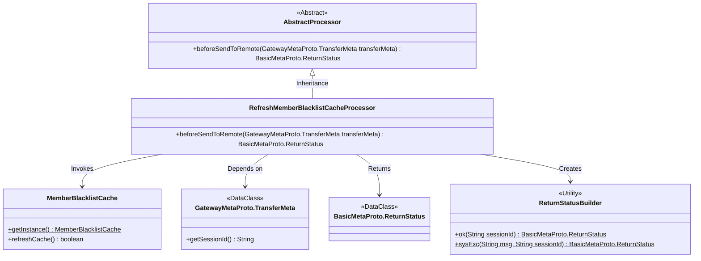

# Basic Information

|      |      |
|------|------|
| Name | RefreshMemberBlacklistCacheProcessor |
| Language | .java |
| Code Path | WeFe/gateway/src/main/java/com/welab/wefe/gateway/service/processors/RefreshMemberBlacklistCacheProcessor.java |
| Package Name | com.welab.wefe.gateway.service.processors |
| Dependencies | ['com.welab.wefe.common.wefe.enums.GatewayProcessorType', 'com.welab.wefe.gateway.api.meta.basic.BasicMetaProto', 'com.welab.wefe.gateway.api.meta.basic.GatewayMetaProto', 'com.welab.wefe.gateway.base.Processor', 'com.welab.wefe.gateway.cache.MemberBlacklistCache', 'com.welab.wefe.gateway.common.ReturnStatusBuilder'] |
| Brief Description | The processor class for refreshing the member blacklist cache, inheriting from AbstractProcessor, invokes the MemberBlacklistCache via the beforeSendToRemote method to refresh the cache, returning a success or failure status. |

# Description

The content describes a processor class named RefreshMemberBlacklistCacheProcessor, which is used to refresh the member blacklist cache. This class inherits from AbstractProcessor and is annotated to identify its type as GatewayProcessorType.refreshMemberBlacklistCacheProcessor. Its primary function is to invoke the refreshCache method of MemberBlacklistCache to refresh the cache before sending a remote request, and it returns a success or failure status based on the operation result. Upon success, it returns a success status containing the session ID; upon failure, it returns a system exception status containing the error message and session ID.

# Class Summary

| Name   | Type  | Description |
|-------|------|-------------|
| RefreshMemberBlacklistCacheProcessor | class | The processor class for refreshing the member blacklist cache, inherits from AbstractProcessor. It invokes the refreshCache method of MemberBlacklistCache via the beforeSendToRemote method to update the cache and returns the operation status. Returns OK on success, or an error message on failure. |

## Class RefreshMemberBlacklistCacheProcessor

|      |      |
|------|------|
| Access Modifier | @Processor(type = GatewayProcessorType.refreshMemberBlacklistCacheProcessor, desc = "Refresh member blacklist cache processor");public |
| Type | class |
| Name | RefreshMemberBlacklistCacheProcessor |
| Description | The processor class for refreshing the member blacklist cache, inherits from AbstractProcessor. It invokes the refreshCache method of MemberBlacklistCache via the beforeSendToRemote method to update the cache and returns the operation status. Returns OK on success, or an error message on failure. |

### UML Class Diagram

This code describes a refresh member blacklist cache processor that inherits from an abstract processor class. Its primary function is to update the cache by invoking the refreshCache method of the MemberBlacklistCache singleton and construct different return statuses based on the result. The class diagram illustrates the interaction between the processor and cache components, data transfer objects, and status builder, reflecting the typical layered architecture design of a gateway processor.

### Internal Method Call Graph

The flowchart illustrates the core logic flow of the RefreshMemberBlacklistCacheProcessor. This class is declared as a gateway processor through annotation and inherits from an abstract processor class. The main method beforeSendToRemote refreshes the member blacklist cache before executing remote sending, returning different statuses based on the refresh result: OK status for success, system exception status for failure. The process clearly demonstrates the complete execution path from method invocation to conditional branching.

### Field List

| Name  | Type  | Description |
|-------|-------|------|

### Method List

| Name  | Type  | Description |
|-------|-------|------|
| beforeSendToRemote | BasicMetaProto.ReturnStatus | The method `beforeSendToRemote` checks the refresh status of the member blacklist cache. Upon success, it returns an OK status along with the session ID. Upon failure, it returns system exception information along with the session ID. |

