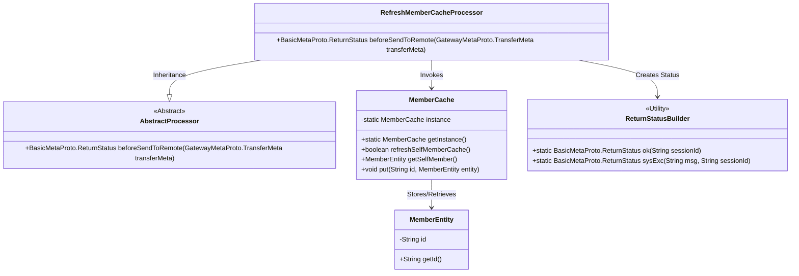
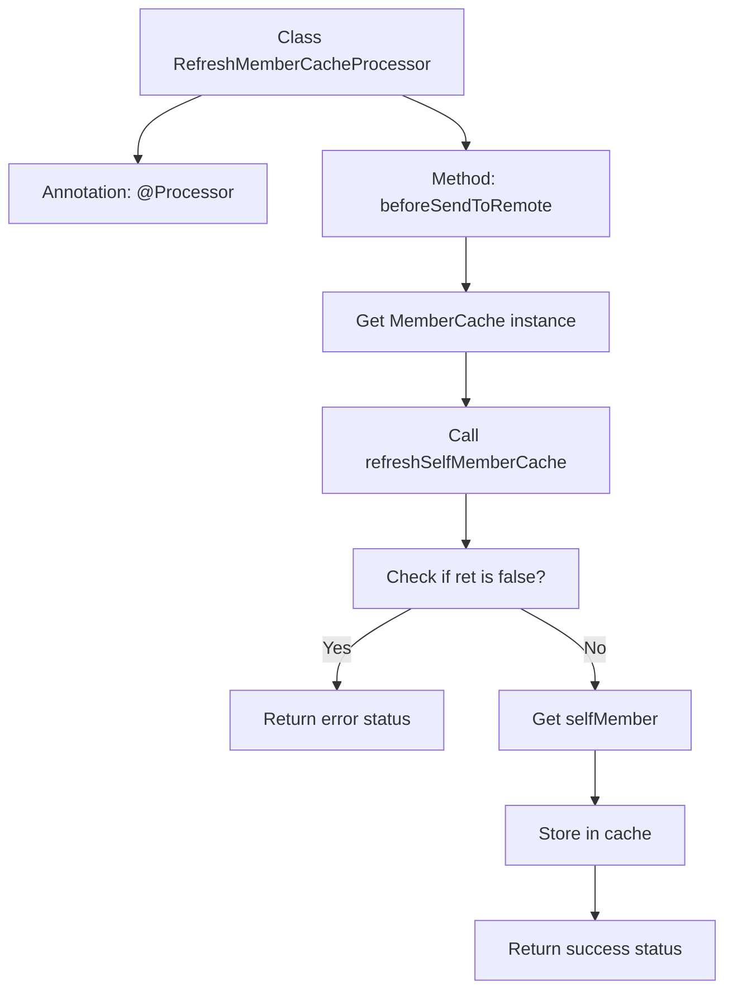

# Basic Information

|      |      |
|------|------|
| Name | RefreshMemberCacheProcessor |
| Language | .java |
| Code Path | WeFe/gateway/src/main/java/com/welab/wefe/gateway/service/processors/RefreshMemberCacheProcessor.java |
| Package Name | com.welab.wefe.gateway.service.processors |
| Dependencies | ['com.welab.wefe.common.wefe.enums.GatewayProcessorType', 'com.welab.wefe.gateway.api.meta.basic.BasicMetaProto', 'com.welab.wefe.gateway.api.meta.basic.GatewayMetaProto', 'com.welab.wefe.gateway.base.Processor', 'com.welab.wefe.gateway.cache.MemberCache', 'com.welab.wefe.gateway.common.ReturnStatusBuilder', 'com.welab.wefe.gateway.entity.MemberEntity'] |
| Brief Description | Refresh member cache handler, checks and updates the local cache, returns an error on failure, and returns the status on success. |

# Description

The content describes a processor class named RefreshMemberCacheProcessor, which is used to refresh local member cache. This class inherits from AbstractProcessor and is identified by the annotation as GatewayProcessorType.refreshMemberCacheProcessor. The main functionality is implemented in the beforeSendToRemote method: first, it obtains the MemberCache instance and attempts to refresh its own member cache, returning an error status if it fails; if successful, it retrieves its own member entity and stores it in the cache, finally returning a success status. The entire process involves auxiliary classes such as TransferMeta and ReturnStatus.

# Class Summary

| Name   | Type  | Description |
|-------|------|-------------|
| RefreshMemberCacheProcessor | class | Refresh member cache handler, checks and updates the local member cache, returns an error status on failure, or stores the current member information and returns a success status on success. |

## Class RefreshMemberCacheProcessor

|      |      |
|------|------|
| Access Modifier | @Processor(type = GatewayProcessorType.refreshMemberCacheProcessor, desc = "Refresh local member cache processor");public |
| Type | class |
| Name | RefreshMemberCacheProcessor |
| Description | Refresh member cache handler, checks and updates the local member cache, returns an error status on failure, or stores the current member information and returns a success status on success. |

### UML Class Diagram

This code demonstrates a RefreshMemberCacheProcessor that inherits from AbstractProcessor, utilizing the singleton pattern to access a MemberCache instance for refreshing and manipulating member cache data. Key processes include: 1) Refreshing local cache; 2) Retrieving current member entity; 3) Updating cache; 4) Returning operation status. The class diagram clearly illustrates inheritance relationships, utility class invocations, and associations between cache and entity classes, reflecting the core logic of cache synchronization in a gateway system.

### Internal Method Call Graph

This flowchart illustrates the core processing logic of the RefreshMemberCacheProcessor class. The process begins with the beforeSendToRemote method, which first retrieves the MemberCache singleton and attempts to refresh the local member cache. If the refresh fails, it returns an error status; otherwise, it retrieves the current member entity and updates it in the cache before finally returning a success status. The entire process demonstrates the key control flow and exception handling path for cache refresh, with arrows clearly showing the logical relationships between each step.

### Field List

| Name  | Type  | Description |
|-------|-------|------|

### Method List

| Name  | Type  | Description |
|-------|-------|------|
| beforeSendToRemote | BasicMetaProto.ReturnStatus | The method `beforeSendToRemote` refreshes the member cache, returning an error status on failure or updating the cache and returning a success status on success. |

