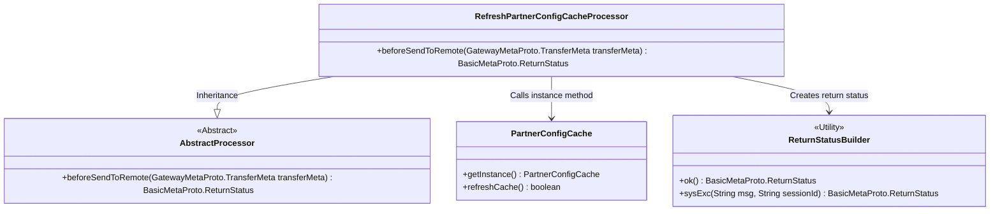
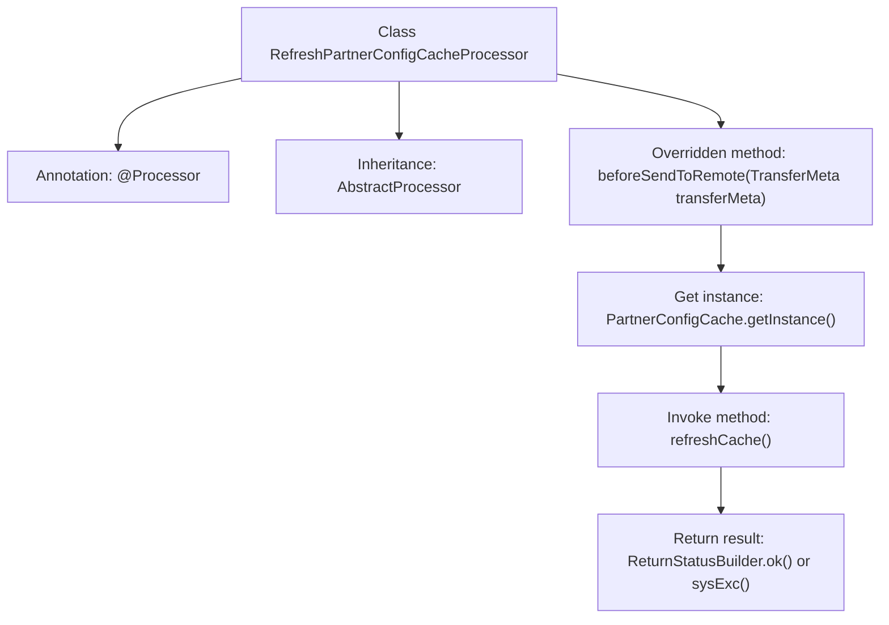

# Basic Information

|      |      |
|------|------|
| Name | RefreshPartnerConfigCacheProcessor |
| Language | .java |
| Code Path | WeFe/gateway/src/main/java/com/welab/wefe/gateway/service/processors/RefreshPartnerConfigCacheProcessor.java |
| Package Name | com.welab.wefe.gateway.service.processors |
| Dependencies | ['com.welab.wefe.common.wefe.enums.GatewayProcessorType', 'com.welab.wefe.gateway.api.meta.basic.BasicMetaProto', 'com.welab.wefe.gateway.api.meta.basic.GatewayMetaProto', 'com.welab.wefe.gateway.base.Processor', 'com.welab.wefe.gateway.cache.PartnerConfigCache', 'com.welab.wefe.gateway.common.ReturnStatusBuilder'] |
| Brief Description | The handler class for refreshing partner configuration cache updates the cache by invoking the refreshCache method of the PartnerConfigCache instance, returning an OK status upon success or an error message along with the session ID upon failure. |

# Description

This is a processor class named `RefreshPartnerConfigCacheProcessor`, which inherits from `AbstractProcessor`. It is annotated as the type `GatewayProcessorType.refreshPartnerConfigCacheProcessor` with the description "Refresh local partner config processor". The processor overrides the `beforeSendToRemote` method, where it invokes the `refreshCache` method through the singleton instance of `PartnerConfigCache` to refresh the partner configuration cache. If the refresh succeeds, it returns an `OK` status; otherwise, it returns a system exception status containing the error message and session ID.

# Class Summary

| Name   | Type  | Description |
|-------|------|-------------|
| RefreshPartnerConfigCacheProcessor | class | The handler class for refreshing partner configuration cache, which updates the cache via the refreshCache method, returns an OK status upon success, and returns error messages along with the session ID upon failure. |

## Class RefreshPartnerConfigCacheProcessor

|      |      |
|------|------|
| Access Modifier | @Processor(type = GatewayProcessorType.refreshPartnerConfigCacheProcessor, desc = "Refresh local partner config processor");public |
| Type | class |
| Name | RefreshPartnerConfigCacheProcessor |
| Description | The handler class for refreshing partner configuration cache, which updates the cache via the refreshCache method, returns an OK status upon success, and returns error messages along with the session ID upon failure. |

### UML Class Diagram

This class diagram illustrates the core structure of the Refresh Partner Config Cache Processor. The RefreshPartnerConfigCacheProcessor inherits from AbstractProcessor, refreshes the cache via the PartnerConfigCache singleton, and utilizes the ReturnStatusBuilder utility class to construct return statuses. The processor implements core logic in the beforeSendToRemote method, returning an OK status upon success and a system exception status with session ID upon failure. All components collaborate through clear dependency relationships to form a complete cache refresh workflow.

### Internal Method Call Graph

This flowchart illustrates the core structure and workflow of the RefreshPartnerConfigCacheProcessor class. Marked as a gateway processor by the @Processor annotation, the class inherits from the AbstractProcessor base class. The main logic is implemented in the overridden beforeSendToRemote method: first obtaining the PartnerConfigCache singleton instance, then invoking its refreshCache method to update the cache, and finally returning either a success status or a system exception status with error information based on the refresh result. The entire process clearly reflects the responsibility chain and exception handling mechanism of the cache refresh processor.

### Field List

| Name  | Type  | Description |
|-------|-------|------|

### Method List

| Name  | Type  | Description |
|-------|-------|------|
| beforeSendToRemote | BasicMetaProto.ReturnStatus | The method `beforeSendToRemote` checks the partner configuration cache refresh status, returning `OK` on success or an error message along with the session ID on failure. |

