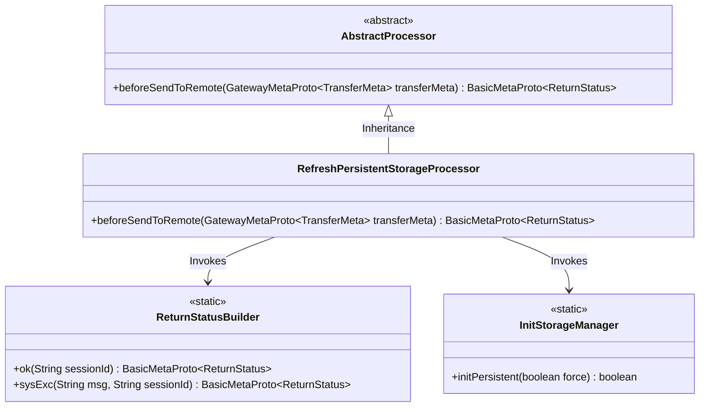
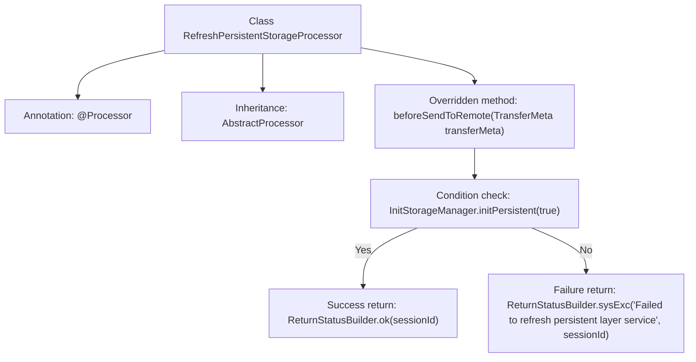

# Basic Information

|      |      |
|------|------|
| Name | RefreshPersistentStorageProcessor |
| Language | .java |
| Code Path | WeFe/gateway/src/main/java/com/welab/wefe/gateway/service/processors/RefreshPersistentStorageProcessor.java |
| Package Name | com.welab.wefe.gateway.service.processors |
| Dependencies | ['com.welab.wefe.common.wefe.enums.GatewayProcessorType', 'com.welab.wefe.gateway.api.meta.basic.BasicMetaProto', 'com.welab.wefe.gateway.api.meta.basic.GatewayMetaProto', 'com.welab.wefe.gateway.base.Processor', 'com.welab.wefe.gateway.common.ReturnStatusBuilder', 'com.welab.wefe.gateway.init.InitStorageManager'] |
| Brief Description | Refresh Persistent Storage Handler Class, inherits from the Abstract Handler, returns operation status by initializing the storage manager, returns OK on success, or an error message on failure. |

# Description

The content describes a processor class named RefreshPersistentStorageProcessor, which belongs to the GatewayProcessorType.refreshPersistentStorageProcessor type. This class inherits from AbstractProcessor and overrides the beforeSendToRemote method. The method takes a TransferMeta parameter and initializes persistent layer storage by calling InitStorageManager.initPersistent(true). If the initialization succeeds, it returns a success status containing the session ID; if it fails, it returns a system exception status with an error message and the session ID. The entire process is used to refresh the persistent layer service.

# Class Summary

| Name   | Type  | Description |
|-------|------|-------------|
| RefreshPersistentStorageProcessor | class | Refresh persistent storage handler class, inherits from abstract handler, overrides the pre-remote-send method, returns OK status upon successful storage initialization, and returns system exception status upon failure. |

## Class RefreshPersistentStorageProcessor

|      |      |
|------|------|
| Access Modifier | @Processor(type = GatewayProcessorType.refreshPersistentStorageProcessor, desc = "Refresh persistent storage processor");public |
| Type | class |
| Name | RefreshPersistentStorageProcessor |
| Description | Refresh persistent storage handler class, inherits from abstract handler, overrides the pre-remote-send method, returns OK status upon successful storage initialization, and returns system exception status upon failure. |

### UML Class Diagram

Class Diagram Description: The diagram illustrates that RefreshPersistentStorageProcessor inherits from the abstract class AbstractProcessor and overrides the beforeSendToRemote method. The processor invokes the initPersistent method of the static class InitStorageManager to initialize the persistent layer and constructs a return status using ReturnStatusBuilder based on the result. The overall structure reflects the processing flow of the gateway handler for persistent layer refresh operations, including error handling and status return mechanisms.

### Internal Method Call Graph

This code demonstrates a processor class for refreshing persistent storage, which inherits from an abstract processor class and is identified by annotations indicating its type and description. The core method is beforeSendToRemote, which returns different statuses based on the result of initializing persistent storage: a success status with session ID when successful, or a system exception status containing error information when failed. The flowchart clearly presents the class structure and main method logic.

### Field List

| Name  | Type  | Description |
|-------|-------|------|

### Method List

| Name  | Type  | Description |
|-------|-------|------|
| beforeSendToRemote | BasicMetaProto.ReturnStatus | The method checks the initialization status of the persistence layer, returns OK upon success, and returns an error message along with the session ID upon failure. |

