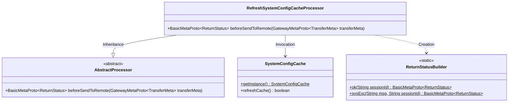
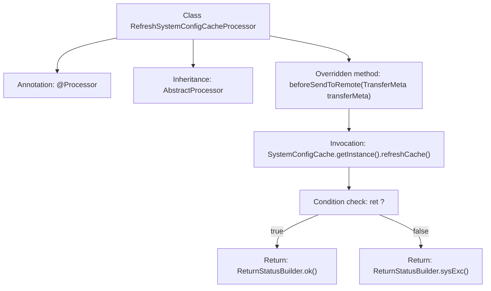

# Basic Information

|      |      |
|------|------|
| Name | RefreshSystemConfigCacheProcessor |
| Language | .java |
| Code Path | WeFe/gateway/src/main/java/com/welab/wefe/gateway/service/processors/RefreshSystemConfigCacheProcessor.java |
| Package Name | com.welab.wefe.gateway.service.processors |
| Dependencies | ['com.welab.wefe.common.wefe.enums.GatewayProcessorType', 'com.welab.wefe.gateway.api.meta.basic.BasicMetaProto', 'com.welab.wefe.gateway.api.meta.basic.GatewayMetaProto', 'com.welab.wefe.gateway.base.Processor', 'com.welab.wefe.gateway.cache.SystemConfigCache', 'com.welab.wefe.gateway.common.ReturnStatusBuilder'] |
| Brief Description | The processor class for refreshing system configuration cache updates the cache through the refreshCache method and returns the operation status (success or failure). |

# Description

This is a processor class designed for refreshing the system configuration cache, inherited from an abstract base processor class. The processor type is defined as a system configuration cache refresh processor. The core logic is implemented in the `beforeSendToRemote` method, which refreshes the cache by invoking the `refreshCache` method of the `SystemConfigCache` singleton. Upon successful operation, it returns a success status containing the session ID; in case of failure, it returns a system exception status with the error message and session ID. The entire processor focuses on the functionality of refreshing the system configuration cache.

# Class Summary

| Name   | Type  | Description |
|-------|------|-------------|
| RefreshSystemConfigCacheProcessor | class | The processor class for refreshing system configuration cache, which inherits from AbstractProcessor, updates the cache through the refreshCache method and returns a success or failure status. |

## Class RefreshSystemConfigCacheProcessor

|      |      |
|------|------|
| Access Modifier | @Processor(type = GatewayProcessorType.refreshSystemConfigCacheProcessor, desc = "Refresh system configuration cache processor");public |
| Type | class |
| Name | RefreshSystemConfigCacheProcessor |
| Description | The processor class for refreshing system configuration cache, which inherits from AbstractProcessor, updates the cache through the refreshCache method and returns a success or failure status. |

### UML Class Diagram

This code demonstrates a processor class for refreshing system configuration cache, which inherits from an abstract processor class. Its primary functionality is to refresh the cache via the SystemConfigCache singleton and construct return statuses using the ReturnStatusBuilder based on results. The class diagram clearly illustrates inheritance relationships, utility class invocations, and the usage of static builders, reflecting the implementation approach of concrete processors in the Chain of Responsibility pattern.

### Internal Method Call Graph

This flowchart illustrates the structure and workflow of the RefreshSystemConfigCacheProcessor class. Marked as a gateway processor by the @Processor annotation, the class inherits from AbstractProcessor and overrides the beforeSendToRemote method. The method first invokes SystemConfigCache's refreshCache method to refresh the cache, then constructs and returns either a success or failure ReturnStatus object based on the result. The entire process clearly demonstrates the conditional branching and status return logic path.

### Field List

| Name  | Type  | Description |
|-------|-------|------|

### Method List

| Name  | Type  | Description |
|-------|-------|------|
| beforeSendToRemote | BasicMetaProto.ReturnStatus | The method refreshes the system configuration cache before sending a remote request, returning an OK status upon success or a system exception status along with the session ID upon failure. |

