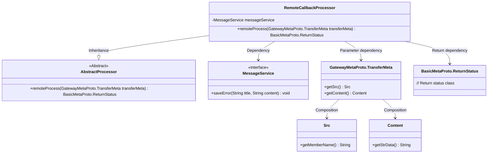
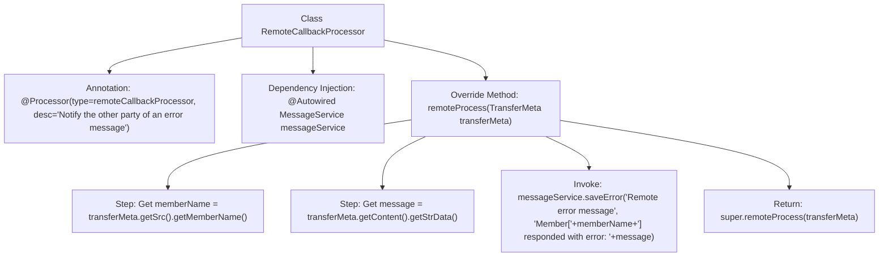

# Basic Information

|      |      |
|------|------|
| Name | RemoteCallbackProcessor |
| Language | .java |
| Code Path | WeFe/gateway/src/main/java/com/welab/wefe/gateway/service/processors/RemoteCallbackProcessor.java |
| Package Name | com.welab.wefe.gateway.service.processors |
| Dependencies | ['com.welab.wefe.common.wefe.enums.GatewayProcessorType', 'com.welab.wefe.gateway.api.meta.basic.BasicMetaProto', 'com.welab.wefe.gateway.api.meta.basic.GatewayMetaProto', 'com.welab.wefe.gateway.base.Processor', 'com.welab.wefe.gateway.service.MessageService', 'org.springframework.beans.factory.annotation.Autowired'] |
| Brief Description | Remote callback handler class, which saves member error messages via the messaging service and returns the processing status. |

# Description

This is a remote callback processor class named RemoteCallbackProcessor, used to notify the counterpart of error messages. It inherits from AbstractProcessor and is annotated as a remote callback processor type. The class injects MessageService for message processing. The core method remoteProcess receives transmission metadata, extracts the member name and message content from it, calls the message service to save the error information in the format "Member [name] responded with error content: message", and finally invokes the parent class method for processing.

# Class Summary

| Name   | Type  | Description |
|-------|------|-------------|
| RemoteCallbackProcessor | class | Remote callback handler class, which saves error information through the messaging service, including member names and error content. |

## Class RemoteCallbackProcessor

|      |      |
|------|------|
| Access Modifier | @Processor(type = GatewayProcessorType.remoteCallbackProcessor, desc = "Notify the other party of an error message");public |
| Type | class |
| Name | RemoteCallbackProcessor |
| Description | Remote callback handler class, which saves error information through the messaging service, including member names and error content. |

### UML Class Diagram

This code demonstrates a remote callback processor `RemoteCallbackProcessor`, which inherits from `AbstractProcessor` and implements error message notification functionality. The class diagram clearly illustrates the relationships between core classes: the processor saves error logs by depending on the `MessageService` interface, parses `Src` and `Content` data from the `TransferMeta` parameter during processing, and ultimately returns a `ReturnStatus` status object. The overall structure reflects the combination of the Chain of Responsibility pattern and dependency injection, making it suitable for error callback scenarios in distributed systems.

### Internal Method Call Graph

This code flowchart illustrates the core processing flow of the RemoteCallbackProcessor class. Marked as a remote callback processor via the @Processor annotation, the class injects the MessageService and sequentially executes in the remoteProcess method: extracting member name and message content from transfer metadata, invoking the message service to store contextual error logs, and finally calling the parent class processing method. The entire process achieves capturing, formatted storage, and propagation of remote error messages.

### Field List

| Name  | Type  | Description |
|-------|-------|------|
| messageService | MessageService | Automatically inject the MessageService instance. |

### Method List

| Name  | Type  | Description |
|-------|-------|------|
| remoteProcess | BasicMetaProto.ReturnStatus | The method `remoteProcess` handles remote transmission metadata, logs member error messages, and invokes the parent class method. |

