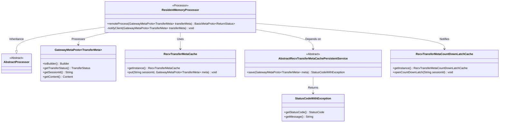

# Basic Information

|      |      |
|------|------|
| Name | ResidentMemoryProcessor |
| Language | .java |
| Code Path | WeFe/gateway/src/main/java/com/welab/wefe/gateway/service/processors/ResidentMemoryProcessor.java |
| Package Name | com.welab.wefe.gateway.service.processors |
| Dependencies | ['com.welab.wefe.common.StatusCode', 'com.welab.wefe.common.exception.StatusCodeWithException', 'com.welab.wefe.common.wefe.enums.GatewayProcessorType', 'com.welab.wefe.gateway.GatewayServer', 'com.welab.wefe.gateway.api.meta.basic.BasicMetaProto', 'com.welab.wefe.gateway.api.meta.basic.GatewayMetaProto', 'com.welab.wefe.gateway.base.Processor', 'com.welab.wefe.gateway.cache.RecvTransferMetaCache', 'com.welab.wefe.gateway.cache.RecvTransferMetaCountDownLatchCache', 'com.welab.wefe.gateway.common.ReturnStatusBuilder', 'com.welab.wefe.gateway.service.base.AbstractRecvTransferMetaCachePersistentService'] |
| Brief Description | Resident memory processor, processes transmission metadata, sets the status to completed and persists it. If successful, stores it in the cache (excluding content); if failed, marks it as erroneous and notifies the client. |

# Description

The ResidentMemoryProcessor is a memory-resident processor that inherits from AbstractProcessor. It handles remote transmission metadata by first setting the state to COMPLETE, then saving the data through the persistence service. If the save fails, it returns an error state; if successful, it clears the content and stores it in the cache. Any exceptions during processing are logged with the ERROR state set. Finally, it notifies the client of data arrival via the notifyClient method. The entire process ensures data persistence and state updates while preventing excessive cache growth.

# Class Summary

| Name   | Type  | Description |
|-------|------|-------------|
| ResidentMemoryProcessor | class | Resident memory processor, processes transmission metadata, sets the status to completed and persists it, logs errors and notifies the client in case of exceptions, and notifies the client of data arrival upon success. |

## Class ResidentMemoryProcessor

|      |      |
|------|------|
| Access Modifier | @Processor(type = GatewayProcessorType.residentMemoryProcessor, desc = "Memory resident processor");public |
| Type | class |
| Name | ResidentMemoryProcessor |
| Description | Resident memory processor, processes transmission metadata, sets the status to completed and persists it, logs errors and notifies the client in case of exceptions, and notifies the client of data arrival upon success. |

### UML Class Diagram

This diagram illustrates the ResidentMemoryProcessor class and its related dependencies. ResidentMemoryProcessor inherits from AbstractProcessor, processes GatewayMetaProto.TransferMeta objects, utilizes RecvTransferMetaCache for caching operations, depends on AbstractRecvTransferMetaCachePersistentService for persistence, and notifies clients via RecvTransferMetaCountDownLatchCache. The persistence service returns StatusCodeWithException status objects. The overall structure clearly demonstrates the interaction relationships between the processor and caching, persistence services, and client notification mechanisms.

### Internal Method Call Graph

This code demonstrates the core workflow of a resident memory processor, primarily handling the persistence of transfer metadata and client notification. The flowchart clearly illustrates both normal and exception handling paths, including key steps such as status setting, service acquisition, data persistence, cache operations, and client notification. The sequence diagram details the interaction sequence between components, particularly the collaboration between the persistent service and countdown latch cache. The entire design emphasizes exception handling and resource cleanup to ensure system stability.

### Field List

| Name  | Type  | Description |
|-------|-------|------|

### Method List

| Name  | Type  | Description |
|-------|-------|------|
| remoteProcess | BasicMetaProto.ReturnStatus | This method processes transmission metadata, sets the status to completed, and persists the storage. If it fails, it logs the error and sets the status to error. Regardless of success or failure, it clears the content, caches the metadata, and notifies the client. It returns OK upon success or exception information upon failure. |
| notifyClient | void | This method is used to notify the client to open the countdown latch of the specified session ID by invoking the cache instance. |

