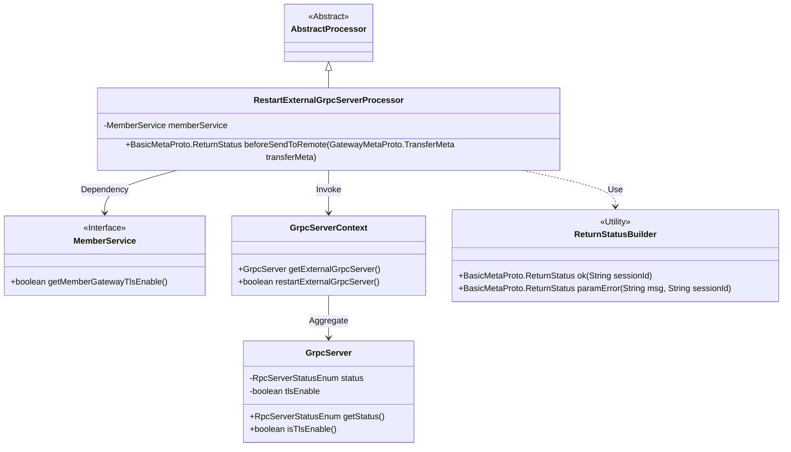
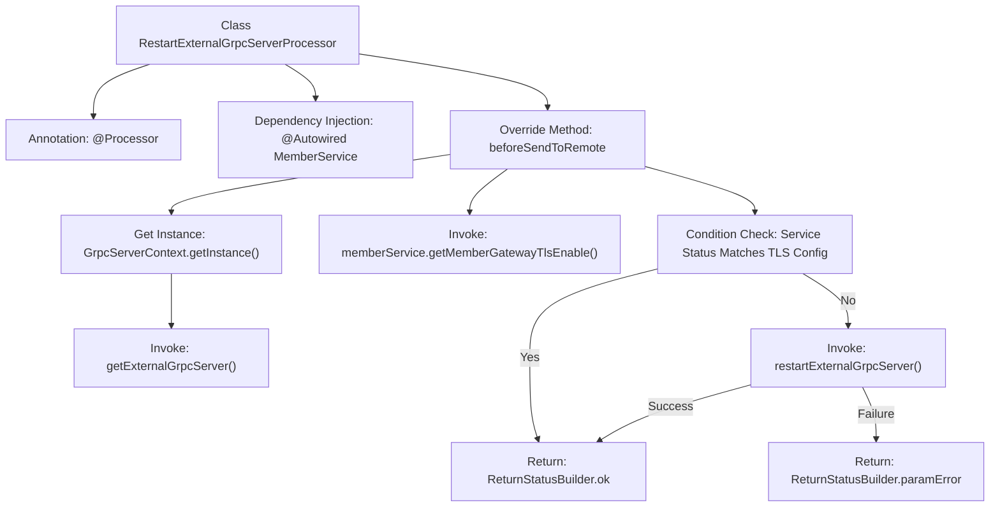

# Basic Information

|      |      |
|------|------|
| Name | RestartExternalGrpcServerProcessor |
| Language | .java |
| Code Path | WeFe/gateway/src/main/java/com/welab/wefe/gateway/service/processors/RestartExternalGrpcServerProcessor.java |
| Package Name | com.welab.wefe.gateway.service.processors |
| Dependencies | ['com.welab.wefe.common.wefe.enums.GatewayProcessorType', 'com.welab.wefe.gateway.api.meta.basic.BasicMetaProto', 'com.welab.wefe.gateway.api.meta.basic.GatewayMetaProto', 'com.welab.wefe.gateway.base.Processor', 'com.welab.wefe.gateway.common.ReturnStatusBuilder', 'com.welab.wefe.gateway.common.RpcServerStatusEnum', 'com.welab.wefe.gateway.init.grpc.GrpcServer', 'com.welab.wefe.gateway.init.grpc.GrpcServerContext', 'com.welab.wefe.gateway.service.MemberService', 'org.springframework.beans.factory.annotation.Autowired'] |
| Brief Description | The `RestartExternalGrpcServerProcessor` class is used to restart an external gRPC server, check the server status and TLS settings, and perform the restart operation if needed while returning the status result. |

# Description

This is a processor class named RestartExternalGrpcServerProcessor, designed to restart an external gRPC server. It inherits from AbstractProcessor and is annotated as GatewayProcessorType.restartExternalGrpcServer. The class injects a MemberService member service and overrides the beforeSendToRemote method. This method first checks the current gRPC server status and TLS settings, returning success if conditions are met. Otherwise, it attempts to restart the server, returning a success status if successful or a parameter error message if failed. The entire process associates the session ID from the transmission metadata.

# Class Summary

| Name   | Type  | Description |
|-------|------|-------------|
| RestartExternalGrpcServerProcessor | class | The RestartExternalGrpcServerProcessor class is used to restart external gRPC services, check service status and TLS settings, returning OK on success or error messages on failure. |

## Class RestartExternalGrpcServerProcessor

|      |      |
|------|------|
| Access Modifier | @Processor(type = GatewayProcessorType.restartExternalGrpcServer, desc = "Restart external grpc server processor");public |
| Type | class |
| Name | RestartExternalGrpcServerProcessor |
| Description | The RestartExternalGrpcServerProcessor class is used to restart external gRPC services, check service status and TLS settings, returning OK on success or error messages on failure. |

### UML Class Diagram

This code demonstrates a processor class structure for restarting external gRPC servers. The core class `RestartExternalGrpcServerProcessor` inherits from an abstract processor, retrieves server instances via `GrpcServerContext`, and relies on `MemberService` to obtain TLS configurations. It directly returns success when the server status is running and TLS configurations match, otherwise attempts to restart the server. The class diagram clearly illustrates dependency relationships and responsibility divisions among components, including the usage of the utility class `ReturnStatusBuilder`.

### Internal Method Call Graph

This flowchart illustrates the core processing logic of RestartExternalGrpcServerProcessor. It first retrieves the external gRPC service instance via GrpcServerContext, then checks whether the service runtime status matches the TLS configuration. If matched, it directly returns success; otherwise, it attempts to restart the service. A successful restart returns an OK status, while a failure returns a parameter error. The entire process involves multiple conditional branches and external service invocations, demonstrating a complete control flow for gRPC service state management.

### Field List

| Name  | Type  | Description |
|-------|-------|------|
| memberService | MemberService | Automatically inject the MemberService instance. |

### Method List

| Name  | Type  | Description |
|-------|-------|------|
| beforeSendToRemote | BasicMetaProto.ReturnStatus | Method checks the gRPC server status. If it is running and the TLS configuration matches, it returns success; otherwise, it attempts to restart the server, returning success if successful or an error message if it fails. |

