# Basic Information

|      |      |
|------|------|
| Name | processors |
| Language | .java |
| Code Path | WeFe/gateway/src/main/java/com/welab/wefe/gateway/service/processors |
| Package Name | docs.gateway.src.main.java.com.welab.wefe.gateway.service.processors |
| Brief Description | Distributed Service Availability Check Framework, including gateway connection verification and backend health checks, supports multi-level probes and dual-track mode, covering full-link validation from network to storage, with various processor implementations such as MySQL checks, cache refreshes, etc. |

# Description

## Overview  
This module is a service health management framework for distributed systems, with core responsibilities including gateway connectivity detection and microservice status checks, resembling a multi-layer probe system. It adopts a dual-interface specification comprising the Processor abstract class (beforeSendToRemote/remoteProcess) and the Checkpoint mechanism (doCheck/desc). Key data structures include the transmission metadata URI, ReturnStatusBuilder response body, and multi-type checkpoints (e.g., MySQL/Storage). Dependencies cover infrastructure such as gateway networks, function computing, MySQL, and file systems—for example, FileSystemCheckpoint validates directory permissions, while GatewayAliveProcessor detects dual-network connectivity.  

## Core Business Scenarios  
The module supports two types of detection scenarios: gateway-level (e.g., network topology validation) and service-level (e.g., MySQL connection checks), employing a "local pre-check → remote validation" layered strategy. A typical workflow, such as GatewayAvailableProcessor, first verifies session legitimacy before executing multi-checkpoint scans, comprehensively covering end-to-end validation from network to storage. Integration cases include JNI calls to storage services, SM4-encrypted communication (BoardHttpProcessor), and gRPC service restarts (RestartExternalGrpcServerProcessor), akin to a distributed self-healing system. Cache refresh (e.g., RefreshMemberCacheProcessor) and asynchronous message processing (DbFlowTableProcessor) form auxiliary business flows.

### Package Internal Structure View

```mermaid
graph TD
    processors --> available
    processors --> RefreshFcStorageProcessor.java
    processors --> RefreshMemberBlacklistCacheProcessor.java
    processors --> DbFlowTableProcessor.java
    processors --> BoardHttpProcessor.java
    processors --> DbChatTableProcessor.java
    processors --> RefreshMemberCacheProcessor.java
    processors --> RefreshSystemConfigCacheProcessor.java
    processors --> ResidentMemoryProcessor.java
    processors --> RemoteCallbackProcessor.java
    processors --> AbstractProcessor.java
    processors --> RestartExternalGrpcServerProcessor.java
    processors --> RefreshPartnerConfigCacheProcessor.java
    processors --> RefreshPersistentStorageProcessor.java
    processors --> DsourceProcessor.java
    processors --> AvailableCheckBeforeStartJobProcessor.java
    processors --> ProcessorContext.java
    available --> checkpoint
    available --> GatewayAliveProcessor.java
    available --> GatewayAvailableProcessor.java
    checkpoint --> FcCheckpoint.java
    checkpoint --> MysqlCheckpoint.java
    checkpoint --> FileSystemCheckpoint.java
    checkpoint --> StorageCheckpoint.java
    checkpoint --> BoardCheckpoint.java
    checkpoint --> UnionCheckpoint.java
```

This flowchart illustrates the hierarchical structure of WeFe gateway service processors. The root node "processors" contains two main branches: the "available" directory and multiple independent processor files. The "available" directory is further divided into a "checkpoint" subdirectory and two processor files, with the "checkpoint" subdirectory comprising six different types of checkpoint processor implementations. The overall structure clearly demonstrates the organization of the processor module, with a well-defined hierarchy between top-level processors and specific functional processors.

# File List

| Name   | Type  | Description |
|-------|------|-------------|
| [RefreshFcStorageProcessor.java](RefreshFcStorageProcessor.md) | file | Refresh the FC storage processor, initialize the storage manager, and return a success status. |
| [RefreshMemberBlacklistCacheProcessor.java](RefreshMemberBlacklistCacheProcessor.md) | file | The processor class for refreshing the member blacklist cache, inheriting from AbstractProcessor, invokes the MemberBlacklistCache to refresh the cache via the beforeSendToRemote method, returning a success or failure status. |
| [DbFlowTableProcessor.java](DbFlowTableProcessor.md) | file | The DbFlowTableProcessor stores messages into the MySQL process action queue, handles exceptions, and returns status. |
| [BoardHttpProcessor.java](BoardHttpProcessor.md) | file | BoardHttpProcessor is an HTTP-mode message handler responsible for encrypting transmitted data and pushing it to the board module, while recording processing time and handling exceptions. It includes encryption/decryption logic and remote request processing. |
| [DbChatTableProcessor.java](DbChatTableProcessor.md) | file | DbChatTableProcessor stores messages into the MySQL exchange center queue, handles exceptions, and returns status. |
| [RefreshMemberCacheProcessor.java](RefreshMemberCacheProcessor.md) | file | Refresh member cache handler, checks and updates the local cache, returns an error on failure, and returns the status on success. |
| [RefreshSystemConfigCacheProcessor.java](RefreshSystemConfigCacheProcessor.md) | file | The processor class for refreshing system configuration cache updates the cache through the refreshCache method and returns the operation status (success or failure). |
| [ResidentMemoryProcessor.java](ResidentMemoryProcessor.md) | file | Resident memory processor, processes transmission metadata, sets status to completed and persists it. On success, stores in cache (excluding content); on failure, marks error and notifies client. |
| [RemoteCallbackProcessor.java](RemoteCallbackProcessor.md) | file | Remote callback handler class, which saves member error messages via the messaging service and returns the processing status. |
| [AbstractProcessor.java](AbstractProcessor.md) | file | The abstract class AbstractProcessor provides a message processing framework, including methods such as pre-send processing, remote pushing, and receiving processing, supporting subclass extensions. Key methods include beforeSendToRemote, toRemote, and remoteProcess, and it incorporates the target member verification functionality dstMemberIsSelf. |
| [RestartExternalGrpcServerProcessor.java](RestartExternalGrpcServerProcessor.md) | file | The `RestartExternalGrpcServerProcessor` class is used to restart an external gRPC server, check the server status and TLS settings, and perform the restart operation if needed while returning the status result. |
| [RefreshPartnerConfigCacheProcessor.java](RefreshPartnerConfigCacheProcessor.md) | file | The processor class for refreshing the partner configuration cache updates the cache by invoking the `refreshCache` method of the `PartnerConfigCache` instance. It returns an OK status upon success, or an error message along with the session ID upon failure. |
| [RefreshPersistentStorageProcessor.java](RefreshPersistentStorageProcessor.md) | file | Refresh persistent storage handler class, inherits from the abstract handler, returns operation status through initializing the storage manager, returns OK on success, and error message on failure. |
| [DsourceProcessor.java](DsourceProcessor.md) | file | The DsourceProcessor class is responsible for big data transmission processing, such as CK database data. It includes methods for pre-send validation, data persistence and caching, pushing streaming data to remote endpoints, and receiving and processing remote data. It validates data structures and mandatory fields, caches data upon successful persistence, and logs errors upon failure. For pushing and receiving data, it invokes transferMetaDataSource and transferMetaDataSink respectively for processing. |
| [AvailableCheckBeforeStartJobProcessor.java](AvailableCheckBeforeStartJobProcessor.md) | file | Availability check processor verifies whether the persistence service is initialized before task startup and returns an exception status if uninitialized. |
| [ProcessorContext.java](ProcessorContext.md) | file | The `ProcessorContext` class loads all processor classes into the `PROCESSOR_MAP` via a static block, and provides the `getProcessor` method to retrieve a processor instance by name, throwing an exception if it does not exist. |
| [available](available/_module.md) | package | Service Availability Check Framework validates connectivity for six types of backend services including Function Compute and MySQL by inheriting AbstractCheckpoint. Unified interface specifications cover service type, description, and check logic. Key components include configuration services and persistent storage. Applied for system startup pre-checks and scheduled monitoring. The gateway handler class examines intranet/extranet connection status and service health status. |

