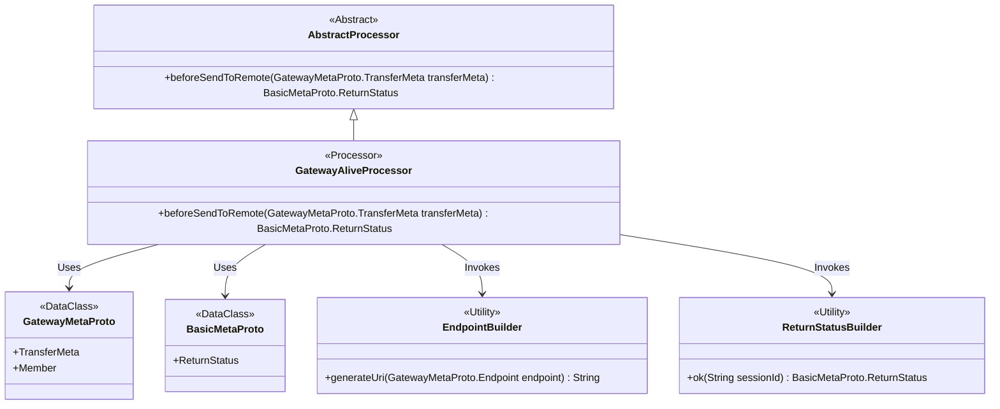

# Basic Information

|      |      |
|------|------|
| Name | GatewayAliveProcessor |
| Language | .java |
| Code Path | WeFe/gateway/src/main/java/com/welab/wefe/gateway/service/processors/available/GatewayAliveProcessor.java |
| Package Name | com.welab.wefe.gateway.service.processors.available |
| Dependencies | ['com.welab.wefe.common.wefe.enums.GatewayProcessorType', 'com.welab.wefe.gateway.api.meta.basic.BasicMetaProto', 'com.welab.wefe.gateway.api.meta.basic.GatewayMetaProto', 'com.welab.wefe.gateway.base.Processor', 'com.welab.wefe.gateway.common.EndpointBuilder', 'com.welab.wefe.gateway.common.ReturnStatusBuilder', 'com.welab.wefe.gateway.service.processors.AbstractProcessor'] |
| Brief Description | Gateway survival handler, checking the connectivity status of internal and external networks, verifying through URI comparison and remote invocation. |

# Description

The code defines a gateway alive processor class `GatewayAliveProcessor`, which inherits from `AbstractProcessor`. It is annotated as a gateway alive processor type. The core functionality involves detecting gateway connection status through the `beforeSendToRemote` method: first, it retrieves the source member and destination member information from the transport metadata and generates the corresponding URI address. If the source member ID matches the destination member ID and the URIs are identical, it returns a success status; otherwise, it calls the `toRemote` method to test external network connectivity. This method is primarily used to verify the availability of both internal and external gateway connections.

# Class Summary

| Name   | Type  | Description |
|-------|------|-------------|
| GatewayAliveProcessor | class | The GatewayAliveProcessor class is used to detect gateway liveliness status and handle internal/external network connection tests, inheriting from AbstractProcessor. It determines the connection type by comparing source and target member information, then returns the status result. |

## Class GatewayAliveProcessor

|      |      |
|------|------|
| Access Modifier | @Processor(type = GatewayProcessorType.gatewayAliveProcessor, desc = "Gateway survival processor");public |
| Type | class |
| Name | GatewayAliveProcessor |
| Description | The GatewayAliveProcessor class is used to detect gateway liveliness status and handle internal/external network connection tests, inheriting from AbstractProcessor. It determines the connection type by comparing source and target member information, then returns the status result. |

### UML Class Diagram

This diagram illustrates the class structure of the gateway alive processor. GatewayAliveProcessor inherits from AbstractProcessor and is annotated as a gateway alive processor. It depends on GatewayMetaProto to handle transfer metadata, utilizes BasicMetaProto for return status, invokes EndpointBuilder to generate URIs, and employs ReturnStatusBuilder to construct return statuses. The core logic of the processor detects intranet/extranet connectivity by comparing source/target member IDs and URIs.

### Internal Method Call Graph

This flowchart illustrates the core logic of GatewayAliveProcessor for gateway liveliness detection. The processor first parses source/destination member information from transfer metadata and generates corresponding URI addresses. If an intranet self-connectivity test is detected (same memberId and URI), it directly returns a success status; otherwise, it proceeds with external network connectivity testing. The entire process reflects a hierarchical verification mechanism for network connection status.

### Field List

| Name  | Type  | Description |
|-------|-------|------|

### Method List

| Name  | Type  | Description |
|-------|-------|------|
| beforeSendToRemote | BasicMetaProto.ReturnStatus | The method `beforeSendToRemote` checks the transmission metadata to verify whether the source and destination member IDs and URIs are the same (for intranet testing). If they are the same, it returns a success status; otherwise, it calls `toRemote` for external network testing. |

