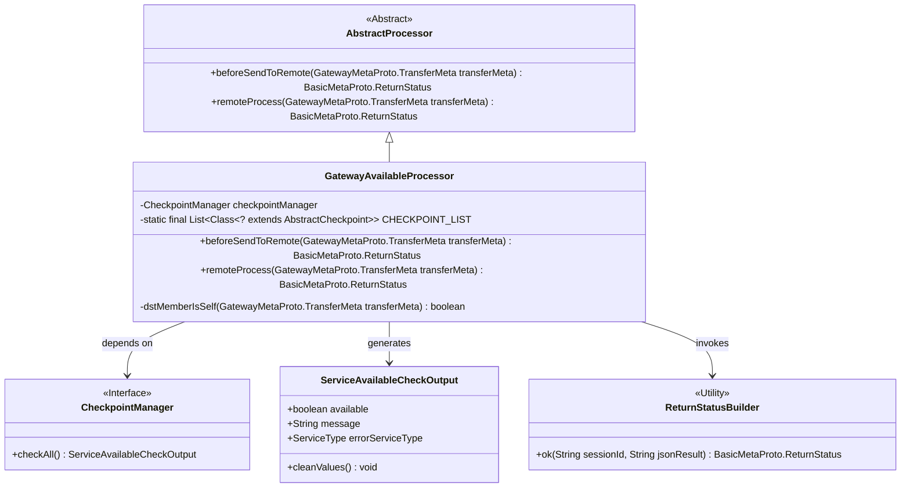
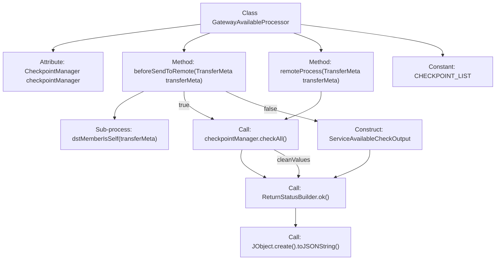
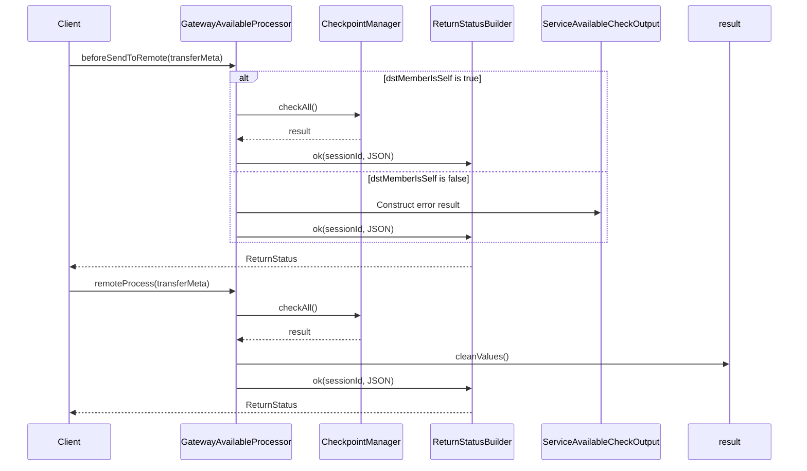

# Basic Information

|      |      |
|------|------|
| Name | GatewayAvailableProcessor |
| Language | .java |
| Code Path | WeFe/gateway/src/main/java/com/welab/wefe/gateway/service/processors/available/GatewayAvailableProcessor.java |
| Package Name | com.welab.wefe.gateway.service.processors.available |
| Dependencies | ['com.welab.wefe.common.util.JObject', 'com.welab.wefe.common.wefe.checkpoint.AbstractCheckpoint', 'com.welab.wefe.common.wefe.checkpoint.CheckpointManager', 'com.welab.wefe.common.wefe.checkpoint.dto.ServiceAvailableCheckOutput', 'com.welab.wefe.common.wefe.enums.GatewayProcessorType', 'com.welab.wefe.common.wefe.enums.ServiceType', 'com.welab.wefe.gateway.api.meta.basic.BasicMetaProto', 'com.welab.wefe.gateway.api.meta.basic.GatewayMetaProto', 'com.welab.wefe.gateway.base.Processor', 'com.welab.wefe.gateway.common.ReturnStatusBuilder', 'com.welab.wefe.gateway.service.processors.AbstractProcessor', 'com.welab.wefe.gateway.service.processors.available.checkpoint', 'org.springframework.beans.factory.annotation.Autowired', 'java.util.Arrays', 'java.util.List'] |
| Brief Description | GatewayAvailableProcessor checks service availability by verifying the status of components such as MySQL and storage through checkpointManager, handles both local and remote requests, and returns status information. |

# Description

This is a gateway availability handler class used to check the status of gateway services. The class contains two main methods: `beforeSendToRemote` checks whether the target member is the local machine before sending to the remote, and if so, it calls the `checkpointManager` to check the status of all services; the `remoteProcess` method handles remote requests and returns the check results. The checkpoint list includes inspection items such as MySQL, storage, federation, dashboard, and file system. An error message is returned when an illegal session source is detected. All check results are constructed and returned via the `ReturnStatusBuilder`.

# Class Summary

| Name   | Type  | Description |
|-------|------|-------------|
| GatewayAvailableProcessor | class | The GatewayAvailableProcessor checks service availability, including MySQL, storage, etc., and returns status information. It handles both local and remote requests, verifying the session origin. |

## Class GatewayAvailableProcessor

|      |      |
|------|------|
| Access Modifier | @Processor(type = GatewayProcessorType.gatewayAvailableProcessor, desc = "Gateway availability processor");public |
| Type | class |
| Name | GatewayAvailableProcessor |
| Description | The GatewayAvailableProcessor checks service availability, including MySQL, storage, etc., and returns status information. It handles both local and remote requests, verifying the session origin. |

### UML Class Diagram

This diagram illustrates the class structure of the gateway availability processor. GatewayAvailableProcessor inherits from AbstractProcessor, performs service availability checks via CheckpointManager, generates ServiceAvailableCheckOutput results, and uses ReturnStatusBuilder to construct return statuses. The processor contains a static checkpoint list and handles gateway requests in different scenarios through the beforeSendToRemote and remoteProcess methods, ensuring comprehensive service availability validation.

### Internal Method Call Graph

This code implements a gateway availability processor, primarily containing two core methods: beforeSendToRemote performs pre-check operations and returns different service availability check results based on whether the target member is the local node; remoteProcess uniformly executes health checks for all checkpoints and returns the status. The flowchart illustrates the class structure and key method invocation relationships, while the sequence diagram details the interaction flow and data processing logic under two scenarios. The processor integrates health status checks for various infrastructure components (MySQL/storage/file systems, etc.) through CheckpointManager.

### Field List

| Name  | Type  | Description |
|-------|-------|------|
| checkpointManager | CheckpointManager | Automatically inject the CheckpointManager instance. |
| CHECKPOINT_LIST = Arrays.asList(            MysqlCheckpoint.class,            StorageCheckpoint.class,            UnionCheckpoint.class,            BoardCheckpoint.class,            FileSystemCheckpoint.class    ) | List<Class<? extends AbstractCheckpoint>> | Defined a private static immutable list CHECKPOINT_LIST containing five checkpoint classes: Mysql, Storage, Union, Board, and FileSystem. |

### Method List

| Name  | Type  | Description |
|-------|-------|------|
| beforeSendToRemote | BasicMetaProto.ReturnStatus | Check whether the target member is the local machine. If yes, return the service availability check result; otherwise, return an unauthorized access error message. |
| remoteProcess | BasicMetaProto.ReturnStatus | This method checks the availability of all services, cleans up the results, and returns a success status containing the session ID and results in JSON format. |

