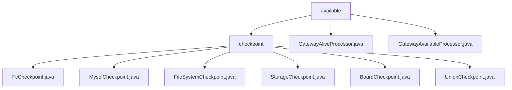

# Basic Information

|      |      |
|------|------|
| Name | available |
| Language | .java |
| Code Path | WeFe/gateway/src/main/java/com/welab/wefe/gateway/service/processors/available |
| Package Name | docs.gateway.src.main.java.com.welab.wefe.gateway.service.processors.available |
| Brief Description | Service Availability Check Framework validates connectivity for six types of backend services including Function Compute and MySQL by inheriting AbstractCheckpoint. Unified interface specifications cover service type, description, and check logic. Key components include configuration services and persistent storage. Applied for system startup pre-checks and scheduled monitoring. The gateway handler class examines intranet/extranet connection status and service health status. |

# Description

## Overview  
This module is a service availability inspection framework designed for distributed environments. Its core responsibilities include gateway connection state verification and backend service health checks, functioning similarly to a multi-level probe system. The interface specification uniformly adopts a dual-track model comprising the Processor abstract class (beforeSendToRemote/remoteProcess methods) and the Checkpoint mechanism (doCheck/desc methods). Key data structures encompass transmission metadata URI, ReturnStatusBuilder response bodies, and checkpoint lists (MySQL/Storage/Union, etc.). External dependencies involve gateway network connectivity, function computing, MySQL, file systems, Storage services, and Board-Service. For instance, the GatewayAliveProcessor detects intranet/extranet connectivity, while the FileSystemCheckpoint validates directory permissions.

## Primary Business Scenarios  
The module supports two types of inspection scenarios: gateway-level and microservice-level. The former, exemplified by GatewayAliveProcessor, verifies network topology through URI comparison, while the latter includes six Checkpoint implementations (e.g., MysqlCheckpoint for MySQL connection validation). The interaction model follows a "local-first → remote detection" layered strategy. For example, GatewayAvailableProcessor first checks session legitimacy before executing multi-checkpoint scans. Full functionality covers end-to-end validation from the network layer to the storage layer, typically applied during gateway handshake phases or scheduled heartbeat detection. API integration cases include JNI calls to storage services and POSIX file operations, resembling the self-healing mechanisms of distributed systems.

### Package Internal Structure View

This flowchart illustrates the hierarchical structure of the availability processing module in the WeFe gateway service. The top level is the 'available' directory, which contains a 'checkpoint' subdirectory and two processor files. The 'checkpoint' directory includes six different types of checkpoint implementation files, each handling checkpoint functionality for different storage systems. The entire structure clearly reflects the file organization of the gateway's availability processing module.

# File List

| Name   | Type  | Description |
|-------|------|-------------|
| [GatewayAliveProcessor.java](GatewayAliveProcessor.md) | file | Gateway liveness handler, checks the connection status of internal and external networks, verifies through URI comparison and remote invocation. |
| [checkpoint](checkpoint/_module.md) | package | FcCheckpoint checks the availability of the Function Compute environment. MysqlCheckpoint verifies the availability of the MySQL service. FileSystemCheckpoint examines the file system access functionality. StorageCheckpoint validates the availability of the storage service. BoardCheckpoint checks the connectivity with the board-service. UnionCheckpoint handles the logic for Union connection checkpoints. |
| [GatewayAvailableProcessor.java](GatewayAvailableProcessor.md) | file | GatewayAvailableProcessor checks service availability by verifying the status of components such as MySQL and storage through checkpointManager, handles both local and remote requests, and returns status information. |

