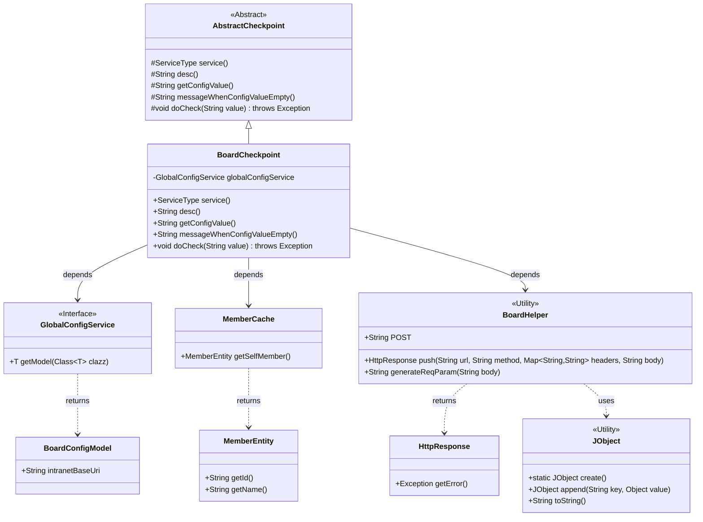
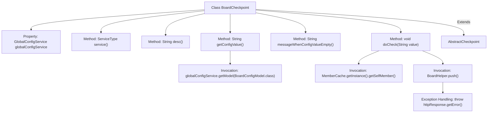

# Basic Information

|      |      |
|------|------|
| Name | BoardCheckpoint |
| Language | .java |
| Code Path | WeFe/gateway/src/main/java/com/welab/wefe/gateway/service/processors/available/checkpoint/BoardCheckpoint.java |
| Package Name | com.welab.wefe.gateway.service.processors.available.checkpoint |
| Dependencies | ['com.welab.wefe.common.http.HttpResponse', 'com.welab.wefe.common.util.JObject', 'com.welab.wefe.common.wefe.checkpoint.AbstractCheckpoint', 'com.welab.wefe.common.wefe.dto.global_config.BoardConfigModel', 'com.welab.wefe.common.wefe.enums.ServiceType', 'com.welab.wefe.gateway.cache.MemberCache', 'com.welab.wefe.gateway.entity.MemberEntity', 'com.welab.wefe.gateway.sdk.BoardHelper', 'com.welab.wefe.gateway.service.GlobalConfigService', 'org.springframework.beans.factory.annotation.Autowired', 'org.springframework.stereotype.Service', 'java.util.HashMap'] |
| Brief Description | The `BoardCheckpoint` class is used to check the connectivity between the gateway and the board-service. It retrieves the intranet address from the global configuration and sends a request for verification. If the configuration is missing, it prompts the user to set it up. |

# Description

This is a Spring service class named BoardCheckpoint, which extends AbstractCheckpoint. It is used to check the connectivity between the gateway and the board-service. The internal network address configuration of the board-service is obtained via the globalConfigService, and if not configured, it prompts the user to set it up. During the check, it constructs a request body containing the caller information and API path, sends a /gateway/redirect request to the board-service, and throws an exception if the response contains an error. The main functionalities involve configuration retrieval, request construction, and connectivity verification.

# Class Summary

| Name   | Type  | Description |
|-------|------|-------------|
| BoardCheckpoint | class | The BoardCheckpoint class checks the connectivity between the gateway and the board-service. It retrieves the intranet address through global configuration and prompts for setup if not configured, then calls the service interface to verify the connection. |

## Class BoardCheckpoint

|      |      |
|------|------|
| Access Modifier | @Service;public |
| Type | class |
| Name | BoardCheckpoint |
| Description | The BoardCheckpoint class checks the connectivity between the gateway and the board-service. It retrieves the intranet address through global configuration and prompts for setup if not configured, then calls the service interface to verify the connection. |

### UML Class Diagram

Class Diagram Description: This diagram illustrates that the BoardCheckpoint class inherits from the AbstractCheckpoint abstract class and depends on the GlobalConfigService interface to retrieve configurations. BoardCheckpoint obtains member information via MemberCache and uses the BoardHelper utility class to initiate HTTP requests, potentially throwing exceptions during response handling. JObject is utilized to construct request bodies, while BoardConfigModel stores configuration data. The overall structure implements a service connectivity check feature, involving collaborative relationships such as configuration retrieval, member information processing, and network requests.

### Internal Method Call Graph

Flowchart Description: This flowchart illustrates the structure of the BoardCheckpoint class and its method invocation relationships. The class inherits from AbstractCheckpoint and contains an injected global configuration service property along with multiple overridden methods. The core logic resides in the doCheck method, which involves retrieving member information, constructing request parameters, invoking BoardHelper to push requests, and throwing exceptions upon error responses. Configuration value retrieval is implemented through globalConfigService, forming a complete service connectivity check process.

### Field List

| Name  | Type  | Description |
|-------|-------|------|
| globalConfigService | GlobalConfigService | The code snippet uses the @Autowired annotation to automatically inject an instance of GlobalConfigService. |

### Method List

| Name  | Type  | Description |
|-------|-------|------|
| service | ServiceType | Rewrite the service method with a return type of ServiceType, defaulting to return null. |
| desc | String | Check the connectivity between the gateway and the board-service. |
| getConfigValue | String | Override the method to retrieve the configuration value. If the configuration model is null, return null; otherwise, return the intranet base URI. |
| messageWhenConfigValueEmpty | String | When the configuration value is empty, prompt the user: Configure the internal network address of the board-service in Global Settings - System Settings. |
| doCheck | void | The method `doCheck` verifies the service liveliness status, constructs a request body containing caller information and API path, and pushes it to the specified URL via `BoardHelper`. If the response contains an error, it throws an exception. |

