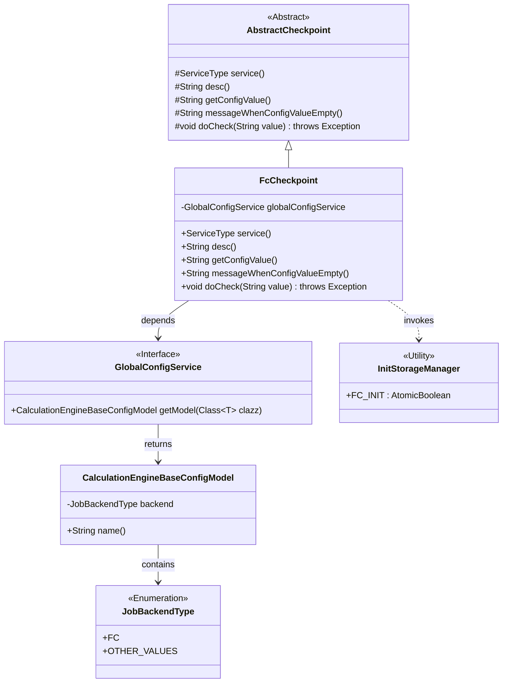
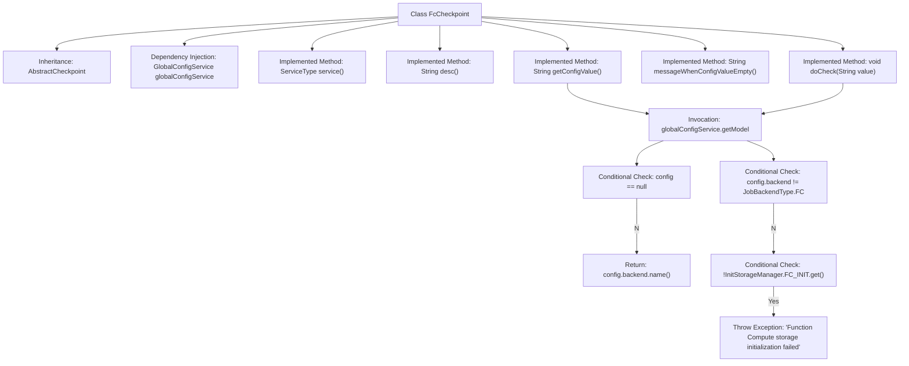

# Basic Information

|      |      |
|------|------|
| Name | FcCheckpoint |
| Language | .java |
| Code Path | WeFe/gateway/src/main/java/com/welab/wefe/gateway/service/processors/available/checkpoint/FcCheckpoint.java |
| Package Name | com.welab.wefe.gateway.service.processors.available.checkpoint |
| Dependencies | ['com.welab.wefe.common.wefe.checkpoint.AbstractCheckpoint', 'com.welab.wefe.common.wefe.dto.global_config.calculation_engine.CalculationEngineBaseConfigModel', 'com.welab.wefe.common.wefe.enums.JobBackendType', 'com.welab.wefe.common.wefe.enums.ServiceType', 'com.welab.wefe.gateway.init.InitStorageManager', 'com.welab.wefe.gateway.service.GlobalConfigService', 'org.springframework.beans.factory.annotation.Autowired', 'org.springframework.stereotype.Service'] |
| Brief Description | The FcCheckpoint class inherits from AbstractCheckpoint, checking the availability of the function computing environment, validating configurations, and initializing storage state. |

# Description

FcCheckpoint is a service class that inherits from AbstractCheckpoint, designed to verify the availability of the Function Compute environment. It retrieves the compute engine configuration via globalConfigService and skips the check if the configuration does not exist or the backend type is not FC. An exception is thrown to prompt users to check their configuration when the Function Compute storage is uninitialized. The service type is FcService, described as checking whether the Function Compute environment is available.

# Class Summary

| Name   | Type  | Description |
|-------|------|-------------|
| FcCheckpoint | class | The FcCheckpoint class inherits from AbstractCheckpoint, checking the availability of the function computing environment, validating configurations, and initializing storage states. |

## Class FcCheckpoint

|      |      |
|------|------|
| Access Modifier | @Service;public |
| Type | class |
| Name | FcCheckpoint |
| Description | The FcCheckpoint class inherits from AbstractCheckpoint, checking the availability of the function computing environment, validating configurations, and initializing storage states. |

### UML Class Diagram

Class Diagram Description: This diagram illustrates that the FcCheckpoint class inherits from the AbstractCheckpoint abstract class, implementing service type checking, configuration retrieval, and validation logic. FcCheckpoint depends on the GlobalConfigService interface to obtain computation engine configurations, where the configuration model CalculationEngineBaseConfigModel includes the JobBackendType enumeration. During validation, it invokes the utility class state of InitStorageManager. The overall structure reflects a layered design of Spring service components, implementing the validation template pattern through the abstract base class.

### Internal Method Call Graph

This flowchart illustrates the structure and main logic flow of the FcCheckpoint class. The class inherits from AbstractCheckpoint, retrieves configuration through globalConfigService, and implements 5 core methods. The key logic resides in the doCheck method, which verifies configuration validity and storage initialization status, throwing an exception if checks fail to prompt users to review Function Compute configurations. The complete workflow demonstrates configuration retrieval, conditional validation, and exception handling, ensuring Function Compute environment availability.

### Field List

| Name  | Type  | Description |
|-------|-------|------|
| globalConfigService | GlobalConfigService | Use @Autowired to automatically inject an instance of GlobalConfigService. |

### Method List

| Name  | Type  | Description |
|-------|-------|------|
| messageWhenConfigValueEmpty | String | Method override, returning a null value indicates the message when the configuration value is empty. |
| getConfigValue | String | The method `getConfigValue` retrieves the `CalculationEngineBaseConfigModel` from the global configuration and returns its `backend` name. If no configuration is found, it returns `null`. |
| desc | String | Checking Function Compute Environment Availability |
| service | ServiceType | Rewrite the service method to return the FcService type. |
| doCheck | void | Check the function compute configuration: skip if global configuration does not exist or the backend is not FC; if storage is not initialized, report an error prompting to check the configuration. |

