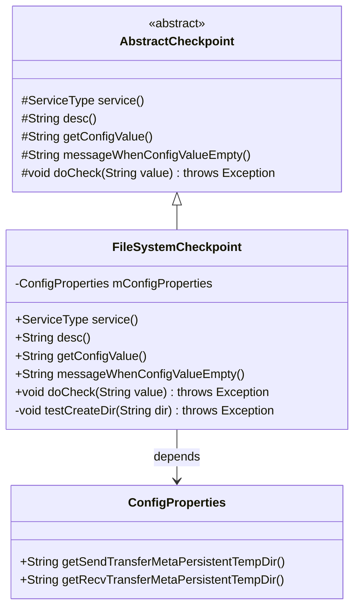
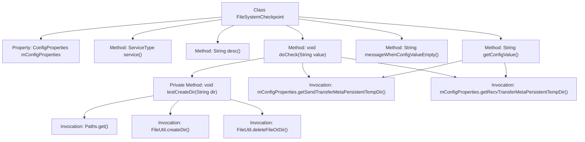

# Basic Information

|      |      |
|------|------|
| Name | FileSystemCheckpoint |
| Language | .java |
| Code Path | WeFe/gateway/src/main/java/com/welab/wefe/gateway/service/processors/available/checkpoint/FileSystemCheckpoint.java |
| Package Name | com.welab.wefe.gateway.service.processors.available.checkpoint |
| Dependencies | ['com.welab.wefe.common.util.FileUtil', 'com.welab.wefe.common.wefe.checkpoint.AbstractCheckpoint', 'com.welab.wefe.common.wefe.enums.ServiceType', 'com.welab.wefe.gateway.config.ConfigProperties', 'org.springframework.beans.factory.annotation.Autowired', 'org.springframework.stereotype.Service', 'java.io.File', 'java.nio.file.Path', 'java.nio.file.Paths'] |
| Brief Description | The FileSystemCheckpoint class inherits from AbstractCheckpoint, checks filesystem access, and verifies whether the configured send and receive directories can be created and deleted. |

# Description

FileSystemCheckpoint is a service class that inherits from AbstractCheckpoint, designed to verify filesystem access functionality. It retrieves the send and receive directory configurations via ConfigProperties and validates whether the creation and deletion operations for these directories function correctly. If configurations are missing, it prompts users to set send.transfer.meta.persistent.temp.dir and recv.transfer.meta.persistent.temp.dir. The core logic includes testing directory creation and deletion, throwing exceptions upon failure.

# Class Summary

| Name   | Type  | Description |
|-------|------|-------------|
| FileSystemCheckpoint | class | The FileSystemCheckpoint class inherits from AbstractCheckpoint, checks filesystem access, verifies the creation and deletion functionality of send and receive directories, and relies on configuration properties. |

## Class FileSystemCheckpoint

|      |      |
|------|------|
| Access Modifier | @Service;public |
| Type | class |
| Name | FileSystemCheckpoint |
| Description | The FileSystemCheckpoint class inherits from AbstractCheckpoint, checks filesystem access, verifies the creation and deletion functionality of send and receive directories, and relies on configuration properties. |

### UML Class Diagram

This code demonstrates a file system checkpoint service `FileSystemCheckpoint`, which inherits from the abstract class `AbstractCheckpoint` and implements multiple checkpoint-related abstract methods. The class retrieves send and receive directory configurations via `ConfigProperties` and provides testing functionality for directory creation and deletion. The class diagram clearly shows the inheritance and dependency relationships, where `FileSystemCheckpoint` handles the concrete file system access check logic, including verifying directory read/write permissions, while configuration information is obtained through the dependency-injected `ConfigProperties`. The overall design reflects object-oriented abstraction and the principle of separation of responsibilities.

### Internal Method Call Graph

This flowchart illustrates the structure and method invocation relationships of the FileSystemCheckpoint class. Inheriting from AbstractCheckpoint, the class contains configuration property injection and core validation logic. The main workflow involves: retrieving directory configurations via getConfigValue, then testing directory creation/deletion functionality in doCheck by calling testCreateDir. The testCreateDir method constructs paths using Paths, performs directory operations with FileUtil for verification, and throws exceptions upon failure. Overall, it implements a validation mechanism for filesystem access capabilities.

### Field List

| Name  | Type  | Description |
|-------|-------|------|
| mConfigProperties | ConfigProperties | Automatically inject configuration property objects. |

### Method List

| Name  | Type  | Description |
|-------|-------|------|
| getConfigValue | String | This method overrides the parent class logic, retrieves the sending and receiving directory paths through configured properties, and returns them concatenated with a vertical bar separator. |
| messageWhenConfigValueEmpty | String | The configuration file does not have the temp.dir item configured for send or recv, which needs to be set in config.properties. |
| desc | String | Check if the file system access is functioning normally. |
| service | ServiceType | Rewrite the service method to return the FileSystem service type. |
| doCheck | void | Check and create temporary directories for sending and receiving. |
| testCreateDir | void | Test the functionality of creating and deleting folders, verify if the path exists, and throw an exception upon failure. |

