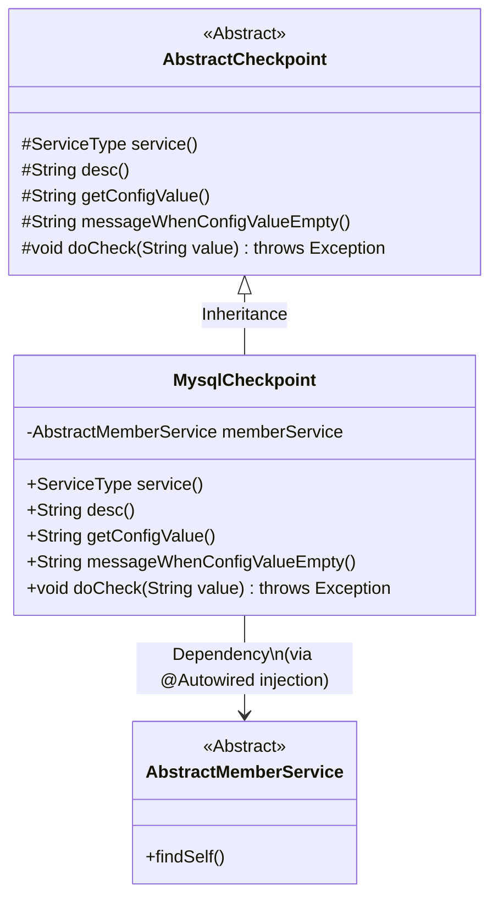
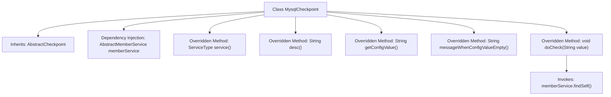

# Basic Information

|      |      |
|------|------|
| Name | MysqlCheckpoint |
| Language | .java |
| Code Path | WeFe/gateway/src/main/java/com/welab/wefe/gateway/service/processors/available/checkpoint/MysqlCheckpoint.java |
| Package Name | com.welab.wefe.gateway.service.processors.available.checkpoint |
| Dependencies | ['com.welab.wefe.common.wefe.checkpoint.AbstractCheckpoint', 'com.welab.wefe.common.wefe.enums.ServiceType', 'com.welab.wefe.gateway.service.base.AbstractMemberService', 'org.springframework.beans.factory.annotation.Autowired', 'org.springframework.stereotype.Service'] |
| Brief Description | The `MysqlCheckpoint` class inherits from `AbstractCheckpoint` and checks the availability of MySQL services by invoking `memberService.findSelf()`. |

# Description

This is a Spring service class named MysqlCheckpoint, which extends the AbstractCheckpoint abstract class. It injects the AbstractMemberService member service via @Autowired. The class overrides several methods from its parent class: the service method returns the MysqlService service type, and the desc method describes its functionality as checking MySQL service availability. The getConfigValue and messageWhenConfigValueEmpty methods return null. The core checking logic is implemented in the doCheck method, which verifies service availability by calling the findSelf method of memberService.

# Class Summary

| Name   | Type  | Description |
|-------|------|-------------|
| MysqlCheckpoint | class | The `MysqlCheckpoint` class inherits from `AbstractCheckpoint` and checks the availability of MySQL services by invoking `memberService.findSelf()`. |

## Class MysqlCheckpoint

|      |      |
|------|------|
| Access Modifier | @Service;public |
| Type | class |
| Name | MysqlCheckpoint |
| Description | The `MysqlCheckpoint` class inherits from `AbstractCheckpoint` and checks the availability of MySQL services by invoking `memberService.findSelf()`. |

### UML Class Diagram

This code demonstrates a MySQL service checkpoint implementation class MysqlCheckpoint, which inherits from the abstract class AbstractCheckpoint. The class obtains an instance of AbstractMemberService through dependency injection and calls the member service's findSelf() method within the doCheck method to verify MySQL service availability. As a concrete implementation class, it overrides the parent class's abstract methods, specifies the service type as MysqlService, and provides check descriptions. The class diagram clearly presents the inheritance relationship and dependency injection pattern, reflecting the typical service component design approach in the Spring framework.

### Internal Method Call Graph

This code illustrates a Spring service class named MysqlCheckpoint that inherits from the AbstractCheckpoint abstract class. Its primary function is to verify MySQL service availability by invoking the findSelf() method through the injected memberService to implement core checking logic. The class overrides five abstract methods from its parent class: service() and desc() return service type and description information respectively, while getConfigValue() and messageWhenConfigValueEmpty() return null values. The doCheck() method contains the actual checking logic. This design exemplifies the Template Method pattern, where the parent class defines the framework of the checking process, and the child class implements specific details.

### Field List

| Name  | Type  | Description |
|-------|-------|------|
| memberService | AbstractMemberService | Automatically inject member service instance. |

### Method List

| Name  | Type  | Description |
|-------|-------|------|
| service | ServiceType | Rewrite the service method to return the MysqlService type. |
| getConfigValue | String | Method override returns null value. |
| messageWhenConfigValueEmpty | String | When the configuration value is empty, return null. |
| desc | String | Check if the MySQL service is available. |
| doCheck | void | Check method calls member service to look up its own information. |

