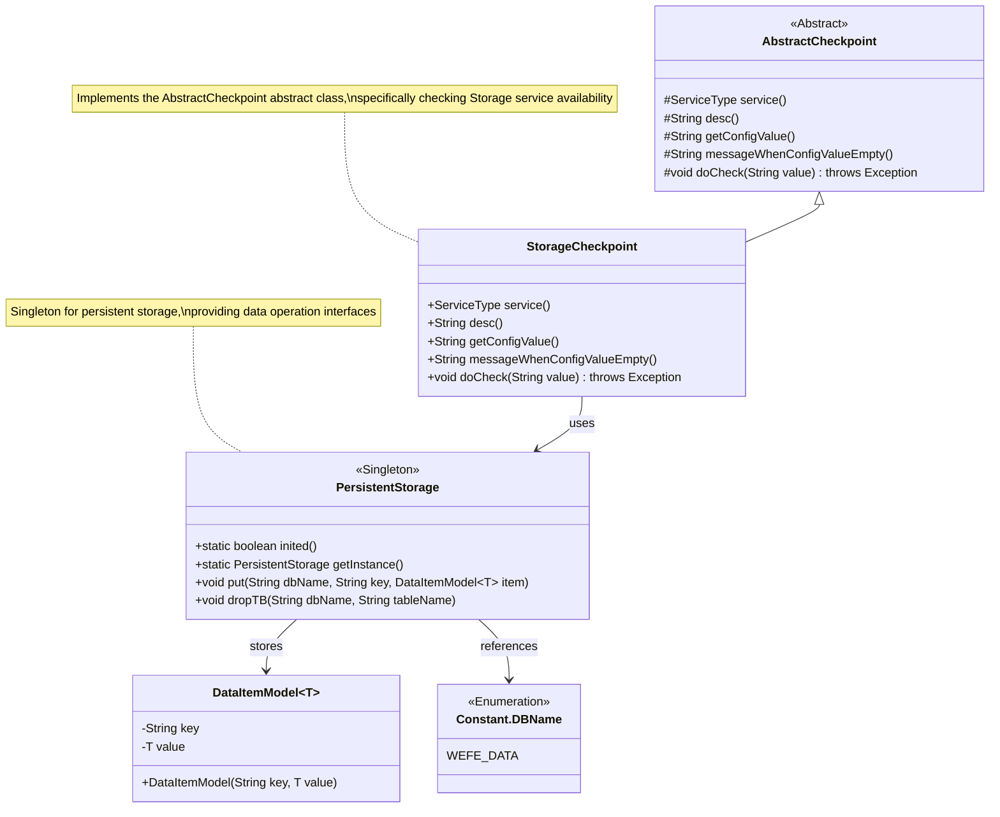
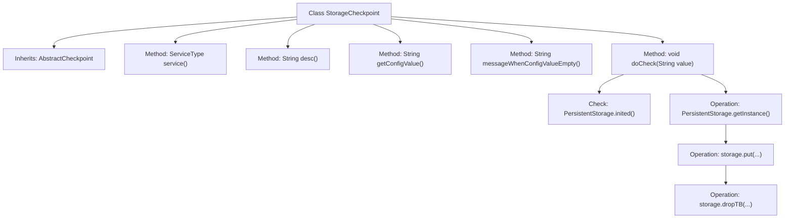

# Basic Information

|      |      |
|------|------|
| Name | StorageCheckpoint |
| Language | .java |
| Code Path | WeFe/gateway/src/main/java/com/welab/wefe/gateway/service/processors/available/checkpoint/StorageCheckpoint.java |
| Package Name | com.welab.wefe.gateway.service.processors.available.checkpoint |
| Dependencies | ['com.welab.wefe.common.data.storage.common.Constant', 'com.welab.wefe.common.data.storage.model.DataItemModel', 'com.welab.wefe.common.data.storage.service.persistent.PersistentStorage', 'com.welab.wefe.common.wefe.checkpoint.AbstractCheckpoint', 'com.welab.wefe.common.wefe.enums.ServiceType', 'org.apache.commons.lang3.RandomStringUtils', 'org.springframework.stereotype.Service'] |
| Brief Description | The `StorageCheckpoint` class inherits from `AbstractCheckpoint` to verify whether the storage service is accessible normally, checking storage initialization and read/write operations. |

# Description

StorageCheckpoint is a service class that inherits from AbstractCheckpoint, designed to inspect the gateway's access status to the storage service. Its service type is defined as StorageService, with a functional description of verifying the availability of the storage service. This class overrides multiple methods from its parent class, among which the doCheck method serves as the core logic: it first checks whether PersistentStorage is initialized, throwing an exception to prompt storage configuration verification if uninitialized; then it performs test operations, including generating a random name, writing test data to the WEFE_DATA database table via a PersistentStorage instance, and finally deleting this test table to complete the validation process. Other configuration-related methods return null values.

# Class Summary

| Name   | Type  | Description |
|-------|------|-------------|
| StorageCheckpoint | class | The `StorageCheckpoint` class inherits from `AbstractCheckpoint` and checks the gateway's access to the storage service. It verifies the storage initialization state and performs test write and delete operations. If the storage is not initialized, it throws an exception. |

## Class StorageCheckpoint

|      |      |
|------|------|
| Access Modifier | @Service;public |
| Type | class |
| Name | StorageCheckpoint |
| Description | The `StorageCheckpoint` class inherits from `AbstractCheckpoint` and checks the gateway's access to the storage service. It verifies the storage initialization state and performs test write and delete operations. If the storage is not initialized, it throws an exception. |

### UML Class Diagram

Class Diagram Description:
This diagram illustrates the structural relationships of the StorageCheckpoint service and its related classes. StorageCheckpoint inherits from the AbstractCheckpoint abstract class, implementing concrete logic to check the availability of storage services. It relies on the PersistentStorage singleton class for actual storage operations. PersistentStorage uses the generic class DataItemModel to encapsulate data items and references the Constant.DBName enumeration class to identify database names. The overall structure reflects layered design and separation of responsibilities, with StorageCheckpoint focusing on inspection logic and PersistentStorage handling underlying storage operations.

### Internal Method Call Graph

This flowchart illustrates the structure of the StorageCheckpoint class and its core method invocation relationships. The class inherits from AbstractCheckpoint, primarily implementing abstract methods such as service type declaration and description information return. The core logic is concentrated in the doCheck method: first verifying the initialization status of the storage system, then validating storage operations (including data writing and table deletion steps) using randomly generated test data. The entire process demonstrates a complete storage service availability verification mechanism, encompassing both abnormal state detection and normal operation validation branches.

### Field List

| Name  | Type  | Description |
|-------|-------|------|

### Method List

| Name  | Type  | Description |
|-------|-------|------|
| doCheck | void | The method `doCheck` verifies whether the dataset storage is initialized; if not, it throws an exception. It then generates a random name, stores the test data, and immediately deletes it. |
| getConfigValue | String | Method override, returning empty configuration values. |
| service | ServiceType | Rewrite the service method to return the StorageService type. |
| messageWhenConfigValueEmpty | String | Method override, returning a null value indicates the message when the configuration value is empty. |
| desc | String | Check if the gateway can access the storage service normally. |

