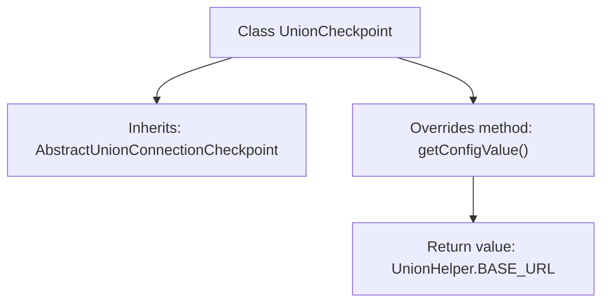

# Basic Information

|      |      |
|------|------|
| Name | UnionCheckpoint |
| Language | .java |
| Code Path | WeFe/gateway/src/main/java/com/welab/wefe/gateway/service/processors/available/checkpoint/UnionCheckpoint.java |
| Package Name | com.welab.wefe.gateway.service.processors.available.checkpoint |
| Dependencies | ['com.welab.wefe.common.wefe.checkpoint.AbstractUnionConnectionCheckpoint', 'com.welab.wefe.gateway.sdk.UnionHelper', 'org.springframework.stereotype.Service'] |
| Brief Description | The `UnionCheckpoint` class inherits from `AbstractUnionConnectionCheckpoint` and overrides the `getConfigValue` method to return `UnionHelper.BASE_URL`. |

# Description

The content describes a service class named UnionCheckpoint, which inherits from the abstract class AbstractUnionConnectionCheckpoint. This class overrides the getConfigValue method, returning UnionHelper.BASE_URL as the configuration value. This indicates that the class is used to handle checkpoint logic related to Union connections and retrieves the base URL configuration through the abstract method provided by the base class. The implementation is concise and focused on returning a specific configuration value.

# Class Summary

| Name   | Type  | Description |
|-------|------|-------------|
| UnionCheckpoint | class | The `UnionCheckpoint` class inherits from `AbstractUnionConnectionCheckpoint` and overrides the `getConfigValue` method to return `UnionHelper.BASE_URL`. |


## Class UnionCheckpoint

|      |      |
|------|------|
| Access Modifier | @Service;public |
| Type | class |
| Name | UnionCheckpoint |
| Description | The `UnionCheckpoint` class inherits from `AbstractUnionConnectionCheckpoint` and overrides the `getConfigValue` method to return `UnionHelper.BASE_URL`. |


### UML Class Diagram

```mermaid
classDiagram
    class AbstractUnionConnectionCheckpoint {
        <<Abstract>>
        +String getConfigValue()*
    }
    // AbstractUnionConnectionCheckpoint is an abstract base class defining the abstract method getConfigValue

    class UnionCheckpoint {
        +String getConfigValue()
    }
    // UnionCheckpoint inherits and implements the abstract method getConfigValue from AbstractUnionConnectionCheckpoint

    class UnionHelper {
        <<final>>
        +String BASE_URL
    }
    // UnionHelper provides the constant BASE_URL

    AbstractUnionConnectionCheckpoint <|-- UnionCheckpoint : Inheritance Implementation
    UnionCheckpoint --> UnionHelper : Dependency on Constant
```

This class diagram illustrates that UnionCheckpoint inherits from the abstract class AbstractUnionConnectionCheckpoint and implements its getConfigValue method, which returns the BASE_URL constant from the UnionHelper class. As a concrete service class, UnionCheckpoint realizes the configuration value retrieval logic through inheritance, while UnionHelper serves as a utility class providing the base URL constant. The overall design demonstrates the application of the Template Method pattern, where the abstract class defines the algorithm skeleton and concrete subclasses implement specific steps.


### Internal Method Call Graph



This flowchart illustrates the structure of the UnionCheckpoint class, which is a service class inheriting from AbstractUnionConnectionCheckpoint and overriding the getConfigValue() method. The method returns the value of UnionHelper.BASE_URL. The entire process is concise and clear, demonstrating the inheritance relationship between classes and the logic of method overriding.

### Field List

| Name  | Type  | Description |
|-------|-------|------|

### Method List

| Name  | Type  | Description |
|-------|-------|------|
| getConfigValue | String | Rewrite the method to return the BASE_URL value of UnionHelper. |


