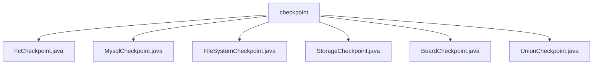

# Basic Information

|      |      |
|------|------|
| Name | checkpoint |
| Language | .java |
| Code Path | WeFe/gateway/src/main/java/com/welab/wefe/gateway/service/processors/available/checkpoint |
| Package Name | docs.gateway.src.main.java.com.welab.wefe.gateway.service.processors.available.checkpoint |
| Brief Description | FcCheckpoint checks the availability of the Function Compute environment. MysqlCheckpoint verifies the availability of the MySQL service. FileSystemCheckpoint examines the file system access functionality. StorageCheckpoint validates the availability of the storage service. BoardCheckpoint checks the connectivity with the board-service. UnionCheckpoint handles the logic for Union connection checkpoints. |

# Description

## Overview  
This module serves as a service availability checking framework, with its core responsibility being to verify the connectivity of various backend services by inheriting `AbstractCheckpoint`, akin to a health check probe. The interface specification uniformly adopts three key elements: service type definition (e.g., `FcService`/`MysqlService`), descriptive information (`desc` method), and core check logic (`doCheck` method). Key data structures include the `GlobalConfigService` configuration service, `PersistentStorage` for persistent storage, and `ConfigProperties` for directory configuration. External dependencies involve the Function Compute environment, MySQL database, file system, Storage service, and Board-Service. For example, `FcCheckpoint` validates Function Compute configurations, while `FileSystemCheckpoint` tests directory read/write capabilities.  

## Core Business Scenarios  
The module supports six typical check scenarios: Function Compute configuration validation (`FcCheckpoint`), MySQL service connectivity testing (`MysqlCheckpoint`), file system permission verification (`FileSystemCheckpoint`), Storage service read/write testing (`StorageCheckpoint`), Board-Service interface invocation (`BoardCheckpoint`), and Union connection checking (`UnionCheckpoint`). The interaction pattern follows the "configuration retrieval → test operation → exception handling" workflow. For instance, `StorageCheckpoint` verifies database write capabilities by creating temporary tables. The framework provides comprehensive coverage for multi-level health checks, from infrastructure to microservices, typically applied in system startup environment pre-checks or scheduled monitoring tasks. API integration examples include JNI calls to local storage services and POSIX-based file operations.

### Package Internal Structure View

This flowchart illustrates the file structure relationships within the checkpoint directory of the WeFe gateway project. The checkpoint serves as the parent node, encompassing six specific checkpoint implementation class files, including FcCheckpoint, MysqlCheckpoint, and others. These files reside at the same directory level and are designed to handle different types of availability checkpoint functionalities. Each file is directly subordinate to the checkpoint directory with no deeper nesting relationships.

# File List

| Name   | Type  | Description |
|-------|------|-------------|
| [FcCheckpoint.java](FcCheckpoint.md) | file | The FcCheckpoint class inherits from AbstractCheckpoint, checking the availability of the function computing environment, validating configurations, and initializing state storage. |
| [MysqlCheckpoint.java](MysqlCheckpoint.md) | file | The `MysqlCheckpoint` class inherits from `AbstractCheckpoint` and checks the availability of MySQL services by invoking `memberService.findSelf()`. |
| [FileSystemCheckpoint.java](FileSystemCheckpoint.md) | file | The FileSystemCheckpoint class inherits from AbstractCheckpoint, checks filesystem access, and verifies whether the configured send and receive directories can be created and deleted. |
| [StorageCheckpoint.java](StorageCheckpoint.md) | file | The `StorageCheckpoint` class inherits from `AbstractCheckpoint` and checks whether the storage service is accessible normally, verifying storage initialization as well as read/write operations. |
| [BoardCheckpoint.java](BoardCheckpoint.md) | file | The BoardCheckpoint class is used to verify the connectivity between the gateway and board-service. It retrieves the intranet address through global configuration and sends requests for validation, prompting the user to configure if settings are missing. |
| [UnionCheckpoint.java](UnionCheckpoint.md) | file | The `UnionCheckpoint` class inherits from `AbstractUnionConnectionCheckpoint` and overrides the `getConfigValue` method to return `UnionHelper.BASE_URL`. |

