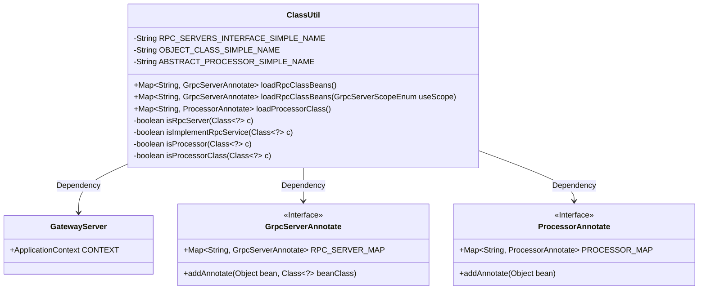
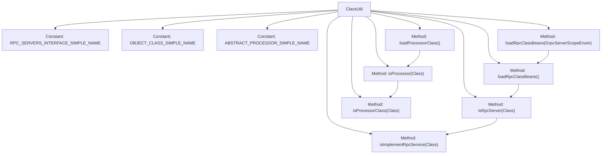

# Basic Information

|      |      |
|------|------|
| Name | ClassUtil |
| Language | .java |
| Code Path | WeFe/gateway/src/main/java/com/welab/wefe/gateway/util/ClassUtil.java |
| Package Name | com.welab.wefe.gateway.util |
| Dependencies | ['com.welab.wefe.gateway.GatewayServer', 'com.welab.wefe.gateway.base.Processor', 'com.welab.wefe.gateway.base.ProcessorAnnotate', 'com.welab.wefe.gateway.base.GrpcServer', 'com.welab.wefe.gateway.base.GrpcServerAnnotate', 'com.welab.wefe.gateway.common.GrpcServerScopeEnum', 'java.lang.reflect.Modifier', 'java.util.HashMap', 'java.util.Map'] |
| Brief Description | The ClassUtil utility class provides methods for loading RPC service and handler classes. It includes methods to determine whether a class is an RPC service or handler, supporting filtering RPC services by scope. Returns a Map structure containing annotation information. |

# Description

ClassUtil is a utility class primarily designed for loading and identifying specific types of classes. It contains three constant definitions: the base class name for RPC services, the base class name for Java objects, and the base class name for processors. It offers two main functionalities: first, loading gRPC service classes annotated with @RpcServer and returning a map containing class paths and annotation information; second, loading processor classes annotated with @Processor and returning a map containing processor names and annotation details. The class also includes multiple private methods to determine whether a class is a gRPC service class or a processor class, achieved by inspecting annotations, inheritance relationships, and interface implementations. All loaded data is stored in corresponding static maps for subsequent use.

# Class Summary

| Name   | Type  | Description |
|-------|------|-------------|
| ClassUtil | class | The ClassUtil utility class provides functionality for loading RPC service and handler classes, including methods to determine whether a class is an RPC service or handler, and supports filtering RPC service classes by scope. |

## Class ClassUtil

|      |      |
|------|------|
| Access Modifier | public |
| Type | class |
| Name | ClassUtil |
| Description | The ClassUtil utility class provides functionality for loading RPC service and handler classes, including methods to determine whether a class is an RPC service or handler, and supports filtering RPC service classes by scope. |

### UML Class Diagram

This code demonstrates a utility class `ClassUtil`, primarily used for loading and identifying classes annotated with specific annotations (`@RpcServer` and `@Processor`). `ClassUtil` checks whether a class implements a specific interface or inherits from a particular parent class through static methods, and stores the information of qualified classes in the static Maps of `GrpcServerAnnotate` and `ProcessorAnnotate`. `GatewayServer` provides the Spring application context for retrieving bean definitions. This utility class is mainly used for the dynamic loading and categorized management of gRPC services and processor classes.

### Internal Method Call Graph

This flowchart illustrates the structure of the ClassUtil class and its key method invocation relationships. The class contains 3 constant definitions and 6 core methods, where loadRpcClassBeans() and loadProcessorClass() serve as public entry methods, invoking isRpcServer() and isProcessor() respectively for class type validation. The isRpcServer() method further calls isImplementRpcService() to check interface implementation, while isProcessor() invokes isProcessorClass() to verify superclass inheritance. These methods form a clear hierarchical call chain, collectively enabling the loading functionality for gRPC services and processor classes.

### Field List

| Name  | Type  | Description |
|-------|-------|------|
| ABSTRACT_PROCESSOR_SIMPLE_NAME = "AbstractProcessor" | String | Define the constant ABSTRACT_PROCESSOR_SIMPLE_NAME with the value "AbstractProcessor". |
| RPC_SERVERS_INTERFACE_SIMPLE_NAME = "BindableService" | String | Define the constant string RPC_SERVERS_INTERFACE_SIMPLE_NAME with the value BindableService. |
| OBJECT_CLASS_SIMPLE_NAME = "Object" | String | Define a private static constant OBJECT_CLASS_SIMPLE_NAME with the value "Object". |

### Method List

| Name  | Type  | Description |
|-------|-------|------|
| loadRpcClassBeans | Map<String, GrpcServerAnnotate> | The method scans the beans in the Spring container, filters classes annotated with RPC service annotations, registers them into a global mapping table, and returns the result. |
| isProcessor | boolean | Check if the class is a processor: it must be a public class with a Processor annotation, or its parent class meets the processor conditions; otherwise, return false. |
| loadRpcClassBeans | Map<String, GrpcServerAnnotate> | Load the specified range of gRPC service classes and return the qualified annotation mapping table. |
| loadProcessorClass | Map<String, ProcessorAnnotate> | The method loads all processor classes, checks if they are of the processor type, and if so, saves them to a constant map, finally returning the processor map. |
| isRpcServer | boolean | Check if the class is a gRPC server: it must be a public class, annotated with GrpcServer, and implement the RPC service interface; otherwise, return false. |
| isImplementRpcService | boolean | Check whether the class implements the RPC service interface by comparing the interface name with the preset value. |
| isProcessorClass | boolean | Check if the class is a processor class by comparing whether the class name matches the preset abstract processor name. |

