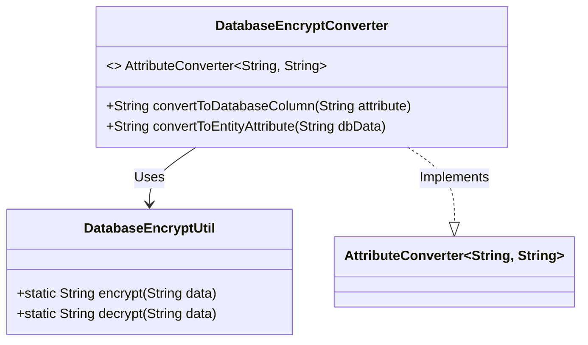
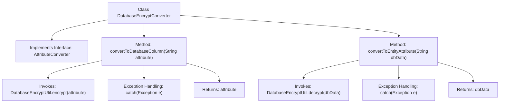

# Basic Information

|      |      |
|------|------|
| Name | DatabaseEncryptConverter |
| Language | .java |
| Code Path | WeFe/gateway/src/main/java/com/welab/wefe/gateway/util/DatabaseEncryptConverter.java |
| Package Name | com.welab.wefe.gateway.util |
| Dependencies | ['javax.persistence.AttributeConverter'] |
| Brief Description | The DatabaseEncryptConverter class implements the property conversion interface, providing encryption and decryption methods while returning the original value in case of exceptions. |

# Description

The `DatabaseEncryptConverter` class implements the `AttributeConverter` interface and is used for encrypting and decrypting string-type database fields. This class contains two core methods: the `convertToDatabaseColumn` method invokes `DatabaseEncryptUtil.encrypt` to encrypt attribute values, returning the original value if encryption fails; the `convertToEntityAttribute` method calls `DatabaseEncryptUtil.decrypt` to decrypt database data, also returning the original data if decryption fails. This converter enables automatic encryption during data storage and automatic decryption during data retrieval.

# Class Summary

| Name   | Type  | Description |
|-------|------|-------------|
| DatabaseEncryptConverter | class | Database Encryption Converter Class, implements encryption and decryption conversion between string properties and database columns, returns the original value in case of exceptions. |

## Class DatabaseEncryptConverter

|      |      |
|------|------|
| Access Modifier | public |
| Type | class |
| Name | DatabaseEncryptConverter |
| Description | Database Encryption Converter Class, implements encryption and decryption conversion between string properties and database columns, returns the original value in case of exceptions. |

### UML Class Diagram

This code demonstrates a database encryption converter `DatabaseEncryptConverter`, which implements the `AttributeConverter<String, String>` interface for encrypting/decrypting conversions between entity attributes and database column values. The class achieves functionality by invoking static encryption/decryption methods from `DatabaseEncryptUtil`, returning the original value if conversion fails. The class diagram clearly illustrates the implementation relationship, dependency relationship, and the invocation pattern of the utility class.

### Internal Method Call Graph

This code demonstrates a database encryption converter class that implements the AttributeConverter interface for bidirectional encrypted conversion between entity attributes and database columns. The flowchart clearly illustrates the execution logic of two core methods, convertToDatabaseColumn and convertToEntityAttribute, including both normal encryption/decryption flows and exception handling paths. When exceptions occur during encryption or decryption, the methods return the original data, reflecting a robust error handling mechanism. The entire process presents a complete processing chain from method invocation to final return value.

### Field List

| Name  | Type  | Description |
|-------|-------|------|

### Method List

| Name  | Type  | Description |
|-------|-------|------|
| convertToEntityAttribute | String | The method `convertToEntityAttribute` attempts to decrypt `dbData` and returns the original value if decryption fails. |
| convertToDatabaseColumn | String | This method is used to encrypt string attributes before storing them in the database, and returns the original value if encryption fails. |

