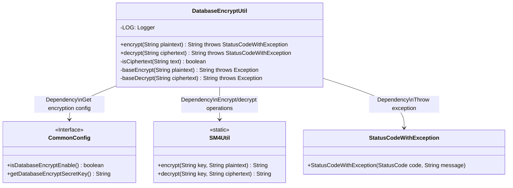
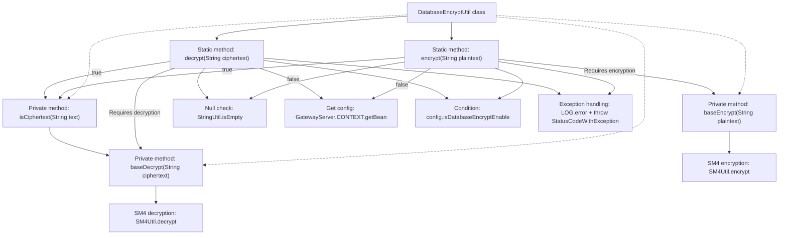

# Basic Information

|      |      |
|------|------|
| Name | DatabaseEncryptUtil |
| Language | .java |
| Code Path | WeFe/gateway/src/main/java/com/welab/wefe/gateway/util/DatabaseEncryptUtil.java |
| Package Name | com.welab.wefe.gateway.util |
| Dependencies | ['com.welab.wefe.common.StatusCode', 'com.welab.wefe.common.exception.StatusCodeWithException', 'com.welab.wefe.common.util.SM4Util', 'com.welab.wefe.common.util.StringUtil', 'com.welab.wefe.gateway.GatewayServer', 'com.welab.wefe.gateway.config.CommonConfig', 'org.slf4j.Logger', 'org.slf4j.LoggerFactory'] |
| Brief Description | The DatabaseEncryptUtil class provides database encryption and decryption functionality, including encryption, decryption, and ciphertext judgment methods. It employs the SM4 algorithm and supports configuration switches. |

# Description

DatabaseEncryptUtil is a utility class that provides database encryption and decryption functionalities, including encrypting, decrypting, and determining whether a string is ciphertext. The encryption method first checks if the plaintext is empty or already encrypted; if not encrypted, it invokes the SM4 algorithm for encryption. The decryption method follows a similar process, verifying if the ciphertext is empty or not encrypted, and if encrypted, it calls SM4 for decryption. Both encryption and decryption operations rely on the key and switch status configured in CommonConfig. If the operation fails, it logs the error and throws an exception. The isCiphertext method determines whether a string is ciphertext by attempting to decrypt it.

# Class Summary

| Name   | Type  | Description |
|-------|------|-------------|
| DatabaseEncryptUtil | class | The DatabaseEncryptUtil class provides database encryption and decryption functionalities, including methods for encryption, decryption, and ciphertext verification. It employs the SM4 algorithm and supports configuration switches. |

## Class DatabaseEncryptUtil

|      |      |
|------|------|
| Access Modifier | public |
| Type | class |
| Name | DatabaseEncryptUtil |
| Description | The DatabaseEncryptUtil class provides database encryption and decryption functionalities, including methods for encryption, decryption, and ciphertext verification. It employs the SM4 algorithm and supports configuration switches. |

### UML Class Diagram

This code demonstrates a database encryption utility class DatabaseEncryptUtil, which provides static methods for string encryption and decryption operations. The class depends on the CommonConfig interface to obtain encryption configurations, utilizes SM4Util for actual encryption/decryption operations, and throws StatusCodeWithException exceptions when errors occur. Key functionalities include: checking if a string is ciphertext (isCiphertext), basic encryption (baseEncrypt) and decryption (baseDecrypt) methods, as well as publicly exposed encrypt and decrypt methods. The encryption feature can be dynamically enabled/disabled via configuration, achieving decoupling between business logic and encryption implementation.

### Internal Method Call Graph

The flowchart describes the encryption/decryption process of the DatabaseEncryptUtil class. The core logic consists of two main paths: encryption (encrypt) and decryption (decrypt), both starting with null checks before retrieving configuration to determine if encryption is enabled. The encryption path first verifies whether the input is already ciphertext to avoid double encryption, while the decryption path validates ciphertext integrity. Actual cryptographic operations are delegated to SM4Util, with comprehensive exception handling and logging throughout. The private method isCiphertext validates text encryption status through attempted decryption, forming an internal call loop.

### Field List

| Name  | Type  | Description |
|-------|-------|------|
| LOG = LoggerFactory.getLogger(DatabaseEncryptUtil.class) | Logger | Declare a private static log constant LOG for the DatabaseEncryptUtil class, created using LoggerFactory. |

### Method List

| Name  | Type  | Description |
|-------|-------|------|
| baseEncrypt | String | The private method `baseEncrypt` uses the SM4 algorithm to encrypt plaintext, with the key obtained from `CommonConfig`. |
| encrypt | String | Encryption method: Returns directly if the text is empty or already encrypted; also returns the original text if encryption is not enabled in the configuration; otherwise, calls the basic encryption. Logs the failure and throws a system error if the operation fails. |
| isCiphertext | boolean | This method determines whether the input text is ciphertext by attempting to decrypt it, returning true if decryption succeeds and false if it fails. |
| decrypt | String | The static method `decrypt` is used to decrypt strings. If the input is empty or encryption is not enabled, it directly returns the original value. When decryption fails, it logs the error and throws an exception. |
| baseDecrypt | String | The private method `baseDecrypt` is used to decrypt strings by invoking `SM4Util` and reading the decryption key from the configuration. |

