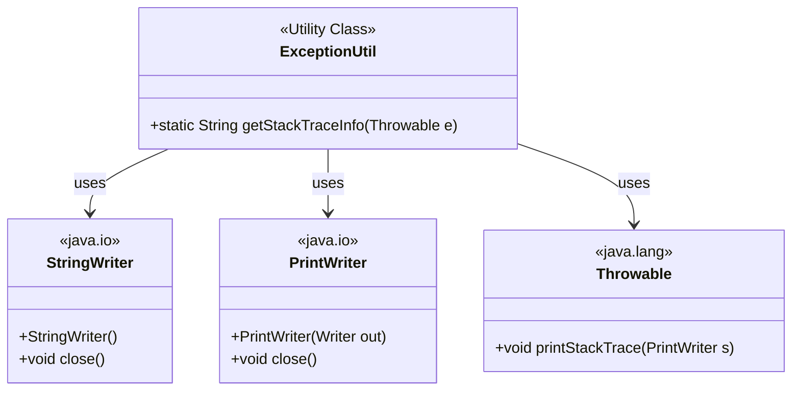
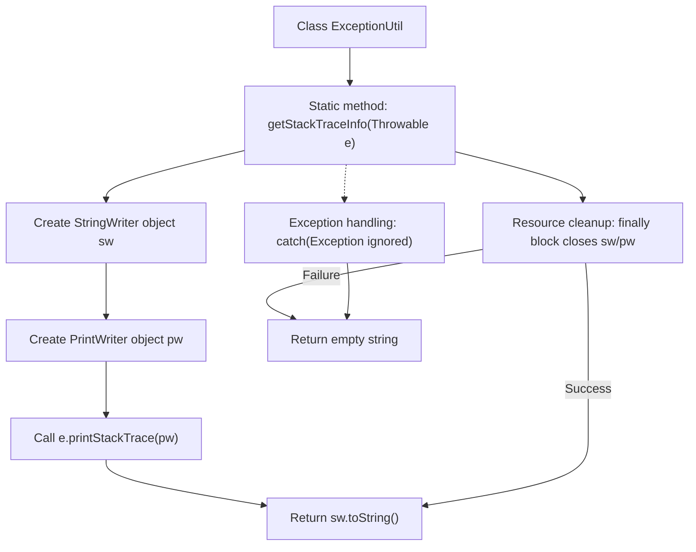

# Basic Information

|      |      |
|------|------|
| Name | ExceptionUtil |
| Language | .java |
| Code Path | WeFe/gateway/src/main/java/com/welab/wefe/gateway/util/ExceptionUtil.java |
| Package Name | com.welab.wefe.gateway.util |
| Dependencies | ['java.io.PrintWriter', 'java.io.StringWriter'] |
| Brief Description | The ExceptionUtil class provides a static method, getStackTraceInfo, which captures and returns the stack trace information string of an exception, including resource cleanup logic. |

# Description

The `ExceptionUtil` class contains a static method `getStackTraceInfo`, which is used to retrieve exception stack trace information. This method takes a `Throwable` parameter and converts the exception stack trace into a string using `StringWriter` and `PrintWriter`. Internally, it employs a `try-catch-finally` structure to ensure proper resource release, returning an empty string if an exception occurs. The method handles all possible exception scenarios, ensuring program robustness.

# Class Summary

| Name   | Type  | Description |
|-------|------|-------------|
| ExceptionUtil | class | The ExceptionUtil class provides a static method, getStackTraceInfo, which is used to retrieve exception stack trace information and return it in string format, including resource cleanup logic. |

## Class ExceptionUtil

|      |      |
|------|------|
| Access Modifier | public |
| Type | class |
| Name | ExceptionUtil |
| Description | The ExceptionUtil class provides a static method, getStackTraceInfo, which is used to retrieve exception stack trace information and return it in string format, including resource cleanup logic. |

### UML Class Diagram

This code demonstrates an exception handling utility class ExceptionUtil, which converts stack trace information of Throwable objects into strings using StringWriter and PrintWriter. The class diagram clearly shows the dependency relationships between the utility class and Java I/O classes (StringWriter, PrintWriter) as well as the exception base class Throwable, reflecting the typical resource acquisition-usage-release pattern with resource closure ensured in finally blocks.

### Internal Method Call Graph

This flowchart illustrates the execution process of the method for obtaining exception stack trace information in the ExceptionUtil class. The method first initializes StringWriter and PrintWriter, outputs exception information to the writer via printStackTrace, and ultimately returns the result in string form. The flow includes both normal execution paths and exception handling paths, ensuring proper closure of IO resources in both scenarios. Regardless of whether an exception occurs, the method returns a valid result (stack trace or empty string), demonstrating a robust error handling mechanism.

### Field List

| Name  | Type  | Description |
|-------|-------|------|

### Method List

| Name  | Type  | Description |
|-------|-------|------|
| getStackTraceInfo | String | To obtain the stack trace of an exception, use StringWriter and PrintWriter to capture and return it as a string, ensuring resources are properly closed. |

