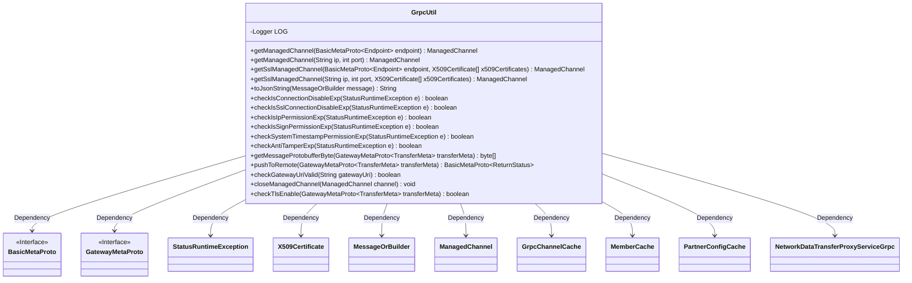
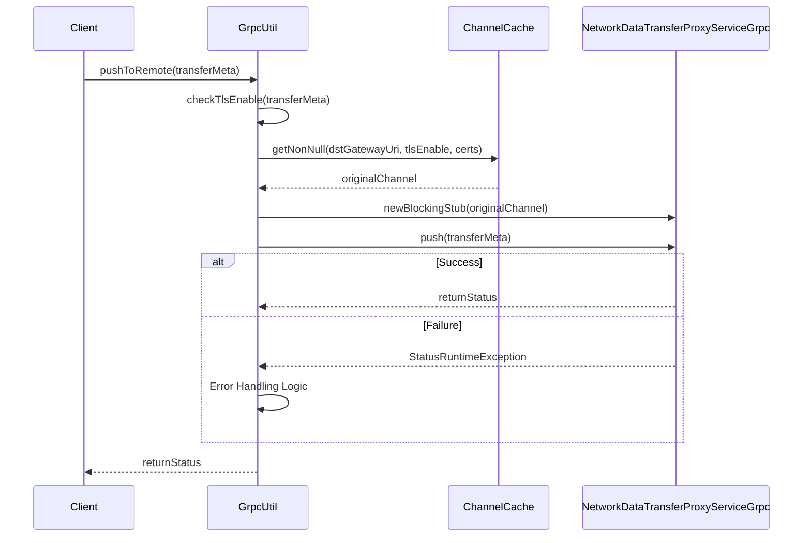

# Basic Information

|      |      |
|------|------|
| Name | GrpcUtil |
| Language | .java |
| Code Path | WeFe/gateway/src/main/java/com/welab/wefe/gateway/util/GrpcUtil.java |
| Package Name | com.welab.wefe.gateway.util |
| Dependencies | ['java.security.cert.X509Certificate', 'java.util.Arrays', 'java.util.Date', 'java.util.List', 'java.util.concurrent.TimeUnit', 'javax.net.ssl.SSLException', 'com.welab.wefe.gateway.cache.PartnerConfigCache', 'org.apache.commons.lang3.math.NumberUtils', 'org.slf4j.Logger', 'org.slf4j.LoggerFactory', 'com.google.protobuf.MessageOrBuilder', 'com.google.protobuf.util.JsonFormat', 'com.welab.wefe.common.util.DateUtil', 'com.welab.wefe.common.util.StringUtil', 'com.welab.wefe.common.util.ThreadUtil', 'com.welab.wefe.gateway.api.meta.basic.BasicMetaProto', 'com.welab.wefe.gateway.api.meta.basic.GatewayMetaProto', 'com.welab.wefe.gateway.api.service.proto.NetworkDataTransferProxyServiceGrpc', 'com.welab.wefe.gateway.cache.GrpcChannelCache', 'com.welab.wefe.gateway.cache.MemberCache', 'com.welab.wefe.gateway.common.EndpointBuilder', 'com.welab.wefe.gateway.common.GrpcConstant', 'com.welab.wefe.gateway.common.ReturnStatusBuilder', 'com.welab.wefe.gateway.entity.MemberEntity', 'com.welab.wefe.gateway.interceptor.AntiTamperMetadataBuilder', 'com.welab.wefe.gateway.interceptor.ClientCallCredentials', 'com.welab.wefe.gateway.interceptor.SignVerifyMetadataBuilder', 'com.welab.wefe.gateway.interceptor.SystemTimestampMetadataBuilder', 'io.grpc.ManagedChannel', 'io.grpc.ManagedChannelBuilder', 'io.grpc.StatusRuntimeException', 'io.grpc.netty.GrpcSslContexts', 'io.grpc.netty.NegotiationType', 'io.grpc.netty.NettyChannelBuilder', 'io.netty.handler.ssl.SslContextBuilder', 'io.netty.handler.ssl.util.InsecureTrustManagerFactory'] |
| Brief Description | The GrpcUtil class provides gRPC utility methods, including creating managed channels (plain/SSL), exception checking (connection, SSL, IP whitelist, etc.), message pushing, channel closing, and TLS activation determination. |

# Description

GrpcUtil is a utility class that provides functionalities related to gRPC communication. Its main features include: creating both plain and SSL-encrypted ManagedChannels; converting Protobuf messages into JSON strings; checking exception types (such as connection exceptions, SSL exceptions, IP whitelist exceptions, signature exceptions, timestamp deviation exceptions, and tamper-proof exceptions); pushing messages to remote nodes (with support for retry on failure and exception handling); validating gateway address formats; closing channels; and checking whether target addresses have TLS encryption enabled. The class also includes logging and utility methods for handling common scenarios and errors in gRPC communication.

# Class Summary

| Name   | Type  | Description |
|-------|------|-------------|
| GrpcUtil | class | The GrpcUtil class provides gRPC communication utility methods, including creating managed channels, SSL channels, exception checking, message pushing, JSON conversion, etc., supporting connection retries and error handling. |

## Class GrpcUtil

|      |      |
|------|------|
| Access Modifier | public |
| Type | class |
| Name | GrpcUtil |
| Description | The GrpcUtil class provides gRPC communication utility methods, including creating managed channels, SSL channels, exception checking, message pushing, JSON conversion, etc., supporting connection retries and error handling. |

### UML Class Diagram

This code represents a gRPC utility class, whose primary functionalities include: creating and managing gRPC channels (both regular and SSL-encrypted), message format conversion, exception status checking, remote message pushing, etc. The class diagram illustrates GrpcUtil's dependencies with multiple external classes, including protocol buffer-generated interface classes, certificate classes, channel classes, and more. This class encapsulates the core functionalities of gRPC communication, particularly handling various exception scenarios (such as SSL verification failures, signature anomalies, etc.), and provides comprehensive lifecycle management for message transmission.

### Internal Method Call Graph

The flowchart illustrates the main structure of the GrpcUtil class, containing 18 core methods primarily used for gRPC channel management, exception detection, and message transmission. The sequence diagram details the complete invocation flow of the pushToRemote method, including channel acquisition, TLS verification, gRPC calls, and exception handling mechanisms, demonstrating the interaction process with channel caching and service stubs during message pushing. This class implements comprehensive gRPC communication functionalities, including SSL/TLS support, multiple exception detection mechanisms, and retry logic.

### Field List

| Name  | Type  | Description |
|-------|-------|------|
| LOG = LoggerFactory.getLogger(GrpcUtil.class) | Logger | The GrpcUtil class defines a static immutable logger instance named LOG. |

### Method List

| Name  | Type  | Description |
|-------|-------|------|
| checkIsIpPermissionExp | boolean | Check IP permission exception: The static method determines whether the IP permission has expired based on the exception message, which must be non-empty and contain a specific identifier. |
| checkSystemTimestampPermissionExp | boolean | Checking system timestamp permission exception: The static method determines whether it is a permission expiration exception through error messages, which must be non-empty and contain specific identifiers. |
| checkAntiTamperExp | boolean | Static methods check whether the exception is triggered by tamper-proofing failure by determining if the exception message is non-empty and contains a specific invalid parameter identifier. |
| checkIsConnectionDisableExp | boolean | Check if the connection is disabled due to an exception: Returns true if the error message is empty or contains a specific message. |
| checkIsSslConnectionDisableExp | boolean | Static methods check for SSL connection exceptions by matching specific keywords in the exception stack trace (such as SSLHandshakeException and certificate errors) to determine whether the connection was disabled due to SSL issues. |
| checkIsSignPermissionExp | boolean | Check if the exception is due to signature permission expiration: Determine whether the exception message contains a specific expiration identifier. |
| getSslManagedChannel | ManagedChannel | This method creates and returns an SSL-enabled ManagedChannel. Depending on whether the passed X509 certificate array is empty, it determines whether to use an insecure trust manager or specified certificates. It sets the TLS negotiation type, maximum message size, and overrides the authority when certificates are present. Finally, it constructs and returns the channel instance. |
| pushToRemote | BasicMetaProto.ReturnStatus | The method `pushToRemote` pushes the `transferMeta` to the remote gateway via gRPC, supporting up to 5 retries upon failure. It handles exceptions such as TLS, signature verification, system time discrepancies, and tamper prevention, returning status information. In case of failure, it checks network connectivity, certificate validity, and address validity, while logging the details. |
| getSslManagedChannel | ManagedChannel | The static method `getSslManagedChannel` takes an `Endpoint` and an array of `X509` certificates, then returns an SSL-based `ManagedChannel`. Internally, it calls an overloaded method of the same name to handle the IP and port parameters. |
| getManagedChannel | ManagedChannel | The static method `getManagedChannel` takes an `Endpoint` parameter, calls the method of the same name, and returns a `ManagedChannel` object, with the parameter converted to an IP and port. |
| getMessageProtobufferByte | byte[] | This method converts the GatewayMetaProto.TransferMeta object into a byte array, returning an empty byte array if the object is null. |
| getManagedChannel | ManagedChannel | This method creates a gRPC management channel, specifies the target IP and port, sets the maximum inbound message size to unlimited, and uses plaintext transmission. |
| toJsonString | String | Convert a MessageOrBuilder object to a JSON string, returning null on failure. |
| checkGatewayUriValid | boolean | Check the validity of the gateway URI: non-empty and formatted as "host:port", where the port must be a numeric value. |
| closeManagedChannel | void | Methods to close the Grpc channel: close it immediately after a non-null check, wait for 3 seconds, and catch exceptions to log them. |
| checkTlsEnable | boolean | Check TLS enablement status: Returns true if the target member is not itself and TLS is enabled, otherwise false. |

