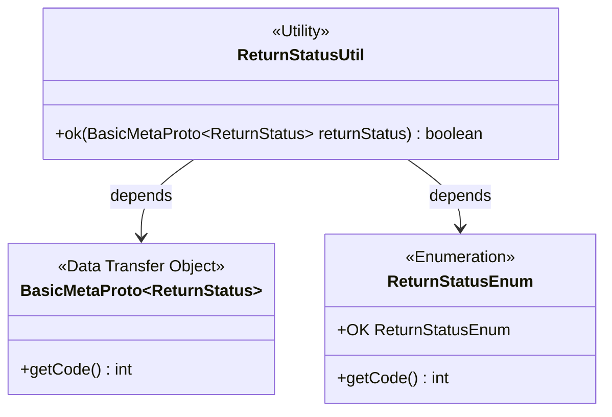
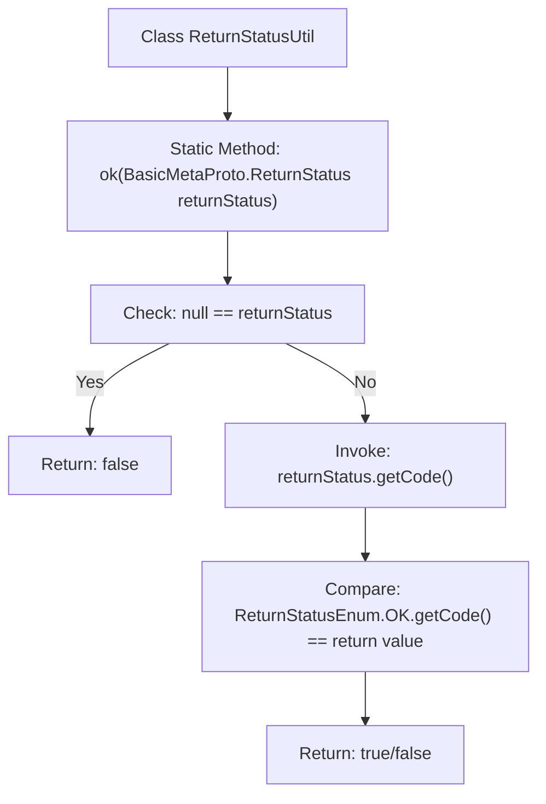

# Basic Information

|      |      |
|------|------|
| Name | ReturnStatusUtil |
| Language | .java |
| Code Path | WeFe/gateway/src/main/java/com/welab/wefe/gateway/util/ReturnStatusUtil.java |
| Package Name | com.welab.wefe.gateway.util |
| Dependencies | ['com.welab.wefe.gateway.api.meta.basic.BasicMetaProto', 'com.welab.wefe.gateway.common.ReturnStatusEnum'] |
| Brief Description | The ReturnStatusUtil class provides a static method `ok` that checks whether a BasicMetaProto.ReturnStatus is in the OK state, returning true if it is non-null and the status code matches. |

# Description

ReturnStatusUtil is a utility class that contains a static method `ok`, which is used to check whether the status of a BasicMetaProto.ReturnStatus object is OK. The method first checks if the input is null; if so, it returns false. Otherwise, it compares the object's code value with the code value of ReturnStatusEnum.OK. If they are equal, it returns true, indicating the status is normal. This method is designed to simplify status judgment logic.

# Class Summary

| Name   | Type  | Description |
|-------|------|-------------|
| ReturnStatusUtil | class | The `ReturnStatusUtil` class provides a static method `ok` that checks whether a `BasicMetaProto.ReturnStatus` is null or its status code equals the `OK` enum value, returning a boolean result. |

## Class ReturnStatusUtil

|      |      |
|------|------|
| Access Modifier | public |
| Type | class |
| Name | ReturnStatusUtil |
| Description | The `ReturnStatusUtil` class provides a static method `ok` that checks whether a `BasicMetaProto.ReturnStatus` is null or its status code equals the `OK` enum value, returning a boolean result. |

### UML Class Diagram

This class diagram illustrates the relationships between the utility class ReturnStatusUtil, the data transfer object BasicMetaProto.ReturnStatus, and the enumeration ReturnStatusEnum. ReturnStatusUtil verifies whether the status code of a ReturnStatus object equals the value of the OK enumeration through its static method ok(). Here, BasicMetaProto.ReturnStatus provides the interface to retrieve the status code, while ReturnStatusEnum defines the OK status code constant. Together, they form a typical status validation utility structure, demonstrating the dependency of a static utility class on both an enumeration and a DTO.

### Internal Method Call Graph

This flowchart illustrates the logical flow of the `ok` method in the `ReturnStatusUtil` class. It first checks whether the input parameter `returnStatus` is null, returning `false` immediately if true; otherwise, it retrieves its `code` value and compares it with `ReturnStatusEnum.OK`'s code, ultimately returning the comparison result. The entire process clearly demonstrates two critical layers of judgment logic: null-check defense and status code validation.

### Field List

| Name  | Type  | Description |
|-------|-------|------|

### Method List

| Name  | Type  | Description |
|-------|-------|------|
| ok | boolean | Static method checks whether the return status is OK, returning false if it is null or a non-OK code. |

