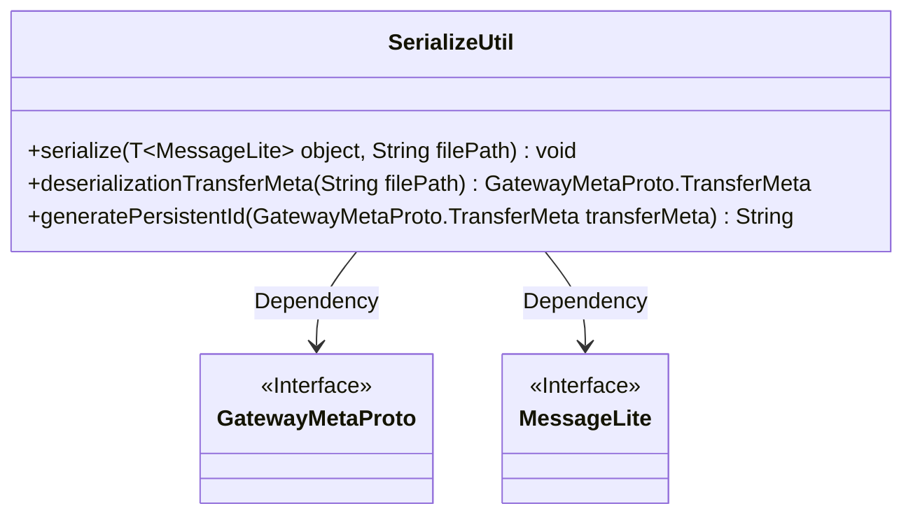
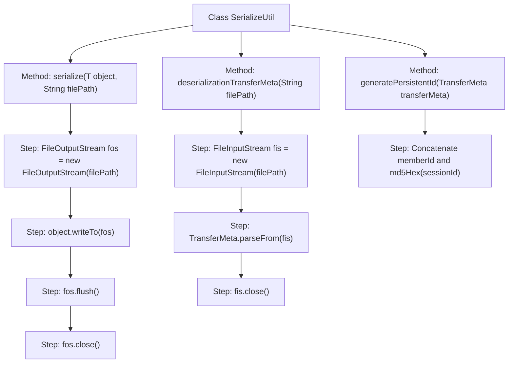

# Basic Information

|      |      |
|------|------|
| Name | SerializeUtil |
| Language | .java |
| Code Path | WeFe/gateway/src/main/java/com/welab/wefe/gateway/util/SerializeUtil.java |
| Package Name | com.welab.wefe.gateway.util |
| Dependencies | ['com.google.protobuf.MessageLite', 'com.welab.wefe.gateway.api.meta.basic.GatewayMetaProto', 'org.apache.commons.codec.digest.DigestUtils', 'java.io.FileInputStream', 'java.io.FileOutputStream', 'java.io.IOException'] |
| Brief Description | The SerializeUtil class provides serialization, deserialization, and persistent ID generation functionalities. It includes methods for serializing objects to files, deserializing TransferMeta objects from files, and generating unique IDs based on TransferMeta. |

# Description

The SerializeUtil class provides serialization and deserialization functionality. It includes three methods: serialize writes a MessageLite object to a specified file path; deserializationTransferMeta deserializes a TransferMeta object from a file path; generatePersistentId generates a persistent filename based on a TransferMeta object, formatted as the MD5 value of sourceMemberID_targetMemberID_sessionID. All file operations include resource cleanup logic.

# Class Summary

| Name   | Type  | Description |
|-------|------|-------------|
| SerializeUtil | class | The SerializeUtil class provides serialization, deserialization, and persistent ID generation functionalities, supporting read/write operations between objects and files. |

## Class SerializeUtil

|      |      |
|------|------|
| Access Modifier | public |
| Type | class |
| Name | SerializeUtil |
| Description | The SerializeUtil class provides serialization, deserialization, and persistent ID generation functionalities, supporting read/write operations between objects and files. |

### UML Class Diagram

This class diagram illustrates the `SerializeUtil` utility class, which provides object serialization/deserialization functionality. It contains three static methods: `serialize` writes objects implementing the `MessageLite` interface to a file; `deserializationTransferMeta` deserializes a `GatewayMetaProto.TransferMeta` object from a file; and `generatePersistentId` generates a persistent ID based on transfer metadata. The class depends on two interfaces, `MessageLite` and `GatewayMetaProto`, which are used for generic constraints and return type definitions respectively.

### Internal Method Call Graph

This flowchart illustrates three core methods of the SerializeUtil class: `serialize` for object serialization to files, `deserializationTransferMeta` for object deserialization from files, and `generatePersistentId` for generating persistent filenames. Each method clearly demonstrates its internal processing steps, including file stream operations, data conversion, and resource release, reflecting the complete lifecycle of object serialization/deserialization.

### Field List

| Name  | Type  | Description |
|-------|-------|------|

### Method List

| Name  | Type  | Description |
|-------|-------|------|
| serialize | void | Static methods serialize the MessageLite object to the specified file, ensuring resource release. |
| deserializationTransferMeta | GatewayMetaProto.TransferMeta | Static method deserializes a TransferMeta object from a file, automatically closing the file stream. |
| generatePersistentId | String | Method for generating persistent ID: Concatenate the MD5 values of the source member ID, target member ID, and session ID. |

