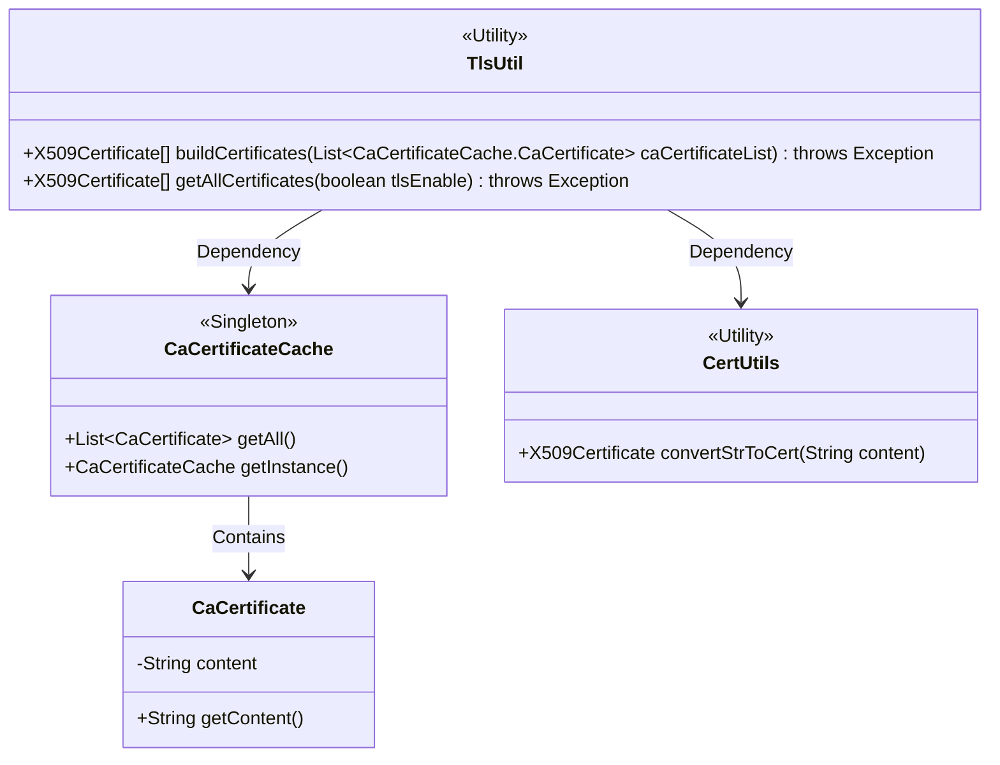
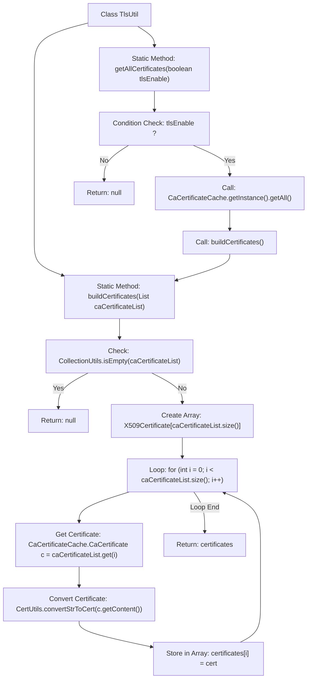

# Basic Information

|      |      |
|------|------|
| Name | TlsUtil |
| Language | .java |
| Code Path | WeFe/gateway/src/main/java/com/welab/wefe/gateway/util/TlsUtil.java |
| Package Name | com.welab.wefe.gateway.util |
| Dependencies | ['com.webank.cert.toolkit.utils.CertUtils', 'com.welab.wefe.gateway.cache.CaCertificateCache', 'org.apache.commons.collections4.CollectionUtils', 'java.security.cert.X509Certificate', 'java.util.List'] |
| Brief Description | The TlsUtil class provides two static methods: buildCertificates converts a list of CA certificates into an X509Certificate array, and getAllCertificates returns all certificates or null based on the tlsEnable flag. |

# Description

The TlsUtil class contains two static methods for handling X509 certificates. The buildCertificates method takes a list of CA certificates and returns null if the list is empty; otherwise, it converts each certificate's content into an X509Certificate object and stores them in an array for return. The getAllCertificates method determines whether to call buildCertificates based on the tlsEnable parameter. If enabled, it retrieves all certificates from the CaCertificateCache and converts them; otherwise, it returns null. Both methods may throw exceptions.

# Class Summary

| Name   | Type  | Description |
|-------|------|-------------|
| TlsUtil | class | The TlsUtil class provides two static methods: buildCertificates converts a list of CA certificates into an X509Certificate array and returns null if the list is empty; getAllCertificates determines whether to fetch and convert all CA certificates based on the tlsEnable parameter. |

## Class TlsUtil

|      |      |
|------|------|
| Access Modifier | public |
| Type | class |
| Name | TlsUtil |
| Description | The TlsUtil class provides two static methods: buildCertificates converts a list of CA certificates into an X509Certificate array and returns null if the list is empty; getAllCertificates determines whether to fetch and convert all CA certificates based on the tlsEnable parameter. |

### UML Class Diagram

This code illustrates a TLS utility class TlsUtil designed to construct X509 certificate arrays. It relies on the singleton class CaCertificateCache to retrieve CA certificate lists and utilizes the CertUtils utility class to convert strings into certificate objects. CaCertificateCache contains an inner class CaCertificate for storing certificate content. The overall design follows the utility class pattern, providing static methods to handle certificate conversion logic and supporting the retrieval of all certificates based on TLS toggle conditions.

### Internal Method Call Graph

This flowchart illustrates the logic of two core methods in the TlsUtil class. The buildCertificates method first checks if the input list is empty, returning null if true; otherwise, it iterates through the list to convert each certificate content into an X509Certificate object and stores it in an array. The getAllCertificates method determines whether to retrieve and build the certificate array based on the tlsEnable flag, demonstrating a complete process of conditional branching and internal method calls.

### Field List

| Name  | Type  | Description |
|-------|-------|------|

### Method List

| Name  | Type  | Description |
|-------|-------|------|
| buildCertificates | X509Certificate[] | The method converts the CA certificate list into an X509Certificate array, returning null if the list is empty. It iterates through the list, using CertUtils to transform the certificate content into X509Certificate objects and stores them in the array. |
| getAllCertificates | X509Certificate[] | This method returns an array of all TLS certificates or null based on the tlsEnable parameter. If TLS is enabled, it retrieves certificates from the CaCertificateCache and constructs the array; otherwise, it returns a null value. |

