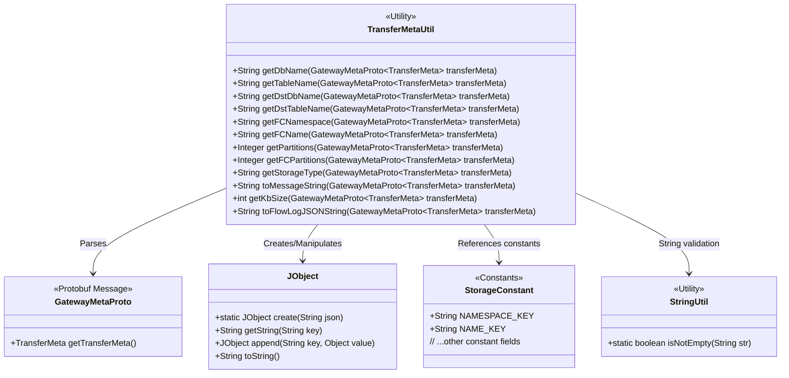
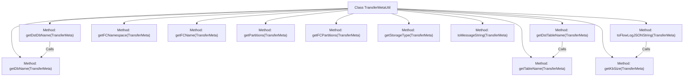

# Basic Information

|      |      |
|------|------|
| Name | TransferMetaUtil |
| Language | .java |
| Code Path | WeFe/gateway/src/main/java/com/welab/wefe/gateway/util/TransferMetaUtil.java |
| Package Name | com.welab.wefe.gateway.util |
| Dependencies | ['com.welab.wefe.common.util.JObject', 'com.welab.wefe.common.util.StringUtil', 'com.welab.wefe.gateway.api.meta.basic.GatewayMetaProto', 'com.welab.wefe.gateway.common.StorageConstant', 'java.math.BigDecimal', 'java.math.RoundingMode'] |
| Brief Description | The TransferMetaUtil class provides methods for extracting database names, table names, target database table names, partition counts, and generating logs from TransferMeta messages. |

# Description

TransferMetaUtil is a utility class that provides methods for extracting various types of information from TransferMeta messages. Its main functionalities include retrieving the database name, table name, target database name, target table name, FC namespace and name, partition count, storage type, and more. It can also convert messages into a log string format, calculate message size (KB), and generate traffic log JSON strings. All methods obtain the corresponding field values by parsing the JSON data within the message content.

# Class Summary

| Name   | Type  | Description |
|-------|------|-------------|
| TransferMetaUtil | class | The TransferMetaUtil class provides methods for extracting database names, table names, target database names, target table names, partition counts, and generating logs from TransferMeta messages. |

## Class TransferMetaUtil

|      |      |
|------|------|
| Access Modifier | public |
| Type | class |
| Name | TransferMetaUtil |
| Description | The TransferMetaUtil class provides methods for extracting database names, table names, target database names, target table names, partition counts, and generating logs from TransferMeta messages. |

### UML Class Diagram

Class Diagram Description:
TransferMetaUtil is a utility class specifically designed for parsing and converting GatewayMetaProto.TransferMeta messages. It provides 12 static methods, including retrieving metadata such as database/table names, partition counts, storage types, as well as generating log formats and calculating data sizes. The class depends on the GatewayMetaProto protocol class to obtain raw data, uses JObject for JSON content manipulation, references configuration constants from StorageConstant, and employs StringUtil for empty string validation. All methods are public and stateless, adhering to utility class design principles.

### Internal Method Call Graph

This flowchart illustrates the structure of the TransferMetaUtil utility class, which contains 12 static methods. Core functionalities are categorized into three types: 1) Metadata parsing (e.g., getDbName/getTableName); 2) Log processing (e.g., toMessageString/toFlowLogJSONString); 3) Data calculation (e.g., getKbSize). Method invocation relationships exist, such as getDstDbName fallback calling getDbName, and toFlowLogJSONString relying on getKbSize calculation results. All methods revolve around field extraction and transformation of TransferMeta objects.

### Field List

| Name  | Type  | Description |
|-------|-------|------|

### Method List

| Name  | Type  | Description |
|-------|-------|------|
| getFCName | String | The method extracts the content string from the transmission metadata, parses it into a JSON object, and returns the value of the FC_NAME field. |
| getStorageType | String | This method extracts the storage type from the transmission metadata by parsing the JSON content to obtain the target storage type field value and returns it. |
| getFCNamespace | String | Static method to obtain the FC namespace, parse the content string from the transmission metadata, and extract the specified field value. |
| getDbName | String | This method extracts the database name from the transmission metadata and obtains the namespace key-value by parsing the content string. |
| getPartitions | Integer | The static method `getPartitions` extracts and parses the partition count from `transferMeta`, returning an integer result. |
| getDstTableName | String | The static method `getDstTableName` extracts the destination table name from `transferMeta`, and calls `getTableName` to obtain it if it does not exist. |
| getDstDbName | String | The static method `getDstDbName` extracts the target database name from `transferMeta`, and calls `getDbName` to obtain it if the name does not exist. |
| getFCPartitions | Integer | The static method `getFCPartitions` extracts content from `transferMeta` and parses it into a `JObject`, then retrieves the `FC_PARTITIONS` configuration value and converts it to an integer before returning it. |
| getTableName | String | The static method `getTableName` extracts `dbConfig` from `transferMeta` and returns the string value corresponding to its `NAME_KEY`. |
| toMessageString | String | This method converts the TransferMeta object into a string, containing the session ID, source member ID and name, as well as the target member ID and name (if present). |
| toFlowLogJSONString | String | Static methods convert transmission metadata into JSON log strings, including size and member ID. |
| getKbSize | int | This method calculates the KB size of the transmitted metadata, returning 0 if it is empty; otherwise, it divides the byte length by 1024 and rounds to the nearest integer. |

