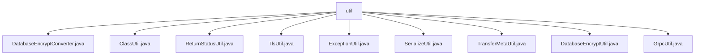

# Basic Information

|      |      |
|------|------|
| Name | util |
| Language | .java |
| Code Path | WeFe/gateway/src/main/java/com/welab/wefe/gateway/util |
| Package Name | docs.gateway.src.main.java.com.welab.wefe.gateway.util |
| Brief Description | DatabaseEncryptConverter implements encryption and decryption for database fields. ClassUtil loads classes with specific annotations. ReturnStatusUtil checks statuses. TlsUtil handles certificates. ExceptionUtil retrieves stack trace information. SerializeUtil provides serialization functionality. TransferMetaUtil extracts message information. DatabaseEncryptUtil offers encryption and decryption. GrpcUtil manages gRPC communication. |

# Description

## Overview  
This module serves as the core toolkit for the gateway system, primarily providing three key functionalities: secure data transmission, class loading management, and gRPC communication support. The interface specifications include: AttributeConverter for field encryption/decryption, and static utility methods offering various conversion and validation capabilities (such as status checks, certificate handling, exception catching, etc.). Key data structures involve the TransferMeta message body, X509Certificate certificate object, and BasicMetaProto.ReturnStatus status object. External dependencies include the SM4 encryption algorithm, gRPC framework, Protobuf serialization, and TLS/SSL protocols. For example, DatabaseEncryptUtil employs SM4 for field encryption, while GrpcUtil relies on gRPC for remote communication.  

## Primary Business Scenarios  
The module supports secure data transmission workflows: fields are automatically encrypted via DatabaseEncryptConverter, TransferMeta messages are serialized using SerializeUtil, GrpcUtil establishes TLS channels for transmission, and exceptions are uniformly captured by ExceptionUtil. The class loading mechanism resembles a plugin system, with ClassUtil dynamically loading classes annotated with @RpcServer and @Processor. Typical applications include encrypted data storage (e.g., SM4-encrypted fields), cross-node communication (e.g., gRPC message pushing), and certificate verification (e.g., TlsUtil constructing X509 certificate chains). API integration cases cover message serialization, traffic log generation, and channel state management.

### Package Internal Structure View

This flowchart illustrates the file structure relationships within the util package of the WeFe gateway project. The root node "util" directly contains 9 utility class files, including a database encryption converter, class operation utility, status return utility, TLS utility, exception handling utility, serialization utility, metadata transfer utility, database encryption utility, and gRPC utility. These utility classes provide foundational functional support for the gateway project.

# File List

| Name   | Type  | Description |
|-------|------|-------------|
| [DatabaseEncryptConverter.java](DatabaseEncryptConverter.md) | file | The DatabaseEncryptConverter class implements the property conversion interface, provides encryption and decryption methods, and returns the original value in case of exceptions. |
| [ClassUtil.java](ClassUtil.md) | file | The ClassUtil utility class provides methods for loading RPC service and handler classes. It includes methods to determine whether a class is an RPC service or handler, supporting filtering RPC services by scope. Returns a Map structure containing annotation information. |
| [ReturnStatusUtil.java](ReturnStatusUtil.md) | file | The ReturnStatusUtil class provides a static method `ok` that checks whether a BasicMetaProto.ReturnStatus is in the OK state, returning true if it is non-null and the status code matches. |
| [TlsUtil.java](TlsUtil.md) | file | The TlsUtil class provides two static methods: buildCertificates converts a list of CA certificates into an X509Certificate array, and getAllCertificates returns all certificates or null based on the tlsEnable flag. |
| [ExceptionUtil.java](ExceptionUtil.md) | file | The ExceptionUtil class provides a static method, getStackTraceInfo, which captures and returns the stack trace information string of an exception, including resource cleanup logic. |
| [SerializeUtil.java](SerializeUtil.md) | file | The SerializeUtil class provides serialization, deserialization, and persistent ID generation functionalities. It includes methods for serializing objects to files, deserializing TransferMeta objects from files, and generating unique IDs based on TransferMeta. |
| [TransferMetaUtil.java](TransferMetaUtil.md) | file | The TransferMetaUtil class provides methods for extracting database names, table names, target database table names, partition counts, and generating logs from TransferMeta messages. |
| [DatabaseEncryptUtil.java](DatabaseEncryptUtil.md) | file | The DatabaseEncryptUtil class provides database encryption and decryption functionality, including encryption, decryption, and ciphertext judgment methods. It employs the SM4 algorithm and supports configuration switches. |
| [GrpcUtil.java](GrpcUtil.md) | file | The GrpcUtil class provides gRPC utility methods, including creating managed channels (plain/SSL), exception checking (connection, SSL, IP whitelist, etc.), message pushing, channel closing, and TLS activation determination. |

