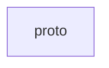

# Basic Information

|      |      |
|------|------|
| Name | proto |
| Language | .java |
| Code Path | WeFe/gateway/src/main/proto |
| Package Name | docs.gateway.src.main.proto |
| Brief Description |  |

# Description

None

### Package Internal Structure View

This flowchart illustrates the storage location of proto files in the WeFe Gateway project. The proto directory is located under the src/main path of the gateway module and is used to store Protocol Buffer definition files. This represents a typical directory structure in microservice architectures for defining inter-service communication protocols, featuring a clear and concise hierarchy.

# File List

| Name   | Type  | Description |
|-------|------|-------------|

