# Basic Information

|      |      |
|------|------|
| Name | com |
| Language | .java |
| Code Path | WeFe/manager/manager-service/src/main/java/com |
| Package Name | docs.manager.manager-service.src.main.java.com |
| Brief Description | The digital certificate management module implements the entire process of application, issuance, and key binding. The core component CertOperationService relies on CertDao for persistence, with data structures including CertRequestVO, etc., using FastJSON for serialization, and exceptions handled by CertMgrException. The consortium chain management system is responsible for multi-dimensional resource management and smart contract interaction, adopting a layered design that supports scenarios such as member registration and data labeling. It relies on MongoDB, FISCO BCOS SDK, etc., with functionalities covering state management and permission verification. |

# Description

## Overview  
This module implements full lifecycle management of multi-dimensional resources in a consortium blockchain ecosystem, with core responsibilities including digital certificate management (application/issuance/key binding), member collaboration, and smart contract interaction, akin to a combination of enterprise RBAC and a distributed configuration center. The interface specification follows a layered design: the RESTful API layer inherits from the AbstractApi base class, the contract layer provides CRUD/event subscription, and the configuration layer supports dynamic loading. Key data structures include CertRequestVO (certificate application), CertVO (certificate entity), InsertEventResponse (on-chain response), and version number strings. External dependencies, after deduplication, consist of Java base libraries, BouncyCastle, FastJSON, MongoDB driver, FISCO BCOS SDK, and the national cryptographic algorithm library. For example, CertOperationService synchronizes on-chain and off-chain states, while TransformUtils copies properties via reflection.

## Core Business Scenarios  
The workflow forms two closed loops: a collaboration loop ("member registration → resource upload → permission configuration") and a certificate management loop ("application → issuance → binding"), resembling a hybrid of a ticketing system and an event bus. Interaction modes include chained parameter validation at the API layer (e.g., UnionNode series APIs for node maintenance) and event-driven operations at the contract layer (e.g., file upload triggering insertEvent). Typical applications involve administrators maintaining node lists and users generating data tag clouds. Functional completeness is reflected in each entity's state management and off-chain listening capabilities (e.g., MemberContract managing public keys). API types encompass queries (QueryAllApi), operations (DeleteByTagId), and file-related actions (DownloadApi), forming a three-stage processing flow: configuration → business → blockchain.

### Package Internal Structure View

```mermaid
graph TD
    com --> webank
    com --> welab
    webank --> cert
    cert --> mgr
    mgr --> utils
    utils --> TransformUtils.java
    mgr --> enums
    enums --> MgrExceptionCodeEnums.java
    mgr --> exception
    exception --> CertMgrException.java
    mgr --> service
    service --> CertOperationService.java
    mgr --> model
    model --> vo
    vo --> CertRequestVO.java
    vo --> CertVO.java
    vo --> CertKeyVO.java
    model --> CommonResponse.java
    mgr --> db
    db --> dao
    dao --> CertDao.java
    mgr --> config
    config --> CertBeans.java
    mgr --> CertApp.java
    welab --> wefe
    wefe --> manager
    manager --> service
    service --> api
    api --> cert
    cert --> QueryCertApi.java
    cert --> DetailCsrApi.java
    cert --> DownloadApi.java
    cert --> TrustCertsUpdateApi.java
    cert --> DetailKeyApi.java
    cert --> QueryCsrApi.java
    cert --> UpdateCertStatusApi.java
    cert --> InitApi.java
    cert --> QueryKeyApi.java
    cert --> DetailCertApi.java
    cert --> QueryTrustCertApi.java
    api --> account
    account --> SsoLoginApi.java
    api --> authtype
    authtype --> UpdateApi.java
    authtype --> DeleteApi.java
    authtype --> AddApi.java
    authtype --> QueryAllApi.java
    api --> dataresource
    dataresource --> QueryApi.java
    dataresource --> DetailApi.java
    dataresource --> DataResourceTagsApi.java
    dataresource --> EnableApi.java
    api --> common
    common --> DownloadFileApi.java
    api --> dataset
    dataset --> UpdateExtJsonApi.java
    dataset --> QueryApi.java
    dataset --> DetailApi.java
    dataset --> DataSetTagsApi.java
    api --> union
    union --> UpdateApi.java
    union --> DeleteApi.java
    union --> QueryAllApi.java
    union --> EnableApi.java
    api --> defaulttag
    defaulttag --> QueryApi.java
    defaulttag --> UpdateApi.java
    defaulttag --> DeleteApi.java
    defaulttag --> AddApi.java
    api --> agreement
    agreement --> UploadRealnameAuthAgreementTemplateApi.java
    agreement --> QueryApi.java
    agreement --> EnableApi.java
    api --> member
    member --> QueryApi.java
    member --> UpdateApi.java
    member --> RealNameAuthAuditApi.java
    member --> RealNameAuthInfoQueryApi.java
    service --> contract
    contract --> MemberAuthTypeContract.java
    contract --> DataSetContract.java
    contract --> TrustCertsContract.java
    contract --> MemberContract.java
    contract --> DataSetDefaultTagContract.java
    contract --> DataResourceContract.java
    contract --> RealnameAuthAgreementTemplateContract.java
    contract --> UnionNodeContract.java
    contract --> DataResourceDefaultTagContract.java
    contract --> DataSetMemberPermissionContract.java
    contract --> MemberFileInfoContract.java
    service --> constant
    constant --> UserConstant.java
    service --> util
    util --> FileCheckerUtil.java
    util --> VersionUtil.java
    service --> mapper
    mapper --> ImageDataSetMapper.java
    mapper --> DataSetMapper.java
    mapper --> TableDataSetMapper.java
    mapper --> BloomFilterMapper.java
    mapper --> MemberMapper.java
    mapper --> DataResourceMapper.java
    mapper --> TrustCertsMapper.java
    mapper --> AccountMapper.java
    mapper --> RealnameAuthAgreementTemplateMapper.java
    mapper --> UnionNodeMapper.java
    service --> service
    service --> DataSetContractService.java
    service --> RealNameAuthAuditService.java
    service --> RealnameAuthAgreementTemplateContractService.java
    service --> AbstractContractService.java
    service --> AccountService.java
    service --> DataResourceDefaultTagContractService.java
    service --> DatSetDefaultTagContractService.java
    service --> TrustCertsContractService.java
    service --> MemberAuthTypeContractService.java
    service --> PrivacyDatabaseEncryptService.java
    service --> DataResourceContractService.java
    service --> UnionNodeContractService.java
    service --> MemberContractService.java
    service --> dto
    dto --> cert
    cert --> TrustCertsQueryOutput.java
    cert --> TrustCertsAddInput.java
    dto --> account
    account --> ResetPasswordInput.java
    account --> AccountEnableInput.java
    account --> UpdatePasswordInput.java
    account --> LoginOutput.java
    account --> LoginInput.java
    account --> AccountRoleChangeInput.java
    account --> QueryAccountInput.java
    account --> QueryAccountOutput.java
    account --> RegisterInput.java
    account --> UpdateInput.java
    dto --> authtype
    authtype --> MemberAuthTypeDeleteInput.java
    authtype --> MemberAuthTypeAddInput.java
    authtype --> MemberAuthTypeUpdateInput.java
    dto --> dataresource
    dataresource --> ApiTableDataSetQueryOutput.java
    dataresource --> ApiBloomFilterQueryOutput.java
    dataresource --> ApiDataResourceQueryOutput.java
    dataresource --> ApiDataResourceDetailInput.java
    dataresource --> ApiImageDataSetQueryOutput.java
    dataresource --> ApiDataResourceQueryInput.java
    dto --> tag
    tag --> DataSetTagsQueryInput.java
    tag --> DataResourceDefaultTagUpdateInput.java
    tag --> ApiDataResourceDefaultTagQueryOutput.java
    tag --> DataResourceDefaultTagAddInput.java
    tag --> DataResourceDefaultTagDeleteInput.java
    tag --> ApiDataSetTagsQueryOutput.java
    tag --> TagsDTO.java
    dto --> common
    common --> UploadFileInput.java
    common --> QueryFileInput.java
    dto --> dataset
    dataset --> ApiDataSetQueryOutput.java
    dataset --> DataSetDetailInput.java
    dataset --> DataSetUpdateExtJsonInput.java
    dataset --> ApiDataSetQueryInput.java
    dto --> union
    union --> UnionNodeQueryOutput.java
    union --> UnionNodeEnableInput.java
    union --> UnionNodeAddInput.java
    union --> UnionNodeUpdateInput.java
    union --> UnionNodeDeleteInput.java
    dto --> operation
    operation --> OperationLogQueryOutput.java
    operation --> OperationLogQueryInput.java
    dto --> agreement
    agreement --> RealnameAuthAgreementTemplateEnableInput.java
    agreement --> RealnameAuthAgreementTemplateOutput.java
    dto --> member
    member --> MemberUpdateInput.java
    member --> RealNameAuthInfoQueryInput.java
    member --> MemberQueryInput.java
    member --> MemberQueryOutput.java
    member --> RealNameAuthInput.java
    dto --> base
    base --> BaseInput.java
    base --> BaseQueryInput.java
    base --> PageInput.java
    service --> operation
    operation --> ManagerApiLogger.java
    service --> task
    task --> UploadFileSyncToUnionTask.java
    service --> listener
    listener --> AutoPrivacyDatabaseEncryptListener.java
    service --> config
    config --> Config.java
    config --> BlockChainConfig.java
    service --> ManagerService.java
```

This flowchart illustrates a complex Java project structure starting from the top-level package com, which branches into webank and welab. The webank branch primarily contains certificate management related modules such as certificate operation services, exception handling, and database access. The welab branch focuses on federation management functionalities, encompassing a wide range of APIs (e.g., certificate query, account login, data resource operations), contract services, data access layers, and various DTO objects. The entire structure adopts a multi-level nested design, demonstrating clear module division and separation of responsibilities.

# File List

| Name   | Type  | Description |
|-------|------|-------------|
| [welab](welab/_module.md) | package | The consortium chain resource management module cluster provides full lifecycle management for certificates, data, nodes, etc., utilizing RESTful interfaces and MongoDB + smart contracts to achieve data synchronization. It supports business closed loops such as member registration, data upload, and permission settings, including functionalities like file inspection, version generation, and object mapping conversion. It relies on Spring, MongoDB, and FISCO BCOS SDK to ensure transaction consistency and secure encryption. |
| [webank](webank/_module.md) | package | TransformUtils provides object conversion functionality, containing three static constants and three conversion methods. CertMgrException is a custom exception class that includes error codes and descriptions. CertOperationService offers certificate management features, including status updates and certificate exports. CertDao manages certificate data access operations. CertBeans is a Spring configuration class that registers CertService. CertApp is an empty implementation class, potentially used for certificate management. The module implements full lifecycle management of digital certificates, covering application, issuance, and key association processes. |

