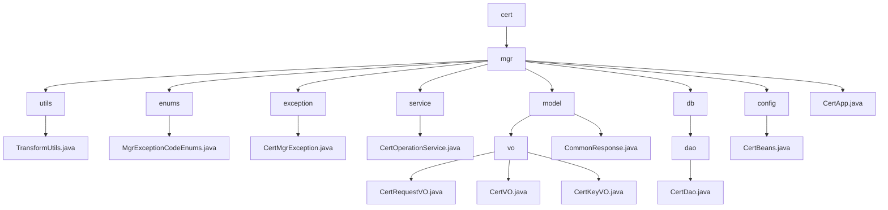

# Basic Information

|      |      |
|------|------|
| Name | cert |
| Language | .java |
| Code Path | WeFe/manager/manager-service/src/main/java/com/webank/cert |
| Package Name | docs.manager.manager-service.src.main.java.com.webank.cert |
| Brief Description | TransformUtils provides object conversion functionality, containing three static constants and three conversion methods. CertMgrException is a custom exception class that includes an error code and description. CertOperationService offers certificate management features, including status updates and certificate exports. CertDao manages certificate data access operations. CertBeans is a Spring configuration class that registers CertService. CertApp is an empty implementation class, potentially used for certificate management. The module implements full lifecycle management of digital certificates, covering application, issuance, and key association processes. |

# Description

## Overview  
This module implements full lifecycle management of digital certificates, including application, issuance, key binding, and exception handling. The core component CertOperationService provides certificate status updates, issuance, and query functionalities, relying on CertDao for data persistence. Key data structures include CertRequestVO (application), CertVO (certificate entity), and CertKeyVO (key metadata), serialized using FastJSON. External dependencies include Java core libraries, the BouncyCastle security provider, and the FastJSON framework. For example, TransformUtils implements object property copying via reflection, and CertMgrException enumerates 7 types of key management exceptions (e.g., 1013 indicates an unsupported key algorithm).  

## Core Business Scenarios  
The workflow follows a three-phase closed loop of "application → issuance → binding": after a user submits a CertRequestVO, the system generates a CertVO and associates it with a CertKeyVO, similar to a ticketing system. Core operations include root certificate initialization, CA certificate issuance, and key pair generation, supporting certificate chain validation (via pCertId parent-child relationships). Interactions are completed through standardized VO objects, such as CertDao paginating certificate lists and CertService handling certificate validity checks. Exception scenarios are uniformly managed by CertMgrException, resembling an event bus-style error propagation mechanism.

### Package Internal Structure View

This flowchart illustrates the Java package structure of the manager-service module in the WeFe project. Starting from the root directory 'cert', it hierarchically expands to 'mgr' and its subdirectories (utils, enums, exception, etc.), ultimately displaying specific Java files. Each node shows only the last-level name, fully presenting the code organization of the certificate management service, including utility classes, enums, exception handling, service layer, models, database access modules, and more.

# File List

| Name   | Type  | Description |
|-------|------|-------------|
| [mgr](mgr/_module.md) | package | TransformUtils provides object conversion functionality, containing three static constants and three conversion methods. CertMgrException is a custom exception class that includes error codes and descriptions. CertOperationService offers certificate management features, including status updates and certificate exports. CertDao manages certificate data access operations. CertBeans is a Spring configuration class that registers CertService. CertApp is an empty implementation class, potentially used for certificate management. The module implements full lifecycle management of digital certificates, covering application, issuance, and key association processes. |

