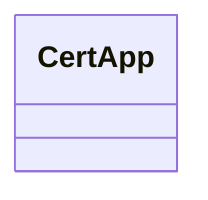

# Basic Information

|      |      |
|------|------|
| Name | CertApp |
| Language | .java |
| Code Path | WeFe/manager/manager-service/src/main/java/com/webank/cert/mgr/CertApp.java |
| Package Name | com.webank.cert.mgr |
| Dependencies | [] |
| Brief Description | CertApp is a public Java class, currently empty. |

# Description

CertApp is a public Java class that currently only contains the class definition without implementing any methods or properties. As a foundational class structure, it may be used for certificate-related functionalities, but its specific purpose depends on subsequent implementations. The class name suggests it might involve certificate management or applications, though it remains an empty implementation at present.

# Class Summary

| Name   | Type  | Description |
|-------|------|-------------|
| CertApp | class | CertApp is a public Java class, currently empty. |

## Class CertApp

|      |      |
|------|------|
| Access Modifier | public |
| Type | class |
| Name | CertApp |
| Description | CertApp is a public Java class, currently empty. |

### UML Class Diagram

This class diagram illustrates an empty class named `CertApp` with no attributes or methods at present. It serves as a foundational framework that can be extended to incorporate business logic and functionalities related to certificate applications based on actual requirements. The diagram clearly depicts the current structural state of the class, providing a starting point for subsequent development.

### Internal Method Call Graph

This flowchart depicts the structure of an empty class named CertApp. The diagram contains only a single node representing the class itself, without any branches for attributes or methods, as this is an empty class framework yet to implement any functionality. The diagram clearly illustrates the basic form of the class, providing a visual starting point for future additions of class members (such as fields, constructors, methods, etc.). This minimal representation aligns with the current state of the code while preserving room for future expansion.

### Field List

| Name  | Type  | Description |
|-------|-------|------|

### Method List

| Name  | Type  | Description |
|-------|-------|------|

