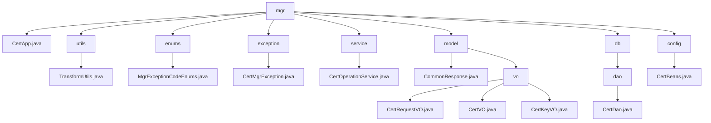

# Basic Information

|      |      |
|------|------|
| Name | mgr |
| Language | .java |
| Code Path | WeFe/manager/manager-service/src/main/java/com/webank/cert/mgr |
| Package Name | docs.manager.manager-service.src.main.java.com.webank.cert.mgr |
| Brief Description | TransformUtils provides object conversion functionality, containing three static constants and three conversion methods. CertMgrException is a custom exception class that includes error codes and descriptions. CertOperationService offers certificate management features, including status updates and certificate exports. CertDao manages certificate data access operations. CertBeans is a Spring configuration class that registers CertService. CertApp is an empty implementation class, potentially used for certificate management. The module implements full lifecycle management of digital certificates, covering application, issuance, and key association processes. |

# Description

## Overview  
This module implements full lifecycle management of digital certificates, including application, issuance, key binding, and exception handling. The core component CertOperationService provides certificate status updates, issuance, and query functionalities, relying on CertDao for data persistence. Key data structures include CertRequestVO (application), CertVO (certificate entity), and CertKeyVO (key metadata), serialized using FastJSON. External dependencies include the Java standard library, BouncyCastle security provider, and FastJSON framework. For example, TransformUtils implements object property copying via reflection, and CertMgrException enumerates 7 types of key management exceptions (e.g., 1013 indicates an unsupported key algorithm).  

## Core Business Scenarios  
The workflow follows a closed-loop three-phase process of "application → issuance → binding": after a user submits a CertRequestVO, the system generates a CertVO and associates it with a CertKeyVO, similar to a ticketing system. Core operations include root certificate initialization, CA certificate issuance, and key pair generation, supporting certificate chain validation (via parent-child association through pCertId). Interactions are completed through standardized VO objects, such as CertDao paginating certificate lists and CertService handling certificate validity checks. Exception scenarios are uniformly handled by CertMgrException, resembling an event bus-style error propagation mechanism.

### Package Internal Structure View

This flowchart illustrates the Java package structure of the WeFe certificate management service, with `mgr` as the root node containing 8 main submodules: `utils` (utility classes), `enums` (enumeration classes), `exception` (exception handling), `service` (service layer), `model` (data models), `db` (database access layer), `config` (configuration classes), and the main application `CertApp`. The `model` includes a `vo` (value object) subpackage, and `db` contains a `dao` (data access object) subpackage. Each module has corresponding concrete implementation class files, forming a clear hierarchical relationship.

# File List

| Name   | Type  | Description |
|-------|------|-------------|
| [model](model/_module.md) | package | This module manages the digital certificate lifecycle, including request, issuance, and key encapsulation functionalities, providing three Java classes to handle related data. It complies with the Java serialization standard and relies on the FastJSON framework. It supports end-to-end certificate management and serialization operations. The CommonResponse class encapsulates generic response data, including status codes, messages, and data bodies, and provides methods for handling success and failure cases. |
| [utils](utils/_module.md) | package | The TransformUtils class provides object transformation capabilities, supporting both single object and list transformations, utilizing reflection and caching to optimize performance. |
| [CertApp.java](CertApp.md) | file | CertApp is a public Java class, currently empty. |
| [config](config/_module.md) | package | The Java configuration class CertBeans defines a Bean method getCertService, which returns a CertService instance. |
| [db](db/_module.md) | package | The CertDao class manages certificate, key, and request information, providing save, query, and update functionalities, with support for paginated queries and status updates. |
| [service](service/_module.md) | package | The CertOperationService provides certificate management functionalities, including updating certificate status, querying certificates, exporting certificates, initializing root certificates, issuing certificates, and more. It supports both RSA and ECDSA algorithms and utilizes the BouncyCastle security library. |
| [exception](exception/_module.md) | package | CertMgrException is a custom exception class that contains an enumerated error code ece. It provides two constructor methods: one accepts an enumeration to set exception information, while the other directly accepts string information. It also provides a method to retrieve the enumerated error code. |
| [enums](enums/_module.md) | package | The enumeration MgrExceptionCodeEnums defines 7 exception codes and messages, including unsupported key algorithm, non-existent user account, non-existent certificate request, etc. Each exception contains a code and a description. |

