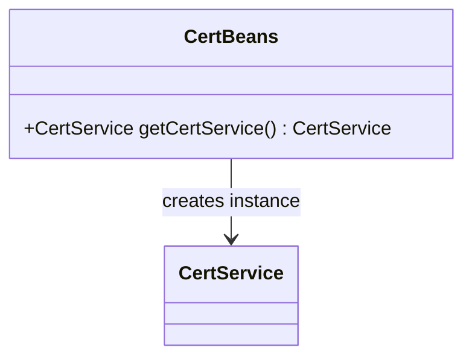
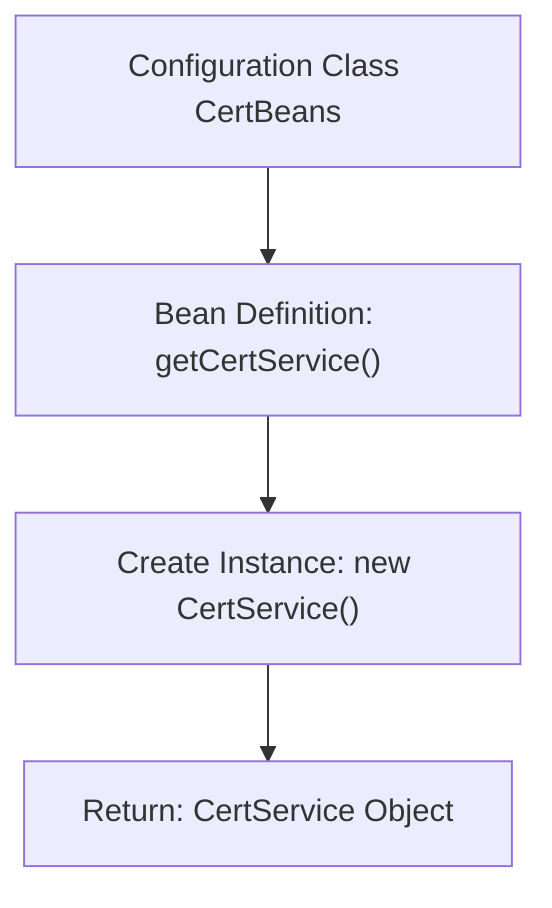

# Basic Information

|      |      |
|------|------|
| Name | CertBeans |
| Language | .java |
| Code Path | WeFe/manager/manager-service/src/main/java/com/webank/cert/mgr/config/CertBeans.java |
| Package Name | com.webank.cert.mgr.config |
| Dependencies | ['com.webank.cert.toolkit.service.CertService', 'org.springframework.context.annotation.Bean', 'org.springframework.context.annotation.Configuration'] |
| Brief Description | Java configuration class CertBeans defines a Bean method getCertService, which returns a CertService instance. |

# Description

The content defines a Java configuration class named CertBeans, using the @Configuration annotation to indicate it is a Spring configuration class. The class includes a getCertService method annotated with @Bean, which creates and returns an instance of the CertService class. The purpose of this configuration class is to register CertService as a managed bean in the Spring container, enabling its injection and use in other components.

# Class Summary

| Name   | Type  | Description |
|-------|------|-------------|
| CertBeans | class | This is a Java configuration class that defines a Bean named CertService, which is used to create and return an instance of CertService. |

## Class CertBeans

|      |      |
|------|------|
| Access Modifier | @Configuration;public |
| Type | class |
| Name | CertBeans |
| Description | This is a Java configuration class that defines a Bean named CertService, which is used to create and return an instance of CertService. |

### UML Class Diagram

This class diagram illustrates the relationship between the Spring configuration class `CertBeans` and the business class `CertService`. As a configuration class, `CertBeans` creates and returns an instance of `CertService` through the `@Bean`-annotated `getCertService()` method, demonstrating the core mechanism of Spring dependency injection. The diagram clearly presents the instantiation dependency of the configuration class on the business class, aligning with the design pattern of the Spring IoC container. The implementation details of `CertService` as a managed Bean are not expanded in the diagram, with the focus being on the declarative binding relationship between the configuration class and the Bean.

### Internal Method Call Graph

This flowchart illustrates the core logic of the Spring configuration class CertBeans. The CertBeans class is marked as a configuration class via the @Configuration annotation, which defines a @Bean method getCertService(). When the Spring container starts, it invokes this method to create and return a CertService instance, which is then managed by the Spring container. The entire process demonstrates the fundamental unit configuration approach of Spring dependency injection.

### Field List

| Name  | Type  | Description |
|-------|-------|------|

### Method List

| Name  | Type  | Description |
|-------|-------|------|
| getCertService | CertService | Define a Spring Bean that returns an instance of CertService. |

