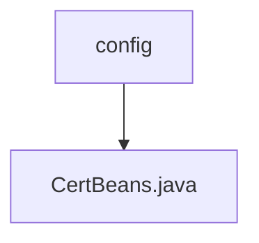

# Basic Information

|      |      |
|------|------|
| Name | config |
| Language | .java |
| Code Path | WeFe/manager/manager-service/src/main/java/com/webank/cert/mgr/config |
| Package Name | docs.manager.manager-service.src.main.java.com.webank.cert.mgr.config |
| Brief Description | The Java configuration class CertBeans defines a Bean method getCertService, which returns a CertService instance. |

# Description

The content defines a Java configuration class named CertBeans, annotated with @Configuration to indicate it is a Spring configuration class. The class includes a getCertService method annotated with @Bean, which creates and returns an instance of the CertService class. The purpose of this configuration class is to register CertService as a managed bean in the Spring container, enabling it to be injected and used in other components.

### Package Internal Structure View

This flowchart illustrates the configuration directory structure under the manager-service module in the WeFe project. The top-level node is the config directory, which contains a Java configuration file named CertBeans.java. Such a concise hierarchical structure is commonly used to store configuration class files for Spring Boot applications, aimed at defining and managing various Bean components within the application.

# File List

| Name   | Type  | Description |
|-------|------|-------------|
| [CertBeans.java](CertBeans.md) | file | The Java configuration class CertBeans defines a Bean method getCertService, which returns a CertService instance. |

