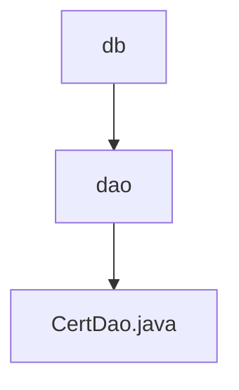

# Basic Information

|      |      |
|------|------|
| Name | db |
| Language | .java |
| Code Path | WeFe/manager/manager-service/src/main/java/com/webank/cert/mgr/db |
| Package Name | docs.manager.manager-service.src.main.java.com.webank.cert.mgr.db |
| Brief Description | The CertDao class manages certificate, key, and request information, providing save, query, and update functionalities, with support for paginated queries and status updates. |

# Description

CertDao is a service class responsible for managing data access operations related to certificates, keys, and certificate requests. It implements CRUD (Create, Read, Update, Delete) functionality through three auto-injected repository interfaces (CertInfoRepo, CertKeyInfoRepo, CertRequestInfoRepo). Key features include saving certificate, key, and request information; querying various types of information by ID; updating certificate status and trust status; and paginated queries for certificate lists, request lists, and key lists. Additionally, it supports queries based on conditions such as user ID, serial number, and parent certificate ID.

### Package Internal Structure View

This flowchart illustrates the database-related code structure within the manager-service module of the WeFe project. The top level is the db directory, which contains the dao subdirectory. The dao directory includes the CertDao.java file. This hierarchical relationship clearly reflects the organizational structure of the database access layer, where the dao layer is responsible for data access operations.

# File List

| Name   | Type  | Description |
|-------|------|-------------|
| [dao](dao/_module.md) | package | The CertDao class manages certificate, key, and request information, providing save, query, and update functionalities, with support for paginated queries and status updates. |

