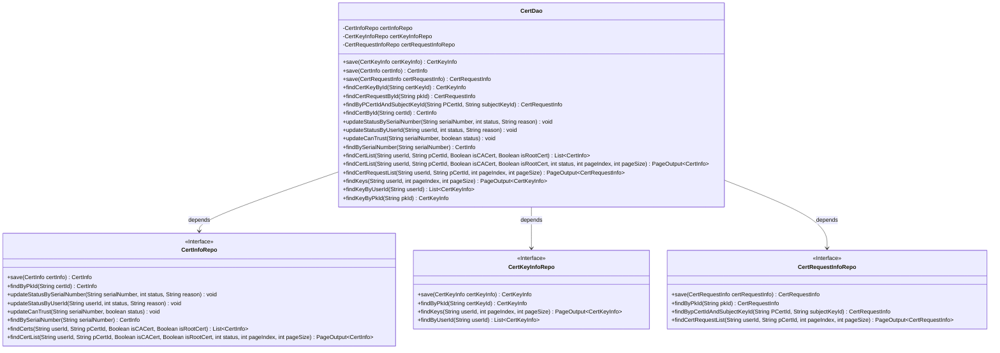

# Basic Information

|      |      |
|------|------|
| Name | CertDao |
| Language | .java |
| Code Path | WeFe/manager/manager-service/src/main/java/com/webank/cert/mgr/db/dao/CertDao.java |
| Package Name | com.webank.cert.mgr.db.dao |
| Dependencies | ['java.util.List', 'org.springframework.beans.factory.annotation.Autowired', 'org.springframework.stereotype.Service', 'com.welab.wefe.common.data.mongodb.dto.PageOutput', 'com.welab.wefe.common.data.mongodb.entity.manager.CertInfo', 'com.welab.wefe.common.data.mongodb.entity.manager.CertKeyInfo', 'com.welab.wefe.common.data.mongodb.entity.manager.CertRequestInfo', 'com.welab.wefe.common.data.mongodb.repo.CertInfoRepo', 'com.welab.wefe.common.data.mongodb.repo.CertKeyInfoRepo', 'com.welab.wefe.common.data.mongodb.repo.CertRequestInfoRepo'] |
| Brief Description | The CertDao class manages certificate, key, and request information, providing save, query, and update functionalities, with support for paginated queries and status updates. |

# Description

CertDao is a service class responsible for managing data access operations related to certificates, keys, and certificate requests. It implements CRUD (Create, Read, Update, Delete) functionality through three auto-injected repository interfaces (CertInfoRepo, CertKeyInfoRepo, CertRequestInfoRepo). Key features include saving certificate, key, and request information, querying various types of information by ID, updating certificate status and trust status, as well as paginated queries for certificate lists, request lists, and key lists. Additionally, it supports queries based on conditions such as user ID, serial number, and parent certificate ID.

# Class Summary

| Name   | Type  | Description |
|-------|------|-------------|
| CertDao | class | The CertDao class is a service component designed for managing certificates, keys, and request information. It provides functionalities for saving, querying, and updating data, supporting operations based on criteria such as ID, serial number, user ID, etc., and also supports paginated queries. |

## Class CertDao

|      |      |
|------|------|
| Access Modifier | @Service;public |
| Type | class |
| Name | CertDao |
| Description | The CertDao class is a service component designed for managing certificates, keys, and request information. It provides functionalities for saving, querying, and updating data, supporting operations based on criteria such as ID, serial number, user ID, etc., and also supports paginated queries. |

### UML Class Diagram

This code demonstrates the data access layer design of a certificate management system. The CertDao class serves as the core service class, implementing CRUD operations for certificate information, key information, and certificate request information through dependency injection of three JPA repository interfaces (CertInfoRepo, CertKeyInfoRepo, CertRequestInfoRepo). The class provides various query methods, including basic operations such as querying by ID, serial number, and user ID, as well as advanced features supporting pagination queries. All repository interfaces follow Spring Data JPA naming conventions, automatically generating query logic through method names. As an intermediary layer, CertDao encapsulates underlying data access details, offering a unified certificate management interface for upper-level business logic.

### Internal Method Call Graph

```mermaid
graph TD
    A["Class CertDao"]
    B["Property: CertInfoRepo certInfoRepo"]
    C["Property: CertKeyInfoRepo certKeyInfoRepo"]
    D["Property: CertRequestInfoRepo certRequestInfoRepo"]
    E["Method: save(CertKeyInfo certKeyInfo)"]
    F["Method: save(CertInfo certInfo)"]
    G["Method: save(CertRequestInfo certRequestInfo)"]
    H["Method: findCertKeyById(String certKeyId)"]
    I["Method: findCertRequestById(String pkId)"]
    J["Method: findByPCertIdAndSubjectKeyId(String PCertId, String subjectKeyId)"]
    K["Method: findCertById(String certId)"]
    L["Method: updateStatusBySerialNumber(String serialNumber, int status, String reason)"]
    M["Method: updateStatusByUserId(String userId, int status, String reason)"]
    N["Method: updateCanTrust(String serialNumber, boolean status)"]
    O["Method: findBySerialNumber(String serialNumber)"]
    P["Method: findCertList(String userId, String pCertId, Boolean isCACert, Boolean isRootCert)"]
    Q["Method: findCertList(String userId, String pCertId, Boolean isCACert, Boolean isRootCert, int status, int pageIndex, int pageSize)"]
    R["Method: findCertRequestList(String userId, String pCertId, int pageIndex, int pageSize)"]
    S["Method: findKeys(String userId, int pageIndex, int pageSize)"]
    T["Method: findKeyByUserId(String userId)"]
    U["Method: findKeyByPkId(String pkId)"]

    A --> B
    A --> C
    A --> D
    A --> E
    A --> F
    A --> G
    A --> H
    A --> I
    A --> J
    A --> K
    A --> L
    A --> M
    A --> N
    A --> O
    A --> P
    A --> Q
    A --> R
    A --> S
    A --> T
    A --> U
```

This flowchart illustrates the structure and functionality of the CertDao class, which is a service class designed to manage certificate, certificate request, and key information. It interacts with the database through three auto-wired repository interfaces (CertInfoRepo, CertKeyInfoRepo, CertRequestInfoRepo) and provides various methods for saving, querying, and updating data. These include lookup by ID, conditional queries, paginated queries, and status updates. The methods primarily handle operations related to certificate lifecycle management.

### Field List

| Name  | Type  | Description |
|-------|-------|------|
| certKeyInfoRepo | CertKeyInfoRepo | Using @Autowired to automatically inject an instance of CertKeyInfoRepo. |
| certInfoRepo | CertInfoRepo | Automatically inject the CertInfoRepo instance. |
| certRequestInfoRepo | CertRequestInfoRepo | Automatically inject certificate request information repository instance. |

### Method List

| Name  | Type  | Description |
|-------|-------|------|
| findByPCertIdAndSubjectKeyId | CertRequestInfo | This method queries certificate request information by certificate ID and subject key ID, and invokes the repository method to return the result. |
| save | CertInfo | Save the certificate information and return the saved object. |
| findKeyByPkId | CertKeyInfo | The method queries CertKeyInfo by pkId, invoking the findByPkId method of certKeyInfoRepo to return the result. |
| save | CertRequestInfo | Save the certificate request information to the repository and return this information. |
| updateCanTrust | void | Methods to update certificate trust status, modify database records based on serial number and status. |
| findCertRequestById | CertRequestInfo | This method queries certificate request information by ID, invoking the repository interface to return the corresponding data object based on the primary key ID. |
| findCertKeyById | CertKeyInfo | Query certificate key information based on the certificate ID. |
| findKeyByUserId | List<CertKeyInfo> | Query the list of certificate key information based on the user ID and return the corresponding results. |
| findBySerialNumber | CertInfo | Query certificate information based on the serial number and return matching results. |
| findCertList | List<CertInfo> | Query the list of user certificates, supporting filtering by user ID, parent certificate ID, whether it is a CA certificate, and root certificate conditions. |
| updateStatusBySerialNumber | void | Method for updating certificate status: Modify certificate status and reason based on serial number. |
| save | CertKeyInfo | This method saves the certificate key information to the database and returns the saved object. |
| updateStatusByUserId | void | Update status and reason based on user ID, and invoke the repository method to perform the operation. |
| findKeys | PageOutput<CertKeyInfo> | This method retrieves certificate key information through paginated queries by user ID, returning paginated results. |
| findCertRequestList | PageOutput<CertRequestInfo> | This method queries the certificate request list by user ID and certificate ID, supports pagination, and returns paginated results. |
| findCertById | CertInfo | Query certificate information based on the certificate ID, and return the result by calling the findByPkId method of certInfoRepo. |
| findCertList | PageOutput<CertInfo> | This method queries the certificate list based on user ID, parent certificate ID, whether it is a CA certificate, whether it is a root certificate, and status, supports pagination, and returns paginated results. |

