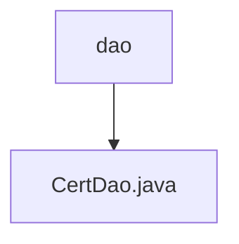

# Basic Information

|      |      |
|------|------|
| Name | dao |
| Language | .java |
| Code Path | WeFe/manager/manager-service/src/main/java/com/webank/cert/mgr/db/dao |
| Package Name | docs.manager.manager-service.src.main.java.com.webank.cert.mgr.db.dao |
| Brief Description | The CertDao class manages certificate, key, and request information, providing save, query, and update functionalities, with support for paginated queries and status updates. |

# Description

CertDao is a service class responsible for managing data access operations related to certificates, keys, and certificate requests. It implements CRUD functionality through three auto-injected repository interfaces (CertInfoRepo, CertKeyInfoRepo, CertRequestInfoRepo). Key features include saving certificate, key, and request information; querying various types of information by ID; updating certificate status and trust status; as well as paginated queries for certificate lists, request lists, and key lists. Additionally, it supports queries based on conditions such as user ID, serial number, and parent certificate ID.

### Package Internal Structure View

This flowchart illustrates a simple structure of the database access layer, where the `dao` directory contains a specific database access implementation file `CertDao.java`. Such a structure is commonly seen in Java projects, where the DAO layer is typically responsible for interacting with the database, and `CertDao.java` is the class file that implements specific database operations.

# File List

| Name   | Type  | Description |
|-------|------|-------------|
| [CertDao.java](CertDao.md) | file | The CertDao class manages certificate, key, and request information, providing save, query, and update functionalities, with support for paginated queries and status updates. |

