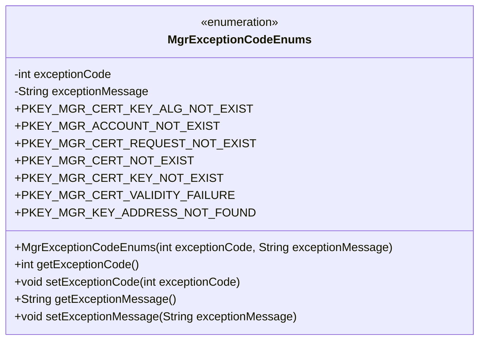

# Basic Information

|      |      |
|------|------|
| Name | MgrExceptionCodeEnums |
| Language | .java |
| Code Path | WeFe/manager/manager-service/src/main/java/com/webank/cert/mgr/enums/MgrExceptionCodeEnums.java |
| Package Name | com.webank.cert.mgr.enums |
| Dependencies | [] |
| Brief Description | The enumeration MgrExceptionCodeEnums defines 7 exception codes and messages, including unsupported key algorithm, non-existent user account, non-existent certificate request, etc. Each exception contains a code and a description. |

# Description

The enumeration class defines exception codes and descriptions related to key management, encompassing 7 types of exceptions. Each exception consists of an error code and error message, for example, 1013 indicates an unsupported key algorithm, while 1006 denotes a non-existent user account. The class provides a constructor to initialize these two fields and includes public methods for retrieving and setting the exception code and message. All exceptions are related to certificate, key, or account management, such as certificate not found, private key missing, certificate expired, or key address not located, etc.

# Class Summary

| Name   | Type  | Description |
|-------|------|-------------|
| MgrExceptionCodeEnums | enum | The enumeration MgrExceptionCodeEnums defines 7 exception codes and messages, including unsupported key algorithm, non-existent user account, non-existent certificate request, non-existent certificate, non-existent private key, expired certificate validity, and missing key address. Each enumeration item contains an exception code and exception message. |

## Class MgrExceptionCodeEnums

|      |      |
|------|------|
| Access Modifier | public |
| Type | enum |
| Name | MgrExceptionCodeEnums |
| Description | The enumeration MgrExceptionCodeEnums defines 7 exception codes and messages, including unsupported key algorithm, non-existent user account, non-existent certificate request, non-existent certificate, non-existent private key, expired certificate validity, and missing key address. Each enumeration item contains an exception code and exception message. |

### UML Class Diagram

This code defines an enumeration class `MgrExceptionCodeEnums` for managing exception codes and their corresponding exception messages. The enumeration class includes seven predefined enum constants, each associated with an exception code and message. It contains private fields `exceptionCode` and `exceptionMessage`, along with corresponding getter and setter methods. The constructor of the enumeration class is private and used to initialize the exception codes and messages for the enum constants. This enumeration class is primarily designed to centrally manage and identify different types of exception scenarios.

### Internal Method Call Graph

```mermaid
graph TD
    A["Enum Class MgrExceptionCodeEnums"]
    B["Enum Value: PKEY_MGR_CERT_KEY_ALG_NOT_EXIST(1013, 'key algorithms are not supported')"]
    C["Enum Value: PKEY_MGR_ACCOUNT_NOT_EXIST(1006, 'user account does not exist')"]
    D["Enum Value: PKEY_MGR_CERT_REQUEST_NOT_EXIST(1014, 'certificate request not exists')"]
    E["Enum Value: PKEY_MGR_CERT_NOT_EXIST(1015, 'certificate not exists')"]
    F["Enum Value: PKEY_MGR_CERT_KEY_NOT_EXIST(1016, 'certificate private key not exists')"]
    G["Enum Value: PKEY_MGR_CERT_VALIDITY_FAILURE(1017, 'the current date is out of the validity of the certificate')"]
    H["Enum Value: PKEY_MGR_KEY_ADDRESS_NOT_FOUND(1018, 'key address not found')"]
    I["Constructor: MgrExceptionCodeEnums(int exceptionCode, String exceptionMessage)"]
    J["Field: int exceptionCode"]
    K["Field: String exceptionMessage"]
    L["Method: getExceptionCode()"]
    M["Method: setExceptionCode(int exceptionCode)"]
    N["Method: getExceptionMessage()"]
    O["Method: setExceptionMessage(String exceptionMessage)"]

    A --> B
    A --> C
    A --> D
    A --> E
    A --> F
    A --> G
    A --> H
    A --> I
    A --> J
    A --> K
    A --> L
    A --> M
    A --> N
    A --> O
```

This flowchart illustrates the complete structure of the MgrExceptionCodeEnums enum class, which includes 7 predefined enum value instances. Each instance is initialized via a constructor with an exception code and message. The class contains two private fields (exceptionCode and exceptionMessage) along with corresponding getter/setter methods. By providing predefined error codes and descriptive messages, this enum class enables standardized exception type management for the system, making it suitable for error classification and handling in key management scenarios.

### Field List

| Name  | Type  | Description |
|-------|-------|------|

### Method List

| Name  | Type  | Description |
|-------|-------|------|

