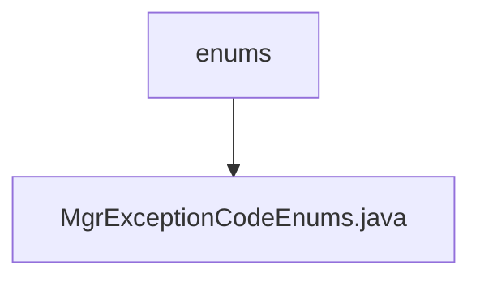

# Basic Information

|      |      |
|------|------|
| Name | enums |
| Language | .java |
| Code Path | WeFe/manager/manager-service/src/main/java/com/webank/cert/mgr/enums |
| Package Name | docs.manager.manager-service.src.main.java.com.webank.cert.mgr.enums |
| Brief Description | The enumeration MgrExceptionCodeEnums defines 7 exception codes and messages, including unsupported key algorithm, non-existent user account, non-existent certificate request, etc. Each exception contains a code and a description. |

# Description

The enumeration class defines exception codes and descriptions related to key management, encompassing 7 types of exceptions. Each exception consists of an error code and an error message. For example, 1013 indicates an unsupported key algorithm, while 1006 denotes a non-existent user account. The class provides a constructor to initialize these two fields and includes public methods for retrieving and setting the exception code and message. All exceptions are related to certificate, key, or account management, such as certificate not found, private key missing, certificate expired, or key address not located, among others.

### Package Internal Structure View

This flowchart illustrates the enum class structure within the manager-service module of the WeFe project. The root node is the enums directory, which contains a specific enum class file named MgrExceptionCodeEnums.java. This structure represents a typical directory organization approach for centralized management of exception code enums in enterprise-level projects, reflecting a clear code layering design philosophy.

# File List

| Name   | Type  | Description |
|-------|------|-------------|
| [MgrExceptionCodeEnums.java](MgrExceptionCodeEnums.md) | file | The enumeration MgrExceptionCodeEnums defines 7 exception codes and messages, including unsupported key algorithm, non-existent user account, non-existent certificate request, etc. Each exception contains a code and a description. |

