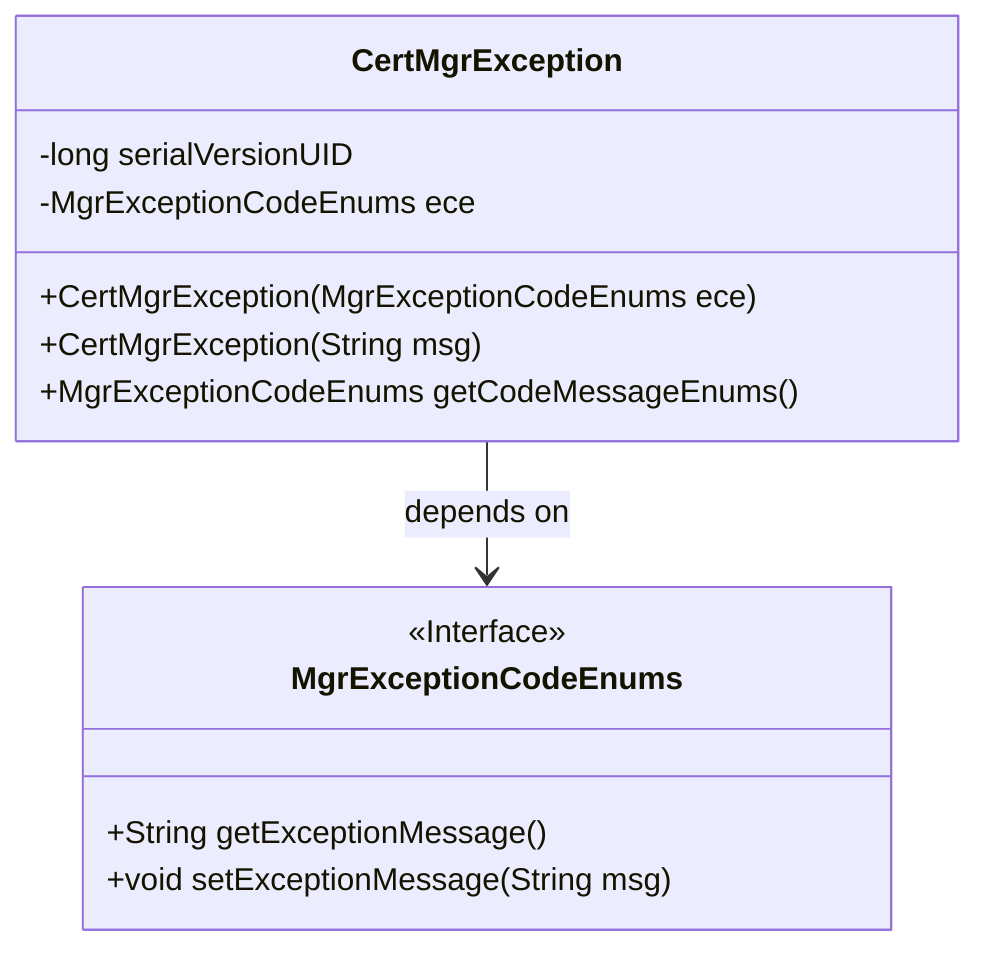
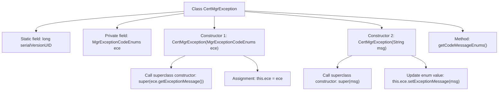

# Basic Information

|      |      |
|------|------|
| Name | CertMgrException |
| Language | .java |
| Code Path | WeFe/manager/manager-service/src/main/java/com/webank/cert/mgr/exception/CertMgrException.java |
| Package Name | com.webank.cert.mgr.exception |
| Dependencies | ['com.webank.cert.mgr.enums.MgrExceptionCodeEnums'] |
| Brief Description | The CertMgrException is a custom exception class that includes an enumerated error code ece. It provides two constructors: one accepts an enumeration to set the exception message, while the other directly accepts a string message. It also offers a method to retrieve the error code enumeration. |

# Description

CertMgrException is a custom exception class that inherits from the Exception class. It contains a private static serialVersionUID field and a private field ece of type MgrExceptionCodeEnums. The class provides two constructors: one that accepts a MgrExceptionCodeEnums parameter and invokes the parent class constructor to set the exception message, and another that accepts a string message and updates the exception message of ece. It also provides a getCodeMessageEnums method for retrieving the ece enumeration value.

# Class Summary

| Name   | Type  | Description |
|-------|------|-------------|
| CertMgrException | class | CertMgrException is a custom exception class that contains an enumerated error code ece. It provides two constructors: one accepts an enumeration to set exception information, while the other directly accepts string information. It also includes a method to retrieve the error code enumeration. |

## Class CertMgrException

|      |      |
|------|------|
| Access Modifier | public |
| Type | class |
| Name | CertMgrException |
| Description | CertMgrException is a custom exception class that contains an enumerated error code ece. It provides two constructors: one accepts an enumeration to set exception information, while the other directly accepts string information. It also includes a method to retrieve the error code enumeration. |

### UML Class Diagram

This code demonstrates a custom exception class `CertMgrException`, which inherits from the `Exception` class. It contains a private member variable `ece` of type `MgrExceptionCodeEnums` to store exception code enumerations. The class provides two constructors: one accepts an enumeration type parameter to set the exception message, while the other directly takes a string message and updates the message in the enumeration. Additionally, it includes a method to retrieve the enumeration object. `MgrExceptionCodeEnums` is an interface that defines methods for getting and setting exception messages. This exception class is primarily used for error handling scenarios related to certificate management.

### Internal Method Call Graph

This flowchart illustrates the structure of the CertMgrException class, which includes two constructors and one query method. The core logic involves managing exception information through the MgrExceptionCodeEnums enumeration. Constructor 1 directly initializes with the enumeration, while Constructor 2 allows custom messages and synchronously updates the enum value. serialVersionUID ensures serialization compatibility, and getCodeMessageEnums() provides access to the internal enumeration. The flow clearly demonstrates two initialization paths for exception messages and the state maintenance mechanism.

### Field List

| Name  | Type  | Description |
|-------|-------|------|
| ece | MgrExceptionCodeEnums | Private exception code enumeration variable ece. |
| serialVersionUID = 893822168485972751L | long | Declare a private static final serial version ID with the value 893822168485972751L. |

### Method List

| Name  | Type  | Description |
|-------|-------|------|
| getCodeMessageEnums | MgrExceptionCodeEnums | This method returns an enumeration object ece of type MgrExceptionCodeEnums. |

