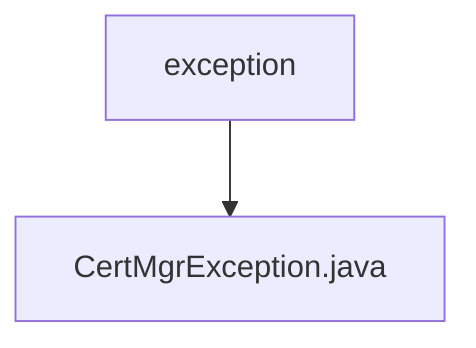

# Basic Information

|      |      |
|------|------|
| Name | exception |
| Language | .java |
| Code Path | WeFe/manager/manager-service/src/main/java/com/webank/cert/mgr/exception |
| Package Name | docs.manager.manager-service.src.main.java.com.webank.cert.mgr.exception |
| Brief Description | CertMgrException is a custom exception class that contains an enumerated error code ece. It provides two constructor methods: one accepts an enumeration to set exception information, while the other directly accepts string information. It also provides a method to retrieve the enumerated error code. |

# Description

CertMgrException is a custom exception class that inherits from the Exception class. It contains a private static serialVersionUID field and a private field ece of type MgrExceptionCodeEnums. The class provides two constructors: one that accepts a MgrExceptionCodeEnums parameter and calls the parent class constructor to set the exception message, and another that accepts a string message and updates the exception message of ece. It also provides a getCodeMessageEnums method to retrieve the ece enum value.

### Package Internal Structure View

This flowchart illustrates the exception handling structure of the manager-service module in the WeFe project. The top-level node is the exception folder, which contains a specific exception class CertMgrException.java. This structure represents a typical Java project exception handling design pattern, where custom exception classes are centrally stored in the exception package for unified management and maintenance of exception handling logic.

# File List

| Name   | Type  | Description |
|-------|------|-------------|
| [CertMgrException.java](CertMgrException.md) | file | CertMgrException is a custom exception class that includes an enumerated error code `ece`. It provides two constructors: one accepts an enumeration to set the exception information, while the other directly accepts a string message. It also provides a method to retrieve the enumerated error code. |

