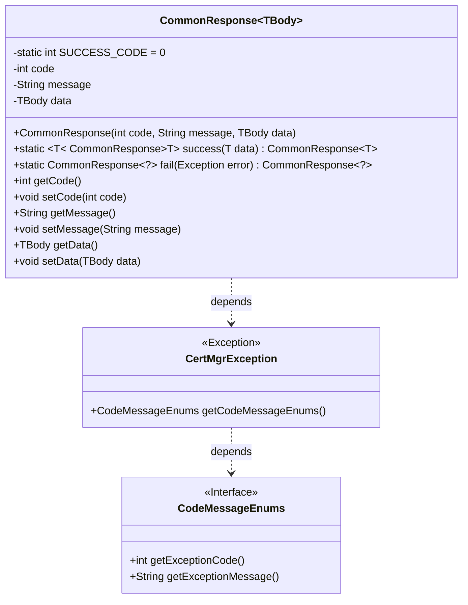
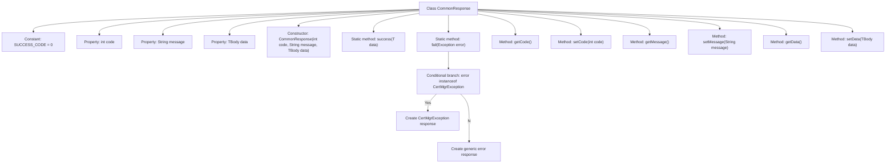

# Basic Information

|      |      |
|------|------|
| Name | CommonResponse |
| Language | .java |
| Code Path | WeFe/manager/manager-service/src/main/java/com/webank/cert/mgr/model/CommonResponse.java |
| Package Name | com.webank.cert.mgr.model |
| Dependencies | ['com.webank.cert.mgr.exception.CertMgrException'] |
| Brief Description | General response class, containing status code, message, and generic data body, providing static construction methods for success and failure, supporting exception handling and data encapsulation. |

# Description

CommonResponse is a generic class designed to encapsulate universal response data. It contains three primary attributes: `code` represents the status code, `message` stores the message text, and `data` holds the data body of a generic type. The class defines a constant `SUCCESS_CODE` to indicate the successful status code 0. It provides two static factory methods: the `success` method returns a successful response with data, while the `fail` method handles exceptions and returns an error response, capable of identifying the specific exception type `CertMgrException` to extract detailed error codes and messages. Additionally, it includes getter and setter methods for each attribute, supporting chained operations.

# Class Summary

| Name   | Type  | Description |
|-------|------|-------------|
| CommonResponse | class | General response class, containing status code, message, and generic data. Provides static methods for success and failure, supports exception handling and property access. |

## Class CommonResponse

|      |      |
|------|------|
| Access Modifier | public |
| Type | class |
| Name | CommonResponse |
| Description | General response class, containing status code, message, and generic data. Provides static methods for success and failure, supports exception handling and property access. |

### UML Class Diagram

This code defines a generic class `CommonResponse<TBody>` for encapsulating generic response data. It includes static factory methods for success and failure, where the `fail()` method handles `CertMgrException`. The class has three main fields: status code, message, and generic data body, along with corresponding getter and setter methods. `CertMgrException` is a custom exception class that retrieves error codes and messages via the `CodeMessageEnums` interface.

### Internal Method Call Graph

This code defines a generic response class CommonResponse with generic design to accommodate different data types. Core functionalities include: initializing response objects through constructors, providing static method success() for quick success response creation, and fail() method for exception handling with error response generation (including special handling branch for CertMgrException). The class contains standard getter/setter methods, maintains status code, message, and generic data body, with SUCCESS_CODE constant defining successful status code 0. The flowchart clearly illustrates the class structure, method invocation relationships, and exception handling branch logic.

### Field List

| Name  | Type  | Description |
|-------|-------|------|
| data | TBody | The private generic variable `data` is of type `TBody`. |
| message | String | Private string variable message |
| SUCCESS_CODE = 0 | int | Define the success status code constant SUCCESS_CODE with a value of 0. |
| code | int | private int variable code |

### Method List

| Name  | Type  | Description |
|-------|-------|------|
| setCode | void | Set the value of the integer variable code. |
| success | CommonResponse | Define a static method `success` that returns a `CommonResponse` object containing a success code, an empty message, and data. |
| getMessage | String | Methods to obtain the message string. |
| setMessage | void | Set the value of the class member variable `message` to the passed parameter. |
| getData | TBody | Method to retrieve data, returns a data object of type TBody. |
| setData | void | The method `setData` is used to assign data of type `TBody` to the `data` property of the current object. |
| getCode | int | This is a Java method that returns the value of the integer variable code. |
| fail | CommonResponse | The static method `fail` handles exceptions and returns a `CommonResponse`. If the exception is a `CertMgrException`, it uses its error code and message; otherwise, it returns the default error code `-1` along with the exception message. |

