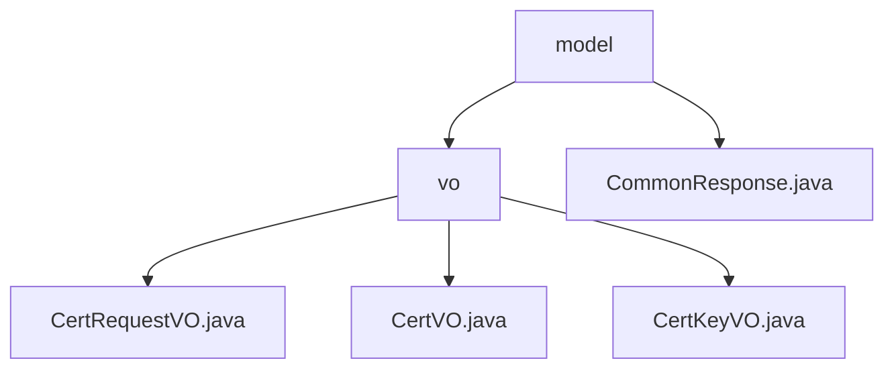

# Basic Information

|      |      |
|------|------|
| Name | model |
| Language | .java |
| Code Path | WeFe/manager/manager-service/src/main/java/com/webank/cert/mgr/model |
| Package Name | docs.manager.manager-service.src.main.java.com.webank.cert.mgr.model |
| Brief Description | This module manages the digital certificate lifecycle, including request, issuance, and key encapsulation functionalities, providing three Java classes to handle related data. It complies with the Java serialization standard and relies on the FastJSON framework. It supports end-to-end certificate management and serialization operations. The CommonResponse class encapsulates generic response data, including status codes, messages, and data bodies, and provides methods for handling success and failure cases. |

# Description

## Overview  
The core responsibility of this module is to implement full lifecycle management of digital certificates, covering processes such as application, issuance, and key association. It employs three serializable objects—CertRequestVO, CertVO, and CertKeyVO—to handle certificate requests, entities, and key metadata respectively, following a ticketing system-like pattern. Interfaces adhere to the Java serialization specification, with JSONField annotations used for field mapping. Key data structures include the certificate subject (subject_cn), issuing authority, and key algorithm (keyAlg). External dependencies are limited to Java core libraries and the FastJSON framework. For example, CertVO implements certificate chain hierarchy management through pCertId, while the CommonResponse generic class uniformly encapsulates response data (including status codes, messages, and data bodies).  

## Key Business Scenarios  
The core workflow follows a three-stage闭环 (closed-loop) process: user application (CertRequestVO) → issuance (CertVO) → key binding (CertKeyVO). CertVO records both issuer and applicant information, supporting certificate chain validation (parent-child association via pCertId) and key retrieval (based on userId + keyAlg). Interactions are completed through VO objects; for instance, CommonResponse provides standardized success/failure responses and can identify CertMgrException exception types. All operations support serialization, adapting to RPC calls or database persistence scenarios, resembling data flow in an event bus-like pattern.

### Package Internal Structure View

This flowchart illustrates the hierarchical structure of the model directory under the manager-service module in the WeFe project. The top level is the model folder, which contains the vo subdirectory and the CommonResponse.java file. The vo directory further includes three VO class files: CertRequestVO.java, CertVO.java, and CertKeyVO.java. The entire structure clearly reflects the organization of Java packages.

# File List

| Name   | Type  | Description |
|-------|------|-------------|
| [CommonResponse.java](CommonResponse.md) | file | Generic response class, including status code, message, and generic data body, providing static construction methods for success and failure, supporting exception handling and data encapsulation. |
| [vo](vo/_module.md) | package | CertRequestVO is a Java class encapsulating certificate request data, containing fields such as pkId. CertVO represents certificate information, including fields like primary key ID. CertKeyVO denotes certificate key information, with fields such as pkId. All three implement the Serializable interface. |

