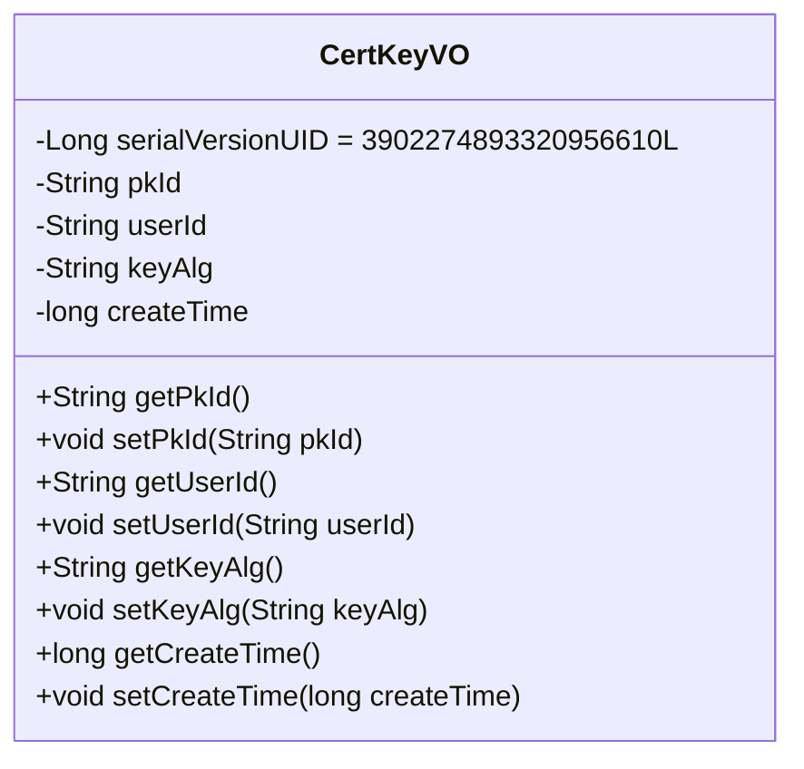

# Basic Information

|      |      |
|------|------|
| Name | CertKeyVO |
| Language | .java |
| Code Path | WeFe/manager/manager-service/src/main/java/com/webank/cert/mgr/model/vo/CertKeyVO.java |
| Package Name | com.webank.cert.mgr.model.vo |
| Dependencies | ['java.io.Serializable'] |
| Brief Description | The CertKeyVO class implements the Serializable interface and includes the fields pkId, userId, keyAlg, and createTime along with their corresponding getter/setter methods. |

# Description

CertKeyVO is a Java class that implements the Serializable interface, used to represent certificate key information. This class contains four private fields: pkId represents the primary key ID, userId represents the user ID, keyAlg represents the key algorithm, and createTime represents the creation time. Each field has corresponding getter and setter methods for accessing and modifying the field values. The class also defines a serialVersionUID for serialization version control.

# Class Summary

| Name   | Type  | Description |
|-------|------|-------------|
| CertKeyVO | class | The CertKeyVO class implements serialization and includes fields such as pkId, userId, keyAlg, createTime along with their corresponding getter/setter methods. |

## Class CertKeyVO

|      |      |
|------|------|
| Access Modifier | public |
| Type | class |
| Name | CertKeyVO |
| Description | The CertKeyVO class implements serialization and includes fields such as pkId, userId, keyAlg, createTime along with their corresponding getter/setter methods. |

### UML Class Diagram

This code defines a class named CertKeyVO, which implements the Serializable interface and serves as a value object representing certificate keys. The class contains four private attributes: pkId (primary key ID), userId (user ID), keyAlg (key algorithm), and createTime (creation time), along with corresponding getter and setter methods for each attribute. The serialVersionUID ensures version consistency during serialization. This class is primarily used to encapsulate and transmit certificate key-related data, making it suitable for scenarios requiring serialization.

### Internal Method Call Graph

```mermaid
graph TD
    A["Class CertKeyVO"]
    B["Static field: serialVersionUID = 3902274893320956610L"]
    C["Field: String pkId"]
    D["Field: String userId"]
    E["Field: String keyAlg"]
    F["Field: long createTime"]
    G["Method: getPkId()"]
    H["Method: setPkId(String pkId)"]
    I["Method: getUserId()"]
    J["Method: setUserId(String userId)"]
    K["Method: getKeyAlg()"]
    L["Method: setKeyAlg(String keyAlg)"]
    M["Method: getCreateTime()"]
    N["Method: setCreateTime(long createTime)"]

    A --> B
    A --> C
    A --> D
    A --> E
    A --> F
    A --> G
    A --> H
    A --> I
    A --> J
    A --> K
    A --> L
    A --> M
    A --> N
```

This flowchart illustrates the complete structure of the CertKeyVO class, a Java value object class implementing the Serializable interface. The class contains 4 private fields (pkId, userId, keyAlg, createTime) with corresponding getter/setter methods, along with a static serialVersionUID field for serialization. All methods are directly associated with the class body, forming a typical POJO structure suitable for encapsulating and transmitting certificate key data.

### Field List

| Name  | Type  | Description |
|-------|-------|------|
| keyAlg | String | Declare a private string variable keyAlg to store the key algorithm type. |
| pkId | String | The private string-type variable pkId is used to store the primary key identifier. |
| userId | String | Declare a private string variable userId. |
| serialVersionUID = 3902274893320956610L | long | Declare a private static final long serialVersionUID with a value of 3902274893320956610. |
| createTime | long | Private long integer variable, recording the creation time. |

### Method List

| Name  | Type  | Description |
|-------|-------|------|
| setUserId | void | Methods for setting the user ID, assigning the input parameter to the class member variable userId. |
| getUserId | String | Methods to obtain the user ID, returns a string-type userId. |
| setPkId | void | Java method: Set the primary key ID, assigning the input parameter pkId to the class member variable this.pkId. |
| getPkId | String | This is a Java method that returns the value of the private variable pkId. The method is named getPkId, and its return type is String. |
| getKeyAlg | String | The method to obtain the key algorithm returns the keyAlg value. |
| setKeyAlg | void | This is a Java method used to set the key algorithm property. The method is named setKeyAlg, which takes a string parameter keyAlg and assigns it to the class member variable of the same name. |
| getCreateTime | long | Methods to obtain the creation time, returns a long integer value createTime. |
| setCreateTime | void | This is a Java method used to set the creation time of an object, with the parameter being a long integer timestamp. |

