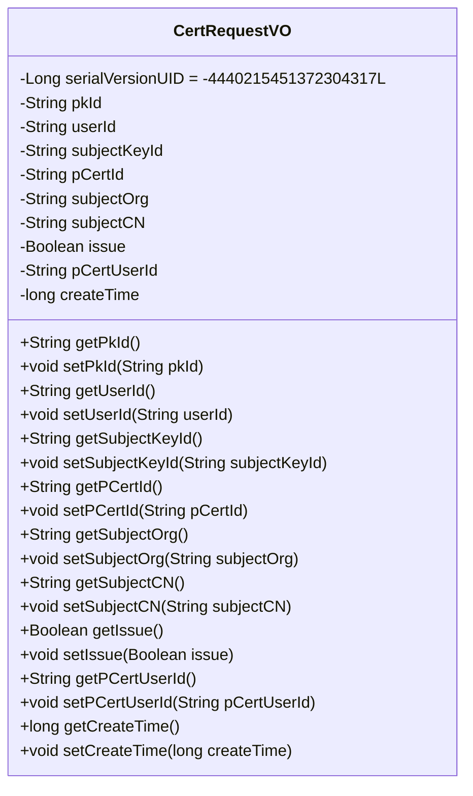

# Basic Information

|      |      |
|------|------|
| Name | CertRequestVO |
| Language | .java |
| Code Path | WeFe/manager/manager-service/src/main/java/com/webank/cert/mgr/model/vo/CertRequestVO.java |
| Package Name | com.webank.cert.mgr.model.vo |
| Dependencies | ['java.io.Serializable', 'com.alibaba.fastjson.annotation.JSONField'] |
| Brief Description | The CertRequestVO class implements the Serializable interface and includes certificate request-related fields such as pkId, userId, subjectKeyId, etc., providing getter and setter methods. |

# Description

CertRequestVO is a Java class that implements the Serializable interface, used to represent certificate request information. The class contains multiple private fields: pkId, userId, subjectKeyId, pCertId, subjectOrg, subjectCN (JSON field name as subject_cn), issue, pCertUserId, and createTime. Each field has corresponding getter and setter methods. The serialVersionUID is used for serialization version control. Comments indicate that the certRequestContent field and related methods are temporarily commented out. This class is primarily used to encapsulate certificate request-related data and supports serialization operations.

# Class Summary

| Name   | Type  | Description |
|-------|------|-------------|
| CertRequestVO | class | The CertRequestVO class implements the Serializable interface and contains certificate request-related fields such as pkId, userId, subjectCN, etc., providing getter and setter methods for each field. |

## Class CertRequestVO

|      |      |
|------|------|
| Access Modifier | public |
| Type | class |
| Name | CertRequestVO |
| Description | The CertRequestVO class implements the Serializable interface and contains certificate request-related fields such as pkId, userId, subjectCN, etc., providing getter and setter methods for each field. |

### UML Class Diagram

This code defines a class named CertRequestVO, which implements the Serializable interface and serves as a value object representing certificate requests. The class contains multiple private fields such as pkId, userId, subjectKeyId, etc., along with their corresponding getter and setter methods. The subjectCN field is annotated with @JSONField for serialization configuration. The design of this class is primarily intended to encapsulate certificate request-related data, facilitating transmission and processing across different layers.

### Internal Method Call Graph

```mermaid
graph TD
    A["Class CertRequestVO"]
    B["Field: String pkId"]
    C["Field: String userId"]
    D["Field: String subjectKeyId"]
    E["Field: String pCertId"]
    F["Field: String subjectOrg"]
    G["Field: String subjectCN"]
    H["Field: Boolean issue"]
    I["Field: String pCertUserId"]
    J["Field: long createTime"]
    K["Method: getPkId()/setPkId()"]
    L["Method: getUserId()/setUserId()"]
    M["Method: getSubjectKeyId()/setSubjectKeyId()"]
    N["Method: getpCertId()/setpCertId()"]
    O["Method: getSubjectOrg()/setSubjectOrg()"]
    P["Method: getSubjectCN()/setSubjectCN()"]
    Q["Method: getIssue()/setIssue()"]
    R["Method: getpCertUserId()/setpCertUserId()"]
    S["Method: getCreateTime()/setCreateTime()"]

    A --> B
    A --> C
    A --> D
    A --> E
    A --> F
    A --> G
    A --> H
    A --> I
    A --> J
    A --> K
    A --> L
    A --> M
    A --> N
    A --> O
    A --> P
    A --> Q
    A --> R
    A --> S
```

This code defines a Java class named CertRequestVO that implements the Serializable interface, primarily used for encapsulating certificate request data. The class contains 9 private fields, each with corresponding getter and setter methods. The subjectCN field uses the @JSONField annotation to specify the field name during JSON serialization. All methods are standard property accessors for reading and writing private fields, forming a typical Data Transfer Object (DTO) pattern.

### Field List

| Name  | Type  | Description |
|-------|-------|------|
| createTime | long | The private long variable createTime is used to store the creation time. |
| userId | String | Define the user ID string variable. |
| pCertUserId | String | The private string variable pCertUserId is used to store the certificate user ID. |
| subjectKeyId | String | Private string variable storing the theme key identifier. |
| issue | Boolean | The private boolean variable `issue` is used to indicate the issue status. |
| subjectCN | String | JSON field mapping: The private string subjectCN corresponds to the JSON key name subject_cn. |
| pCertId | String | The private string variable pCertId is used to store the certificate ID. |
| serialVersionUID = -4440215451372304317L | long | Defined a private static constant serialVersionUID with a value of -4440215451372304317L for serialization version control. |
| pkId | String | Private string type primary key ID. |
| subjectOrg | String | Private string variable storing the main organization information. |

### Method List

| Name  | Type  | Description |
|-------|-------|------|
| getSubjectOrg | String | Method returns the topic organization string. |
| getSubjectCN | String | Get the string value of topic CN. |
| setPkId | void | Methods for setting the primary key ID, assign the parameter pkId to the class's pkId member variable. |
| setIssue | void | Methods for setting the issue status, with a boolean parameter `issue` to update the current object's issue status. |
| getpCertUserId | String | Public method to obtain the pCertUserId value. |
| getPkId | String | This is a Java method that returns a string-type member variable named pkId. |
| setSubjectCN | void | The method `setSubjectCN` is used to set the value of the `subjectCN` property, with the parameter being of string type. |
| getUserId | String | Methods to obtain the user ID, returning a userId of string type. |
| setpCertUserId | void | The method for setting the user certificate ID involves assigning the parameter pCertUserId to the class member variable of the same name. |
| setUserId | void | Methods for setting the user ID: assign the parameter userId to the userId property of the current object. |
| setSubjectOrg | void | Methods for setting up the subject organization, assigning the input parameters to the member variable subjectOrg of the class. |
| setCreateTime | void | Method for setting object creation time, with parameter as a long integer timestamp. |
| setpCertId | void | This is a Java method used to set the value of the pCertId property of an object. The method takes a string parameter pCertId and assigns it to the member variable of the same name in the object. |
| getCreateTime | long | Public method to get the creation time, returns the value of the long variable createTime. |
| getSubjectKeyId | String | Method to obtain the subjectKeyId string. |
| getpCertId | String | This is a Java method that returns the value of a string variable named pCertId. |
| setSubjectKeyId | void | The method for setting the subject key ID assigns the input string to the class member variable `subjectKeyId`. |
| getIssue | Boolean | Public method to obtain the boolean value of an issue. |

