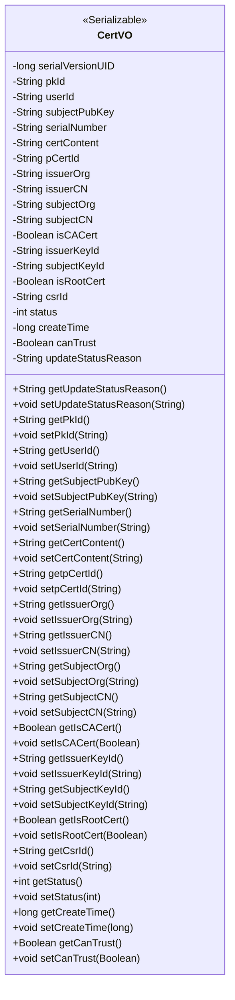

# Basic Information

|      |      |
|------|------|
| Name | CertVO |
| Language | .java |
| Code Path | WeFe/manager/manager-service/src/main/java/com/webank/cert/mgr/model/vo/CertVO.java |
| Package Name | com.webank.cert.mgr.model.vo |
| Dependencies | ['java.io.Serializable', 'com.alibaba.fastjson.annotation.JSONField'] |
| Brief Description | The CertVO class is a certificate value object that includes attributes such as certificate ID, user ID, public key, serial number, content, issuing authority, applicant information, and status, used for certificate management. |

# Description

CertVO is a Java class that implements the Serializable interface, designed to represent certificate information. It includes fields such as primary key ID, user ID, public key, certificate serial number, certificate content, and parent certificate ID. It records the issuer's organization name and common name, the applicant's organization name and common name, as well as whether it is an institutional certificate or a root certificate. Additionally, it contains the private key ID of the issuer and applicant, certificate request ID, certificate status, creation time, trusted status, and the reason for status updates. Each field has corresponding getter and setter methods, with some fields using the JSONField annotation to specify serialization names.

# Class Summary

| Name   | Type  | Description |
|-------|------|-------------|
| CertVO | class | The CertVO class represents certificate information, containing fields such as primary key, user ID, public key, serial number, certificate content, issuing authority, applicant, certificate type, and status. It is used for serializing and deserializing certificate data. |

## Class CertVO

|      |      |
|------|------|
| Access Modifier | public |
| Type | class |
| Name | CertVO |
| Description | The CertVO class represents certificate information, containing fields such as primary key, user ID, public key, serial number, certificate content, issuing authority, applicant, certificate type, and status. It is used for serializing and deserializing certificate data. |

### UML Class Diagram

The CertVO class is a certificate value object that implements the Serializable interface, designed to encapsulate various certificate-related information. It includes attributes such as certificate ID, user ID, public key, serial number, certificate content, issuing authority, applicant information, certificate type identifiers (CA/root certificate), status, creation time, etc., along with complete getter/setter methods. Field name mapping is achieved through JSONField annotations, supporting serialized transmission.

### Internal Method Call Graph

This flowchart illustrates the complete structure of the CertVO class, containing 20 private attributes and their corresponding getter/setter methods. It represents a typical Java Value Object (VO) design for certificate-related information, including core fields such as certificate identifiers, issuer/subject details, key IDs, and status flags. The class implements the Serializable interface to indicate serialization support, with some fields using JSONField annotations for JSON serialization field name mapping. All attributes are exposed through standard getter/setter methods, complying with JavaBean specifications.

### Field List

| Name  | Type  | Description |
|-------|-------|------|
| issuerOrg | String | Declare a private string variable issuerOrg to store issuer organization information. |
| subjectCN | String | JSON field mapping: The private string subjectCN corresponds to the JSON key "subject_cn". |
| isCACert | Boolean | JSON field mapping: The private boolean type isCACert corresponds to the JSON key name is_ca_cert. |
| pCertId | String | The private string variable pCertId is used to store the certificate ID. |
| updateStatusReason | String | JSON field mapping: updateStatusReason, used to store the reason for status updates. |
| userId | String | Declare a private string variable userId. |
| pkId | String | Private string-type primary key ID |
| canTrust | Boolean | Private boolean variable indicating whether it is trusted. |
| isRootCert | Boolean | JSON field mapping, the attribute name is is_root_cert, and the type is Boolean. |
| subjectKeyId | String | The private string variable subjectKeyId is used to store the subject key identifier. |
| csrId | String | Private string variable csrId. |
| certContent | String | The private string variable certContent is used to store certificate content. |
| serialVersionUID = 5882479979815938267L | long | Define the serial version UID with a value of 5882479979815938267 to ensure class version compatibility. |
| serialNumber | String | private String variable serialNumber |
| subjectOrg | String | Declare a private string variable subjectOrg. |
| createTime | long | Private long integer variable, recording the creation time. |
| issuerCN | String | JSON field mapping: issuer_cn corresponds to the issuerCN attribute. |
| status | int | The private integer variable `status` is used to represent the state. |
| subjectPubKey | String | Declare a private string variable subjectPubKey to store the subject public key. |
| issuerKeyId | String | Declare a private string variable issuerKeyId. |

### Method List

| Name  | Type  | Description |
|-------|-------|------|
| setCsrId | void | Method to set CSR ID: Assign the parameter csrId to the class member variable csrId. |
| setUserId | void | Methods for setting the user ID: Assign the parameter userId to the userId property of the current object. |
| getSerialNumber | String | Methods to obtain the serial number, returns the serialNumber of string type. |
| getSubjectCN | String | The method to obtain the subject CN directly returns the value of the private variable subjectCN. |
| getCertContent | String | The method returns the certificate content string. |
| getCsrId | String | This is a Java method that returns the value of the member variable csrId of type String. |
| setIssuerOrg | void | This is a Java method used to set the value of the issuerOrg property. The method accepts a string parameter issuerOrg and assigns it to the class's member variable of the same name. |
| getStatus | int | Methods to obtain the current status value directly return the status variable. |
| setSubjectPubKey | void | The method to set the subject public key assigns the input string to the `subjectPubKey` member variable of the class. |
| getSubjectPubKey | String | Method to obtain the subjectPubKey string value. |
| setSubjectKeyId | void | The method to set the subject key ID assigns the input string to the class member variable `subjectKeyId`. |
| getPkId | String | Methods to obtain the primary key ID, returning pkId. |
| setStatus | void | Methods for setting the status value, which assigns the input parameter `status` to the `status` property of the current object. |
| setIssuerKeyId | void | The method to set the issuer key ID assigns the input string to the class member variable `issuerKeyId`. |
| setIsCACert | void | Method to set whether the certificate is a CA certificate, with the parameter being a boolean value isCACert. |
| setpCertId | void | The method for setting the certificate ID assigns the parameter pCertId to the member variable pCertId of the class. |
| setSerialNumber | void | Methods for setting the device serial number, assigning the input parameter to the member variable serialNumber. |
| getIssuerCN | String | Method to obtain the issuer's common name, returns the issuerCN string. |
| setPkId | void | This is a Java method used to set the value of the pkId property of an object. The method takes a string parameter pkId and assigns it to the pkId field of the current object. |
| setIssuerCN | void | Set the common name of the certificate issuer. |
| getSubjectOrg | String | Methods to obtain the subjectOrg string. |
| getIsRootCert | Boolean | Methods to obtain the root certificate status, returning a boolean value isRootCert. |
| getIsCACert | Boolean | Method to obtain the boolean value indicating whether it is a CA certificate. |
| getpCertId | String | The method returns the pCertId value of string type. |
| getCreateTime | long | Method to get creation time, returns a long integer value. |
| setCreateTime | void | This is a Java method used to set the creation time of an object, with the parameter being a long integer timestamp. |
| getCanTrust | Boolean | The method returns a boolean value canTrust, indicating whether it is trustworthy. |
| setCanTrust | void | This is a Java method used to set the boolean value of the canTrust property. |
| getUpdateStatusReason | String | Method to obtain the update status reason, returns a string-type updateStatusReason. |
| getIssuerOrg | String | Method to obtain the name of the issuing authority, returns a string issuerOrg. |
| getUserId | String | Methods to obtain the user ID, returns a string-type userId. |
| getIssuerKeyId | String | Methods to obtain the publisher key ID, returns a string type value. |
| setUpdateStatusReason | void | The method for setting the update status reason assigns the parameter value to the class member variable `updateStatusReason`. |
| setSubjectOrg | void | This is a Java method used to set the value of the subjectOrg property of an object. The method takes a string parameter and assigns it to the member variable subjectOrg of the object. |
| setIsRootCert | void | Methods for setting the root certificate status, with the parameter being a boolean value. |
| setSubjectCN | void | The method for setting the common name of the subject assigns the input parameter to the member variable `subjectCN` of the class. |
| getSubjectKeyId | String | Methods to obtain the subject key ID, returning the subjectKeyId as a string type. |
| setCertContent | void | The method to set certificate content assigns the input string to the class member variable certContent. |

