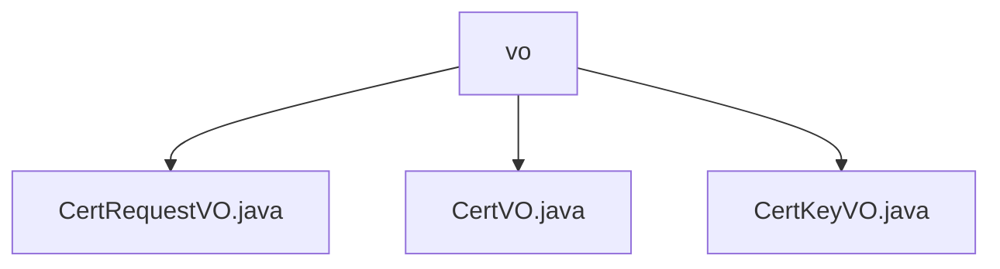

# Basic Information

|      |      |
|------|------|
| Name | vo |
| Language | .java |
| Code Path | WeFe/manager/manager-service/src/main/java/com/webank/cert/mgr/model/vo |
| Package Name | docs.manager.manager-service.src.main.java.com.webank.cert.mgr.model.vo |
| Brief Description | CertRequestVO is a Java class encapsulating certificate request data, containing fields such as pkId. CertVO represents certificate information, including fields like primary key ID. CertKeyVO denotes certificate key information, with fields such as pkId. All three implement the Serializable interface. |

# Description

## Overview  
The core responsibility of this module is to manage the digital certificate lifecycle, including requests, issuance, and key information encapsulation. It primarily provides three serializable Java classes—CertRequestVO, CertVO, and CertKeyVO—to handle certificate requests, certificate entities, and key metadata, respectively.  

The interface specification adheres to Java serialization standards, using JSONField annotations for field mapping. Key data structures include certificate request information (e.g., subject_cn), certificate details (e.g., issuing authority), and key attributes (e.g., keyAlg). External dependencies require only Java core libraries and the FastJSON serialization framework. For example, CertVO maintains certificate hierarchy relationships through pCertId.  

## Key Business Scenarios  
A typical application involves end-to-end certificate management: user-initiated requests (CertRequestVO) → certificate issuance (CertVO) → key association (CertKeyVO). Similar to a ticketing system model, CertRequestVO records application information, CertVO extends status tracking, and CertKeyVO provides cryptographic foundation support.  

Business processes interact via VO objects. For instance, CertVO stores both issuer (issue) and applicant (subjectOrg) information. Integration cases include certificate chain validation (via parent-child relationships with pCertId) and key retrieval (based on userId and keyAlg). All operations support serialization, adapting to RPC or persistence scenarios.

### Package Internal Structure View

This flowchart illustrates the structural relationships within the model/vo directory of the manager-service module in the WeFe project. The parent node 'vo' encompasses three child nodes: CertRequestVO.java, CertVO.java, and CertKeyVO.java, all of which are Java class files located under the vo directory. The entire structure clearly demonstrates the organization of value object class files.

# File List

| Name   | Type  | Description |
|-------|------|-------------|
| [CertRequestVO.java](CertRequestVO.md) | file | The CertRequestVO class implements the Serializable interface and contains certificate request-related fields such as pkId, userId, subjectKeyId, etc., providing getter and setter methods. |
| [CertVO.java](CertVO.md) | file | The CertVO class is a certificate value object that includes attributes such as certificate ID, user ID, public key, serial number, content, issuing authority, applicant information, and status, used for certificate management. |
| [CertKeyVO.java](CertKeyVO.md) | file | The CertKeyVO class implements the Serializable interface and includes fields such as pkId, userId, keyAlg, and createTime, along with their corresponding getter/setter methods. |

