# Basic Information

|      |      |
|------|------|
| Name | CertOperationService |
| Language | .java |
| Code Path | WeFe/manager/manager-service/src/main/java/com/webank/cert/mgr/service/CertOperationService.java |
| Package Name | com.webank.cert.mgr.service |
| Dependencies | ['java.math.BigInteger', 'java.security.KeyPair', 'java.security.PublicKey', 'java.security.Security', 'java.security.cert.CertificateExpiredException', 'java.security.cert.CertificateNotYetValidException', 'java.security.cert.X509Certificate', 'java.util.Date', 'java.util.List', 'javax.transaction.Transactional', 'com.welab.wefe.common.web.util.CurrentAccountUtil', 'org.apache.commons.lang3.StringUtils', 'org.bouncycastle.asn1.x500.RDN', 'org.bouncycastle.asn1.x500.style.BCStyle', 'org.bouncycastle.asn1.x509.KeyUsage', 'org.bouncycastle.jce.provider.BouncyCastleProvider', 'org.bouncycastle.pkcs.PKCS10CertificationRequest', 'org.slf4j.Logger', 'org.slf4j.LoggerFactory', 'org.springframework.beans.factory.annotation.Autowired', 'org.springframework.stereotype.Service', 'com.webank.cert.mgr.db.dao.CertDao', 'com.webank.cert.mgr.enums.MgrExceptionCodeEnums', 'com.webank.cert.mgr.exception.CertMgrException', 'com.webank.cert.mgr.model.vo.CertKeyVO', 'com.webank.cert.mgr.model.vo.CertRequestVO', 'com.webank.cert.mgr.model.vo.CertVO', 'com.webank.cert.mgr.utils.TransformUtils', 'com.webank.cert.toolkit.constants.CertConstants', 'com.webank.cert.toolkit.enums.CertDigestAlgEnums', 'com.webank.cert.toolkit.enums.CertStatusEnums', 'com.webank.cert.toolkit.enums.KeyAlgorithmEnums', 'com.webank.cert.toolkit.model.X500NameInfo', 'com.webank.cert.toolkit.service.CertService', 'com.webank.cert.toolkit.utils.CertUtils', 'com.webank.cert.toolkit.utils.KeyUtils', 'com.welab.wefe.common.data.mongodb.dto.PageOutput', 'com.welab.wefe.common.data.mongodb.entity.manager.CertInfo', 'com.welab.wefe.common.data.mongodb.entity.manager.CertKeyInfo', 'com.welab.wefe.common.data.mongodb.entity.manager.CertRequestInfo', 'com.welab.wefe.common.web.util.DatabaseEncryptUtil'] |
| Brief Description | The CertOperationService provides certificate management functionalities, including updating certificate status, querying certificates, exporting certificates, initializing root certificates, issuing certificates, and more. It supports both RSA and ECDSA algorithms and utilizes the BouncyCastle security library. |

# Description

The CertOperationService is a certificate operation service class that provides certificate management and operational functionalities. Key features include updating certificate status, exporting certificates, querying certificate information, initializing root certificates, creating issuing authority certificates, and user certificates. The service class relies on CertService and CertDao for certificate processing and database operations. During initialization, it checks and adds the BouncyCastle security provider. Core methods involve updating certificate status based on serial numbers or user IDs, exporting certificates to files, querying certificate and private key information, and paginated queries for certificate requests and private key lists. The certificate issuance process involves generating key pairs, saving private keys, creating certificate requests, issuing certificates, and storing certificate information. It supports the issuance of root certificates, CA certificates, and user certificates, including attribute settings such as certificate validity periods and key usage. Exception handling covers scenarios such as non-existent certificates, non-existent keys, and failed certificate validity period verification.

# Class Summary

| Name   | Type  | Description |
|-------|------|-------------|
| CertOperationService | class | The CertOperationService provides certificate management functionalities, including updating status, exporting certificates, querying certificates, issuing root certificates and user certificates, among other operations. |

## Class CertOperationService

|      |      |
|------|------|
| Access Modifier | @Service;public |
| Type | class |
| Name | CertOperationService |
| Description | The CertOperationService provides certificate management functionalities, including updating status, exporting certificates, querying certificates, issuing root certificates and user certificates, among other operations. |

### UML Class Diagram

```mermaid
classDiagram
    class CertOperationService {
        -Logger LOG
        -CertService certService
        -CertDao certDao
        +updateStatusBySerialNumber(String serialNumber, int status, String reason) void
        +updateStatusByUserId(String userId, int status, String reason) void
        +updateCanTrust(String serialNumber, boolean status) void
        +exportCertToDerFile(String certId, String filePath) void
        +queryCertInfoByCertId(String certId) CertVO
        +findCertRequestById(String pkId) CertRequestVO
        +findCertKeyById(String certKeyId) CertKeyVO
        +findBySerialNumber(String serialNumber) CertVO
        +queryCertRequestList(String userId, String pCertId, int pageIndex, int pageSize) PageOutput~CertRequestInfo~
        +findKeys(String userId, int pageIndex, int pageSize) PageOutput~CertKeyInfo~
        +findCertList(String userId, String pCertId, Boolean isCACert, Boolean isRootCert) List~CertInfo~
        +findCertList(String userId, String pCertId, Boolean isCACert, Boolean isRootCert, int status, int pageIndex, int pageSize) PageOutput~CertInfo~
        +initRootCert(String commonName, String organizationName, String organizationUnitName) CertVO
        +createIssuerCert(String rootCertId, String commonName, String organizationName, String organizationUnitName) CertVO
        +createUserCert(String issuerCertId, String memberId, String certRequestContent) CertVO
        -savePrivateKey(String userId, String pemPrivateKey, String priAlg) CertKeyInfo
        -createUserCertRequest(String commonName, String userId, String certRequestContent, String organizationName, X500NameInfo subject) CertRequestInfo
        -buildCertRequestInfo(String csrStr, String subjectKeyId, String commonName, String organizationName, String userId) CertRequestInfo
        -buildCertInfo(String certificatePemStr, String issuerCommonName, String issuerOrgName, String subjectCommonName, String subjectOrgName, PublicKey publicKey, String userId, BigInteger serialNumber, String issuerCertKeyId, String subjectKeyId, boolean isCACert, boolean isRootCert, String issuerCertId, String csrId) CertInfo
        -getCertDigestAlg(KeyAlgorithmEnums keyAlgorithm) CertDigestAlgEnums
        -getKeyPair(KeyAlgorithmEnums keyAlgorithm, String pemPrivateKey) KeyPair
    }

    class CertService {
        <<Interface>>
        +createRootCertificate(String algorithmName, X500NameInfo issuer, KeyUsage keyUsage, Date beginDate, Date endDate, PublicKey publicKey, PrivateKey privateKey) X509Certificate
        +createCertRequest(X500NameInfo subject, PublicKey publicKey, PrivateKey privateKey, String algorithmName) PKCS10CertificationRequest
        +createChildCertificate(boolean isCaCert, String algorithmName, X509Certificate issuerCertificate, PKCS10CertificationRequest csr, KeyUsage keyUsage, Date beginDate, Date endDate, PrivateKey privateKey) X509Certificate
    }

    class CertDao {
        <<Interface>>
        +updateStatusBySerialNumber(String serialNumber, int status, String reason) void
        +updateStatusByUserId(String userId, int status, String reason) void
        +updateCanTrust(String serialNumber, boolean status) void
        +findCertById(String certId) CertInfo
        +findCertRequestById(String pkId) CertRequestInfo
        +findKeyByPkId(String certKeyId) CertKeyInfo
        +findBySerialNumber(String serialNumber) CertInfo
        +findCertRequestList(String userId, String pCertId, int pageIndex, int pageSize) PageOutput~CertRequestInfo~
        +findKeys(String userId, int pageIndex, int pageSize) PageOutput~CertKeyInfo~
        +findCertList(String userId, String pCertId, Boolean isCACert, Boolean isRootCert) List~CertInfo~
        +findCertList(String userId, String pCertId, Boolean isCACert, Boolean isRootCert, int status, int pageIndex, int pageSize) PageOutput~CertInfo~
        +save(CertInfo certInfo) CertInfo
        +save(CertRequestInfo certRequestInfo) CertRequestInfo
        +save(CertKeyInfo certKeyInfo) CertKeyInfo
        +findCertKeyById(String certKeyId) CertKeyInfo
    }

    class CertVO {
        +String certContent
        +String subjectCN
        +String subjectOrg
        +String issuerCN
        +String issuerOrg
        +String subjectPubKey
        +String issuerKeyId
        +String subjectKeyId
        +String serialNumber
        +boolean isCACert
        +boolean isRootCert
        +String csrId
        +int status
    }

    class CertRequestVO {
        +String certRequestContent
        +String subjectKeyId
        +String subjectCN
        +String subjectOrg
        +String userId
        +boolean issue
    }

    class CertKeyVO {
        +String keyAlg
        +String keyPem
        +String userId
        +String createdBy
    }

    class CertInfo {
        +String userId
        +String createdBy
        +String issuerCN
        +String issuerOrg
        +String pCertId
        +String subjectCN
        +String subjectOrg
        +String subjectPubKey
        +String issuerKeyId
        +String subjectKeyId
        +String certContent
        +String serialNumber
        +boolean isCACert
        +boolean isRootCert
        +String csrId
        +int status
    }

    class CertRequestInfo {
        +String userId
        +String createdBy
        +String subjectKeyId
        +String subjectCN
        +String subjectOrg
        +String certRequestContent
        +boolean issue
    }

    class CertKeyInfo {
        +String keyAlg
        +String keyPem
        +String userId
        +String createdBy
        +String pkId
    }

    class PageOutput~T~ {
        +List~T~ data
        +int total
        +int pageIndex
        +int pageSize
    }

    class X500NameInfo {
        +String commonName
        +String organizationName
        +String organizationalUnitName
    }

    class KeyAlgorithmEnums {
        <<Enumeration>>
        +RSA
        +ECDSA
        +SM2
        +getByKeyAlg(String keyAlg) KeyAlgorithmEnums
        +getKeyAlgorithm() String
    }

    class CertDigestAlgEnums {
        <<Enumeration>>
        +SHA256withRSA
        +SHA384withECDSA
        +SM3withSM2
        +getByKeyAlg(String keyAlg) CertDigestAlgEnums
        +getAlgorithmName() String
    }

    class CertStatusEnums {
        <<Enumeration>>
        +VALID
        +REVOKED
        +EXPIRED
        +getCode() int
    }

    class MgrExceptionCodeEnums {
        <<Enumeration>>
        +PKEY_MGR_CERT_NOT_EXIST
        +PKEY_MGR_CERT_KEY_NOT_EXIST
        +PKEY_MGR_CERT_VALIDITY_FAILURE
        +PKEY_MGR_ACCOUNT_NOT_EXIST
        +PKEY_MGR_CERT_KEY_ALG_NOT_EXIST
    }

    class CertMgrException {
        +MgrExceptionCodeEnums code
        +CertMgrException(MgrExceptionCodeEnums code)
    }

    class CertUtils {
        <<Utility>>
        +writeCrt(X509Certificate certificate, String filePath) void
        +convertStrToCert(String certContent) X509Certificate
        +readPEMAsString(Object obj) String
        +convertStrToCsr(String csrContent) PKCS10CertificationRequest
    }

    class KeyUtils {
        <<Utility>>
        +generateKeyPair() KeyPair
        +getRSAKeyPair(String pemPrivateKey) KeyPair
        +getECKeyPair(String pemPrivateKey) KeyPair
    }

    class DatabaseEncryptUtil {
        <<Utility>>
        +encrypt(String data) String
        +decrypt(String data) String
    }

    class TransformUtils {
        <<Utility>>
        +simpleTransform(Object source, Class~T~ targetClass) T
    }

    class CurrentAccountUtil {
        <<Utility>>
        +get() Account
        +getId() String
    }

    CertOperationService --> CertService : Dependency
    CertOperationService --> CertDao : Dependency
    CertOperationService --> CertUtils : Dependency
    CertOperationService --> KeyUtils : Dependency
    CertOperationService --> DatabaseEncryptUtil : Dependency
    CertOperationService --> TransformUtils : Dependency
    CertOperationService --> CurrentAccountUtil : Dependency
    CertOperationService --> CertVO : Return
    CertOperationService --> CertRequestVO : Return
    CertOperationService --> CertKeyVO : Return
    CertOperationService --> CertInfo : Operation
    CertOperationService --> CertRequestInfo : Operation
    CertOperationService --> CertKeyInfo : Operation
    CertOperationService --> X500NameInfo : Use
    CertOperationService --> KeyAlgorithmEnums : Use
    CertOperationService --> CertDigestAlgEnums : Use
    CertOperationService --> CertStatusEnums : Use
    CertOperationService --> MgrExceptionCodeEnums : Use
    CertOperationService --> CertMgrException : Throw
    CertService --> X509Certificate : Return
    CertService --> PKCS10CertificationRequest : Return
    CertDao --> CertInfo : Return
    CertDao --> CertRequestInfo : Return
    CertDao --> CertKeyInfo : Return
    CertDao --> PageOutput~CertRequestInfo~ : Return
    CertDao --> PageOutput~CertKeyInfo~ : Return
    CertDao --> PageOutput~CertInfo~ : Return
    CertVO --> CertInfo : Convert
    CertRequestVO --> CertRequestInfo : Convert
    CertKeyVO --> CertKeyInfo : Convert
```

This code implements a certificate management service with core functionalities including certificate status updates, certificate export, certificate queries, root certificate initialization, issuer certificate creation, and user certificate issuance. The class diagram illustrates the relationships between CertOperationService and multiple helper classes/interfaces, such as the certificate service interface CertService, data access interface CertDao, various value objects and enumeration classes, as well as utility classes like CertUtils and KeyUtils. The design adopts a layered architecture where the service layer depends on the data access layer and utility classes. It manages certificate lifecycle comprehensively through enumeration classes for status and exception codes.

### Internal Method Call Graph

```mermaid
graph TD
    A["Class CertOperationService"]
    B["Static Block: Initialize BouncyCastleProvider"]
    C["Dependency Injection: CertService certService"]
    D["Dependency Injection: CertDao certDao"]
    E["Method: updateStatusBySerialNumber"]
    F["Method: updateStatusByUserId"]
    G["Method: updateCanTrust"]
    H["Method: exportCertToDerFile"]
    I["Method: queryCertInfoByCertId"]
    J["Method: findCertRequestById"]
    K["Method: findCertKeyById"]
    L["Method: findBySerialNumber"]
    M["Method: queryCertRequestList"]
    N["Method: findKeys"]
    O["Method: findCertList"]
    P["Method: initRootCert"]
    Q["Method: createIssuerCert"]
    R["Method: createUserCert"]
    S["Private Method: savePrivateKey"]
    T["Private Method: createUserCertRequest"]
    U["Private Method: buildCertRequestInfo"]
    V["Private Method: buildCertInfo"]
    W["Private Method: getCertDigestAlg"]
    X["Private Method: getKeyPair"]

    A --> B
    A --> C
    A --> D
    A --> E
    A --> F
    A --> G
    A --> H
    A --> I
    A --> J
    A --> K
    A --> L
    A --> M
    A --> N
    A --> O
    A --> P
    A --> Q
    A --> R
    A --> S
    A --> T
    A --> U
    A --> V
    A --> W
    A --> X

    H --> I
    P --> S
    P --> V
    Q --> S
    Q --> V
    Q --> W
    Q --> X
    R --> V
    R --> T
    R --> W
    R --> X
    S --> X
```

This flowchart illustrates the complete structure of the CertOperationService class, including static initialization blocks, dependency injection fields, public business methods, and private utility methods. The core business logic revolves around certificate management, encompassing status updates, certificate queries, root certificate initialization, issuer certificate creation, and user certificate issuance. Private methods primarily handle key storage, certificate information construction, and cryptographic algorithm processing to support the main business flow. The class achieves data persistence through CertDao and implements core certificate operations via CertService, demonstrating a clear layered architecture design.

### Field List

| Name  | Type  | Description |
|-------|-------|------|
| certDao | CertDao | Automatically inject the CertDao instance into the certDao field of the current class. |
| LOG = LoggerFactory.getLogger(CertOperationService.class) | Logger | The class CertOperationService defines a protected static constant LOG for logging purposes. |
| certService | CertService | Automatically inject the CertService instance. |

### Method List

| Name  | Type  | Description |
|-------|-------|------|
| updateStatusBySerialNumber | void | The method updates the status based on the serial number. If the serial number is empty, no action is taken; otherwise, it invokes the DAO layer to update the status and reason. |
| findCertRequestById | CertRequestVO | The method queries the certificate request by ID, retrieves the data by invoking the DAO layer, and then converts it into a VO object for return. |
| queryCertInfoByCertId | CertVO | This method retrieves certificate information by certificate ID, converts the query result into a CertVO object, and returns it. |
| createIssuerCert | CertVO | Method for creating issuer certificate: Generate public-private key pair, verify the validity of the issuing authority's certificate, issue a new certificate, and store the private key and certificate information. |
| findKeys | PageOutput<CertKeyInfo> | This method queries the certificate key information for a specified user ID through certDao, supporting pagination parameters. It returns paginated results. |
| createUserCertRequest | CertRequestInfo | Method for creating a user certificate request: After verifying the user ID is not empty, construct and save the certificate request information. |
| createUserCert | CertVO | Method for creating user certificate: Verify the validity of the issuing authority certificate, generate a subordinate certificate and save CSR and certificate information, then return the certificate VO object. |
| updateCanTrust | void | The method `updateCanTrust` updates the certificate trust status based on the serial number. If the serial number is empty, it returns directly; otherwise, it calls `certDao` to update the status. |
| findCertList | List<CertInfo> | This method queries the certificate list by user ID, parent certificate ID, whether it is a CA certificate, and the root certificate flag, then invokes the DAO layer to return the result. Note that the parameter isRootCert is unused. |
| findCertList | PageOutput<CertInfo> | The method `findCertList` queries the certificate list based on user ID, parent certificate ID, CA certificate flag, root certificate flag, and status, returning paginated results. |
| initRootCert | CertVO | Initialization method for root certificate, generates RSA key pair, creates and saves X509 certificate, returns certificate information. Includes public/private key handling, validity period setting, and database storage. |
| exportCertToDerFile | void | This method exports the certificate file in DER format based on the certificate ID. If the certificate exists and its content is non-empty, it will be written to the specified path; otherwise, an exception indicating the certificate does not exist will be thrown. |
| savePrivateKey | CertKeyInfo | The method savePrivateKey saves the user's private key: it checks that the user ID is not empty, validates the RSA key pair, encrypts the private key before storing it in the database, and returns a CertKeyInfo object. In case of exceptions, it logs the error and throws it. |
| queryCertRequestList | PageOutput<CertRequestInfo> | The method for querying the certificate request list returns paginated results based on user ID and certificate ID. |
| findCertKeyById | CertKeyVO | This method retrieves certificate key information by ID, converts the database entity into a view object, and returns it. |
| updateStatusByUserId | void | Update the status based on the user ID; if the ID is empty, no action will be taken. Invoke the DAO layer to perform the update operation. |
| findBySerialNumber | CertVO | Query certificate information based on the serial number and convert it into a VO object for return. |
| buildCertRequestInfo | CertRequestInfo | Construct certificate request information, set user ID, creator, subject key ID, common name, organization name, CSR content, and issuance flag. |
| buildCertInfo | CertInfo | Construct a certificate information object containing fields such as user ID, issuer, subject, public/private key ID, certificate content, serial number, CA/root flag, CSR ID, and status. |
| getCertDigestAlg | CertDigestAlgEnums | The method retrieves the digest algorithm for the certificate based on the key algorithm. If the key algorithm is empty or no corresponding digest algorithm is found, an exception is thrown. |
| getKeyPair | KeyPair | Generate a key pair from a PEM-format private key based on the key algorithm type (ECDSA/SM2 or RSA), and throw an exception if the algorithm is not supported. |

